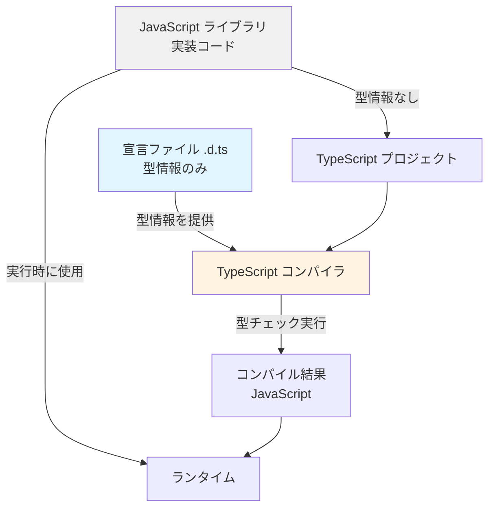

# 宣言ファイル（Declaration Files）完全ガイド

> .d.ts ファイルの仕組みと書き方の全て。DefinitelyTyped、ambient declarations、モジュール拡張、Triple-Slash Directives、型定義の自動生成、ライブラリ作者向けベストプラクティスまで網羅的に解説します。

## この章で学ぶこと

1. **宣言ファイルの基本** -- .d.ts ファイルの役割、なぜ必要か、型情報の分離
2. **declare キーワードの全種類** -- module, namespace, global, var, function, class の使い分け
3. **Ambient Declarations** -- 実装を持たない型宣言の仕組みと原理
4. **DefinitelyTyped エコシステム** -- @types パッケージの仕組み、検索、コントリビュート方法
5. **モジュール拡張とグローバル拡張** -- 既存ライブラリの型定義を安全に拡張する技法
6. **Triple-Slash Directives** -- /// <reference> の使い方と modern TypeScript での位置づけ
7. **型定義の自動生成** -- tsc --declaration、dts-bundle-generator、API Extractor
8. **ライブラリ作者向けベストプラクティス** -- 型定義のパッケージング、バージョニング、メンテナンス
9. **トラブルシューティング** -- 型が見つからない、型の競合、パフォーマンス問題の解決法

---

## 目次

1. [宣言ファイルの基本と役割](#1-宣言ファイルの基本と役割)
2. [declare キーワードの全種類](#2-declare-キーワードの全種類)
3. [Ambient Declarations の仕組み](#3-ambient-declarations-の仕組み)
4. [DefinitelyTyped エコシステム](#4-definitelytyped-エコシステム)
5. [モジュール拡張とグローバル拡張](#5-モジュール拡張とグローバル拡張)
6. [Triple-Slash Directives](#6-triple-slash-directives)
7. [型定義の自動生成](#7-型定義の自動生成)
8. [ライブラリ作者向けベストプラクティス](#8-ライブラリ作者向けベストプラクティス)
9. [トラブルシューティング](#9-トラブルシューティング)
10. [演習問題](#10-演習問題)
11. [まとめ](#11-まとめ)

---

## 1. 宣言ファイルの基本と役割

### 1.1 なぜ宣言ファイルが必要なのか

TypeScript は JavaScript のスーパーセットですが、既存の JavaScript ライブラリは型情報を持っていません。宣言ファイル（.d.ts）は、**JavaScript コードに後付けで型情報を提供する**ための仕組みです。

```
【問題】
JavaScript ライブラリ (lodash.js) には型情報がない
  ↓
TypeScript プロジェクトで使うと any になってしまう
  ↓
型安全性が失われる

【解決】
宣言ファイル (lodash.d.ts) を用意する
  ↓
型情報だけを記述（実装コードなし）
  ↓
TypeScript コンパイラが型チェックを実行できる
```

### 図解1: 宣言ファイルのエコシステム



### 1.2 宣言ファイルの特徴

| 特徴 | 説明 |
|------|------|
| **拡張子** | `.d.ts` （declaration TypeScript の略） |
| **実装コードなし** | 型情報のみを記述。実行可能なコードは書かない |
| **declare キーワード** | 外部に存在する値の型をコンパイラに伝える |
| **コンパイル対象外** | `.d.ts` ファイルは JavaScript にコンパイルされない |
| **型の契約書** | 実装とインターフェースを分離する設計パターン |

### コード例1: 基本的な .d.ts ファイルの構造

```typescript
// types/math-utils.d.ts

// 関数の宣言
declare function add(a: number, b: number): number;
declare function multiply(a: number, b: number): number;
declare function divide(a: number, b: number): number | null;

// 変数の宣言
declare const PI: number;
declare const E: number;
declare let debugMode: boolean;

// クラスの宣言
declare class Calculator {
  constructor(initial?: number);
  add(n: number): this;
  subtract(n: number): this;
  multiply(n: number): this;
  divide(n: number): this;
  result(): number;
  reset(): this;
}

// インターフェース（declare 不要）
interface MathOptions {
  precision: number;
  roundingMode: "ceil" | "floor" | "round" | "trunc";
  useRadians?: boolean;
}

// 型エイリアス（declare 不要）
type MathOperation = "add" | "subtract" | "multiply" | "divide";

// 列挙型の宣言
declare enum MathMode {
  Strict,
  Loose,
  Scientific
}

// 名前空間の宣言
declare namespace MathUtils {
  function randomInt(min: number, max: number): number;
  function clamp(value: number, min: number, max: number): number;

  namespace Advanced {
    function factorial(n: number): number;
    function fibonacci(n: number): number;
  }
}
```

**ポイント:**
- `declare` キーワードは「この値は外部に存在する」という宣言
- `interface` と `type` は既に型レベルの構文なので `declare` 不要
- クラスや関数は実装を書かず、型シグネチャのみ記述

### 1.3 .d.ts ファイルと .ts ファイルの違い

```
┌─────────────────────────────────────────────────────────────┐
│ .ts ファイル（通常の TypeScript）                            │
├─────────────────────────────────────────────────────────────┤
│ ✓ 実装コードを書く                                          │
│ ✓ 型情報も書く                                              │
│ ✓ JavaScript にコンパイルされる                             │
│ ✓ ランタイムで実行される                                    │
└─────────────────────────────────────────────────────────────┘

┌─────────────────────────────────────────────────────────────┐
│ .d.ts ファイル（宣言ファイル）                               │
├─────────────────────────────────────────────────────────────┤
│ ✗ 実装コードは書かない（書いてもコンパイル時に消える）      │
│ ✓ 型情報のみ書く                                            │
│ ✗ JavaScript にコンパイルされない                           │
│ ✗ ランタイムでは使われない（コンパイル時のみ使用）          │
└─────────────────────────────────────────────────────────────┘
```

### コード例2: .ts と .d.ts の対応関係

```typescript
// math-utils.ts （実装ファイル）
export const PI = 3.14159;

export function add(a: number, b: number): number {
  return a + b;  // 実装コードあり
}

export class Calculator {
  private value = 0;

  constructor(initial: number = 0) {
    this.value = initial;
  }

  add(n: number): this {
    this.value += n;
    return this;
  }

  result(): number {
    return this.value;
  }
}
```

```typescript
// math-utils.d.ts （自動生成または手書き）
export declare const PI: number;

export declare function add(a: number, b: number): number;
// 実装コードなし、型シグネチャのみ

export declare class Calculator {
  constructor(initial?: number);
  add(n: number): this;
  result(): number;
  // private フィールドは公開APIでないので省略されることも
}
```

### 1.4 宣言ファイルが必要なケース

```
【ケース1】JavaScript ライブラリに型を付ける
  例: jQuery, lodash, moment など型定義がない古いライブラリ
  → @types/xxx パッケージ or 自前の .d.ts ファイル

【ケース2】グローバル変数に型を付ける
  例: process.env, window.__INITIAL_STATE__, Webpack の define
  → global.d.ts などで declare

【ケース3】非 JS ファイルのインポートに型を付ける
  例: import logo from "./logo.png"
  → declare module "*.png" で型を定義

【ケース4】自作ライブラリの型定義を配布
  例: npm パッケージとして公開する TypeScript ライブラリ
  → tsc --declaration で .d.ts を自動生成

【ケース5】モノレポ内で型情報を共有
  例: 複数パッケージで共通の型定義を使う
  → shared-types パッケージに .d.ts を集約
```

---

## 2. declare キーワードの全種類

### 2.1 declare の役割

`declare` キーワードは「この値は外部のどこかに存在するので、型チェックに使ってほしい」とコンパイラに伝えるためのものです。

```typescript
// declare なし → エラー: 実装が必要
function add(a: number, b: number): number;  // ❌ 実装がない

// declare あり → OK: 外部に存在することを宣言
declare function add(a: number, b: number): number;  // ✅ 型情報のみ
```

### 図解2: declare キーワードの動作原理

```
┌──────────────────────────────────────────────────────────┐
│ TypeScript コンパイラの視点                               │
├──────────────────────────────────────────────────────────┤
│                                                           │
│  declare function foo(): void;                            │
│          ↓                                                │
│  「foo という関数がどこかに存在する」                     │
│  「引数なし、戻り値 void」                                │
│  「実装はチェックしない（外部にあるはず）」               │
│          ↓                                                │
│  foo() を呼ぶコードを型チェックできる                     │
│                                                           │
└──────────────────────────────────────────────────────────┘
```

### 2.2 declare function（関数の宣言）

```typescript
// types/api.d.ts

// 単純な関数
declare function fetchData(url: string): Promise<unknown>;

// オーバーロードも可能
declare function parse(data: string): object;
declare function parse(data: Buffer): object;
declare function parse(data: string | Buffer): object;

// ジェネリック関数
declare function request<T = unknown>(
  url: string,
  options?: RequestOptions
): Promise<T>;

// デフォルト引数（型レベルでは ? で表現）
declare function log(message: string, level?: "info" | "warn" | "error"): void;

// Rest パラメータ
declare function sum(...numbers: number[]): number;

// コールバック
declare function addEventListener(
  event: string,
  handler: (e: Event) => void
): void;
```

### 2.3 declare const/let/var（変数の宣言）

```typescript
// types/globals.d.ts

// 定数（最も一般的）
declare const APP_VERSION: string;
declare const API_ENDPOINT: string;
declare const MAX_RETRY: number;

// let（変更可能な値）
declare let currentUser: User | null;
declare let debugEnabled: boolean;

// var（古い JavaScript コード向け）
declare var jQuery: JQueryStatic;
declare var $: JQueryStatic;

// オブジェクト
declare const config: {
  readonly apiKey: string;
  timeout: number;
  retries: number;
};
```

**const vs let の使い分け:**
```typescript
// 実行時に変更されない値 → const
declare const BUILD_TIME: string;

// 実行時に変更される可能性がある値 → let
declare let isLoggedIn: boolean;
```

### 2.4 declare class（クラスの宣言）

```typescript
// types/database.d.ts

declare class Database {
  // コンストラクタ
  constructor(config: DatabaseConfig);

  // メソッド（実装なし）
  connect(): Promise<void>;
  disconnect(): Promise<void>;
  query<T = unknown>(sql: string, params?: unknown[]): Promise<T[]>;

  // プロパティ
  readonly isConnected: boolean;
  timeout: number;

  // 静的メンバー
  static create(config: DatabaseConfig): Database;
  static readonly defaultTimeout: number;
}

// 継承関係も表現可能
declare class SQLDatabase extends Database {
  beginTransaction(): Promise<Transaction>;
  commit(): Promise<void>;
  rollback(): Promise<void>;
}

// 抽象クラス（実際は interface として使う方が一般的）
declare abstract class BaseRepository<T> {
  abstract findById(id: string): Promise<T | null>;
  abstract save(entity: T): Promise<void>;
  abstract delete(id: string): Promise<void>;
}
```

### 2.5 declare module（モジュールの宣言）

最も重要な使い方の一つです。外部モジュール全体の型を定義します。

```typescript
// types/custom-library.d.ts

// モジュール全体の型を宣言
declare module "custom-library" {
  // エクスポートされる型
  export interface Config {
    host: string;
    port: number;
    ssl?: boolean;
  }

  // エクスポートされる関数
  export function createClient(config: Config): Client;
  export function parseUrl(url: string): ParsedUrl;

  // エクスポートされるクラス
  export class Client {
    constructor(config: Config);
    connect(): Promise<void>;
    disconnect(): Promise<void>;
    send(data: string): Promise<Response>;
  }

  // 型エイリアス
  export type ConnectionStatus = "connected" | "disconnected" | "connecting";

  // デフォルトエクスポート
  export default createClient;
}

// 使用側
import customLib, { Client, Config } from "custom-library";
// ↑ 型情報が効く
```

**Wildcard モジュール宣言:**

```typescript
// types/assets.d.ts

// 画像ファイル全般
declare module "*.png" {
  const src: string;
  export default src;
}

declare module "*.jpg" {
  const src: string;
  export default src;
}

declare module "*.svg" {
  const src: string;
  export default src;
}

// SVG を React コンポーネントとして扱う場合
declare module "*.svg?component" {
  import { FC, SVGProps } from "react";
  const Component: FC<SVGProps<SVGSVGElement>>;
  export default Component;
}

// CSS Modules
declare module "*.module.css" {
  const classes: { readonly [key: string]: string };
  export default classes;
}

declare module "*.module.scss" {
  const classes: { readonly [key: string]: string };
  export default classes;
}

// JSON ファイル
declare module "*.json" {
  const value: unknown;
  export default value;
}

// YAML ファイル
declare module "*.yaml" {
  const data: Record<string, unknown>;
  export default data;
}

// Web Workers
declare module "*.worker.ts" {
  class WebpackWorker extends Worker {
    constructor();
  }
  export default WebpackWorker;
}
```

### 2.6 declare namespace（名前空間の宣言）

```typescript
// types/jquery.d.ts

declare namespace jQuery {
  // ネストした名前空間
  namespace fn {
    interface JQuery {
      customPlugin(options?: CustomPluginOptions): this;
    }
  }

  // インターフェース
  interface AjaxSettings {
    url?: string;
    method?: "GET" | "POST" | "PUT" | "DELETE";
    data?: unknown;
    success?: (data: unknown) => void;
  }

  // 関数
  function ajax(settings: AjaxSettings): void;
  function get(url: string): Promise<unknown>;

  // 定数
  const version: string;
}

// グローバル変数としても使える
declare const jQuery: typeof jQuery;
```

**モダンな TypeScript では namespace より module を推奨:**

```typescript
// 古いスタイル（namespace）
declare namespace MyLib {
  function doSomething(): void;
}

// 新しいスタイル（module）
declare module "my-lib" {
  export function doSomething(): void;
}
```

### 2.7 declare global（グローバルスコープへの追加）

モジュールファイル（export/import がある .d.ts）内でグローバル型を追加したい場合に使います。

```typescript
// types/global.d.ts

// グローバル変数を追加
declare global {
  // Window オブジェクトの拡張
  interface Window {
    __INITIAL_STATE__: {
      user: User | null;
      config: AppConfig;
    };
    gtag: (command: string, ...args: unknown[]) => void;
    dataLayer: unknown[];
  }

  // グローバル関数
  function gtag(command: "event", action: string, params?: object): void;
  function gtag(command: "config", targetId: string, params?: object): void;

  // グローバル型
  type JsonValue = string | number | boolean | null | JsonObject | JsonArray;
  interface JsonObject { [key: string]: JsonValue }
  interface JsonArray extends Array<JsonValue> {}

  // Array の拡張（プロトタイプメソッド追加を想定）
  interface Array<T> {
    last(): T | undefined;
    first(): T | undefined;
  }

  // String の拡張
  interface String {
    capitalize(): string;
    truncate(length: number): string;
  }
}

// モジュールとして認識させるためのダミーエクスポート
export {};
```

**重要:** `declare global` を使うには、そのファイルがモジュールである必要があります（`export {}` など）。

### 2.8 declare enum（列挙型の宣言）

```typescript
// types/enums.d.ts

// 通常の enum
declare enum LogLevel {
  Debug,
  Info,
  Warn,
  Error
}

// 文字列 enum
declare enum Status {
  Pending = "PENDING",
  InProgress = "IN_PROGRESS",
  Completed = "COMPLETED",
  Failed = "FAILED"
}

// const enum（コンパイル時にインライン化される）
declare const enum Direction {
  Up,
  Down,
  Left,
  Right
}
```

**注意:** `declare enum` は ambient context でのみ使用可能です。

### 比較表1: declare の種類と用途

| 宣言方法 | 用途 | スコープ | 例 |
|---------|------|---------|-----|
| `declare function` | 関数の型宣言 | グローバル/モジュール | `declare function log(msg: string): void;` |
| `declare const` | 定数の型宣言 | グローバル/モジュール | `declare const VERSION: string;` |
| `declare let/var` | 変数の型宣言 | グローバル/モジュール | `declare let isDebug: boolean;` |
| `declare class` | クラスの型宣言 | グローバル/モジュール | `declare class User { ... }` |
| `declare module` | モジュール全体の型 | モジュール | `declare module "lib" { ... }` |
| `declare namespace` | 名前空間の型 | グローバル/モジュール | `declare namespace App { ... }` |
| `declare global` | グローバル型の追加 | グローバル（モジュール内から） | `declare global { ... }` |
| `declare enum` | 列挙型の宣言 | グローバル/モジュール | `declare enum Color { Red, Green }` |

---

## 3. Ambient Declarations の仕組み

### 3.1 Ambient とは何か

**Ambient**（環境的、周囲の）という言葉は、「どこかに存在するが、TypeScript コンパイラからは直接見えない」値や型を表します。

```
通常の宣言:
  const x = 10;  // TypeScript が実装を見て型を推論

Ambient 宣言:
  declare const x: number;  // 実装は見えないが「存在する」と信じる
```

### 3.2 Ambient Context とは

Ambient context は「実装コードを持たない型宣言のみの領域」です。以下が ambient context に該当します:

1. `.d.ts` ファイル全体
2. `declare module` ブロック内
3. `declare namespace` ブロック内
4. `declare global` ブロック内

```typescript
// このファイル全体が ambient context
// types/example.d.ts

declare const foo: string;  // OK: ambient context

const bar = "hello";  // これは OK だが、実装コードは .d.ts では無視される

export function baz(): void {
  // ❌ エラー: ambient context では実装を書けない
  console.log("test");
}

export declare function qux(): void;  // ✅ OK: 型宣言のみ
```

### 3.3 Ambient Modules（アンビエントモジュール）

外部モジュールの型を宣言する機能です。

```typescript
// types/external-libs.d.ts

// JavaScript ライブラリに型を付ける
declare module "legacy-lib" {
  export function doSomething(arg: string): number;
  export const version: string;
}

// CSS Modules
declare module "*.css" {
  const content: { [className: string]: string };
  export default content;
}

// JSON imports
declare module "*.json" {
  const value: unknown;
  export default value;
}

// バンドラー固有の機能（Vite の ?url import など）
declare module "*?url" {
  const url: string;
  export default url;
}

declare module "*?raw" {
  const content: string;
  export default content;
}

// Web Assembly
declare module "*.wasm" {
  const moduleFactory: () => Promise<WebAssembly.Instance>;
  export default moduleFactory;
}
```

### コード例3: Ambient Modules の実践例

```typescript
// types/vendor.d.ts

// jQuery プラグインの型定義
declare module "jquery-validation" {
  interface JQuery {
    validate(options?: ValidationOptions): Validator;
  }

  interface ValidationOptions {
    rules?: Record<string, unknown>;
    messages?: Record<string, string>;
    submitHandler?: (form: HTMLFormElement) => void;
  }

  interface Validator {
    form(): boolean;
    element(element: HTMLElement): boolean;
    resetForm(): void;
  }
}

// Webpack の require.context
declare module "*.worker.js" {
  class WebpackWorker extends Worker {
    constructor();
  }
  export default WebpackWorker;
}

// Vite の import.meta.env
declare module "vite/client" {
  interface ImportMetaEnv {
    readonly VITE_APP_TITLE: string;
    readonly VITE_API_URL: string;
    readonly VITE_ENABLE_ANALYTICS: string;
  }

  interface ImportMeta {
    readonly env: ImportMetaEnv;
  }
}
```

### 3.4 Script vs Module Context

TypeScript ファイルは「スクリプト」または「モジュール」のどちらかとして扱われます。

```
【スクリプト】
  - export/import がない .ts/.d.ts ファイル
  - グローバルスコープに直接宣言できる
  - declare なしでグローバル変数を宣言可能

【モジュール】
  - export/import がある .ts/.d.ts ファイル
  - モジュールスコープ（ファイルごとに独立）
  - グローバルに追加するには declare global が必要
```

```typescript
// global-script.d.ts （スクリプト）
// export/import がない → スクリプトとして扱われる

interface User {
  id: string;
  name: string;
}

declare const currentUser: User;  // グローバルに追加される

// このファイルは全プロジェクトで User と currentUser が使える
```

```typescript
// module-types.d.ts （モジュール）
// export がある → モジュールとして扱われる

export interface Product {
  id: string;
  name: string;
}

// グローバルに追加したい場合は declare global が必要
declare global {
  interface Window {
    products: Product[];
  }
}
```

### 図解3: Ambient Declarations の解決フロー

```mermaid
flowchart TD
    A[TypeScript コード] --> B{import/require がある?}
    B -->|Yes| C[モジュール解決]
    B -->|No| D[グローバル解決]

    C --> E{パッケージ内に型定義?}
    E -->|Yes| F[package.json の types フィールド]
    E -->|No| G{@types パッケージ?}
    G -->|Yes| H[@types/xxx から読み込み]
    G -->|No| I[declare module で宣言]

    D --> J[.d.ts ファイルから検索]
    J --> K[tsconfig.json の include/files]
    K --> L[typeRoots からグローバル型を読み込み]

    F --> M[型チェック実行]
    H --> M
    I --> M
    L --> M

    style C fill:#e1f5ff
    style D fill:#ffe1e1
    style M fill:#e1ffe1
```

---

## 4. DefinitelyTyped エコシステム

### 4.1 DefinitelyTyped とは

DefinitelyTyped は、**JavaScript ライブラリの型定義を集約したコミュニティリポジトリ**です。8,000 以上のパッケージの型定義が管理されています。

```
GitHub リポジトリ:
  https://github.com/DefinitelyTyped/DefinitelyTyped

公式サイト:
  https://www.typescriptlang.org/dt/

型定義の検索:
  https://www.typescriptlang.org/dt/search
```

### 4.2 @types パッケージの仕組み

```
DefinitelyTyped に型定義をプッシュ
          ↓
自動的に npm パッケージとして公開
          ↓
@types/パッケージ名 でインストール可能
          ↓
TypeScript が自動的に認識
```

### コード例4: @types パッケージの利用

```bash
# 型定義のインストール
npm install --save-dev @types/node
npm install --save-dev @types/express
npm install --save-dev @types/lodash
npm install --save-dev @types/jest
npm install --save-dev @types/react
npm install --save-dev @types/react-dom

# 型定義の検索（TypeSearch CLI）
npx typesearch express
npx typesearch moment
npx typesearch socket.io

# 特定バージョンの型定義をインストール
npm install --save-dev @types/express@4.17.13
```

```typescript
// @types/express がインストールされていれば型が効く
import express, { Request, Response, NextFunction } from "express";

const app = express();

// Request, Response の型が正確に推論される
app.get("/users/:id", (req: Request, res: Response) => {
  const id = req.params.id;  // 型: string
  const query = req.query;    // 型: qs.ParsedQs
  res.json({ id, query });
});

// Middleware の型も正確
app.use((req: Request, res: Response, next: NextFunction) => {
  console.log(`${req.method} ${req.path}`);
  next();
});

app.listen(3000);
```

### 4.3 型定義の解決順序

TypeScript が型定義を探す優先順位は以下の通りです:

```
【優先度1】ローカルの .d.ts ファイル
  └── tsconfig.json の include/files で指定されたファイル
  └── 例: ./types/custom.d.ts

【優先度2】パッケージ自体に含まれる型定義
  └── package.json の "types" または "typings" フィールド
  └── 例: node_modules/axios/index.d.ts

【優先度3】@types パッケージ
  └── node_modules/@types/ ディレクトリ
  └── 例: node_modules/@types/express/index.d.ts

【優先度4】typeRoots の設定
  └── tsconfig.json の typeRoots で指定されたパス
  └── デフォルト: ["./node_modules/@types"]

【優先度5】paths の設定
  └── tsconfig.json の paths で指定されたエイリアス

見つからない場合:
  └── 暗黙的に any 型（noImplicitAny: true でエラー）
```

### コード例5: tsconfig.json での型解決の設定

```json
{
  "compilerOptions": {
    // 型定義を探すルートディレクトリ
    "typeRoots": [
      "./types",              // プロジェクト独自の型定義
      "./node_modules/@types" // npm の @types パッケージ
    ],

    // 特定の @types のみ使用（指定しない場合は全て読み込む）
    "types": [
      "node",    // @types/node のみ
      "jest",    // @types/jest のみ
      "express"  // @types/express のみ
    ],

    // カスタムパスマッピング
    "paths": {
      "@/*": ["./src/*"],
      "@types/*": ["./types/*"],
      "~/*": ["./"]
    },

    // 暗黙的な any を禁止（型定義がない場合エラー）
    "noImplicitAny": true,

    // 型定義の自動生成
    "declaration": true,
    "declarationMap": true,
    "emitDeclarationOnly": false
  },

  "include": [
    "src/**/*",
    "types/**/*.d.ts"
  ],

  "exclude": [
    "node_modules",
    "dist"
  ]
}
```

### 4.4 DefinitelyTyped へのコントリビュート方法

#### ステップ1: リポジトリをフォークしてクローン

```bash
# フォーク後にクローン
git clone https://github.com/YOUR_USERNAME/DefinitelyTyped.git
cd DefinitelyTyped

# ブランチを作成
git checkout -b add-types-for-my-library
```

#### ステップ2: 型定義ファイルを作成

```bash
# 新しいパッケージの型定義を追加
mkdir -p types/my-library
cd types/my-library
```

```typescript
// types/my-library/index.d.ts

// Type definitions for my-library 1.2
// Project: https://github.com/author/my-library
// Definitions by: Your Name <https://github.com/your-username>
// Definitions: https://github.com/DefinitelyTyped/DefinitelyTyped

export interface Config {
  apiKey: string;
  endpoint?: string;
}

export function initialize(config: Config): void;

export class Client {
  constructor(config: Config);
  request<T>(path: string): Promise<T>;
}

export as namespace MyLibrary;  // UMD global も対応
```

```json
// types/my-library/tsconfig.json
{
  "compilerOptions": {
    "module": "commonjs",
    "lib": ["es6"],
    "noImplicitAny": true,
    "noImplicitThis": true,
    "strictNullChecks": true,
    "strictFunctionTypes": true,
    "baseUrl": "../",
    "typeRoots": ["../"],
    "types": [],
    "noEmit": true,
    "forceConsistentCasingInFileNames": true
  },
  "files": [
    "index.d.ts",
    "my-library-tests.ts"
  ]
}
```

```typescript
// types/my-library/my-library-tests.ts

import { initialize, Client, Config } from "my-library";

// 型テスト: これがコンパイルエラーにならなければOK
const config: Config = {
  apiKey: "test"
};

initialize(config);

const client = new Client(config);
client.request<string>("/api/data");
```

#### ステップ3: テストを実行

```bash
# 型定義のテストを実行
npm test -- my-library
```

#### ステップ4: Pull Request を作成

```bash
git add types/my-library
git commit -m "Add type definitions for my-library"
git push origin add-types-for-my-library

# GitHub で Pull Request を作成
```

### 比較表2: 型定義の提供方法の比較

| 提供方法 | 例 | メリット | デメリット | 推奨度 |
|---------|-----|---------|-----------|--------|
| **バンドル型**<br/>(パッケージに含む) | axios, zod, ts-node | ・ユーザーが追加インストール不要<br/>・バージョン不一致なし<br/>・常に最新 | ・ライブラリ作者の負担<br/>・型定義のバグもリリース必要 | ⭐⭐⭐⭐⭐ |
| **@types パッケージ**<br/>(DefinitelyTyped) | @types/express, @types/lodash | ・コミュニティメンテナンス<br/>・ライブラリ作者の負担軽減<br/>・型のみ更新可能 | ・バージョン不一致のリスク<br/>・メンテナが少ない場合放置される | ⭐⭐⭐⭐ |
| **自前 .d.ts**<br/>(プロジェクト内) | types/custom-lib.d.ts | ・完全な制御<br/>・プロジェクト固有の調整可能 | ・メンテナンスコスト<br/>・他プロジェクトで再利用不可 | ⭐⭐⭐ |
| **型なし** | 古い jQuery プラグインなど | なし | ・型安全性なし<br/>・any になる<br/>・補完なし | ⭐ |

---

## 5. モジュール拡張とグローバル拡張

### 5.1 モジュール拡張（Module Augmentation）

既存のモジュールの型定義を拡張する技法です。

### コード例6: Express の型を拡張

```typescript
// types/express-extension.d.ts

import "express";

// Express の既存インターフェースを拡張
declare module "express" {
  // Request インターフェースにカスタムプロパティを追加
  interface Request {
    userId?: string;
    role?: "admin" | "user" | "guest";
    startTime: number;
    correlationId: string;
  }

  // Response インターフェースも拡張可能
  interface Response {
    sendSuccess<T>(data: T): void;
    sendError(message: string, code?: number): void;
  }
}

// 実装側（別ファイル）
import { Request, Response, NextFunction } from "express";

// ミドルウェアで拡張したプロパティを設定
function authMiddleware(req: Request, res: Response, next: NextFunction) {
  req.userId = "user-123";     // ✅ OK: 拡張されている
  req.role = "admin";          // ✅ OK
  req.startTime = Date.now();  // ✅ OK
  req.correlationId = crypto.randomUUID();  // ✅ OK
  next();
}

// Response の拡張メソッドを実装
function setupResponseHelpers(req: Request, res: Response, next: NextFunction) {
  res.sendSuccess = function<T>(data: T) {
    this.json({ success: true, data });
  };

  res.sendError = function(message: string, code = 500) {
    this.status(code).json({ success: false, error: message });
  };

  next();
}

// 使用例
app.get("/api/data", (req, res) => {
  res.sendSuccess({ items: [] });  // ✅ 型安全
});
```

### 5.2 グローバル型の拡張

```typescript
// types/global-extensions.d.ts

// Window オブジェクトの拡張
declare global {
  interface Window {
    __REDUX_DEVTOOLS_EXTENSION__?: {
      connect(): void;
    };

    gtag?: (
      command: "event" | "config" | "set",
      ...args: unknown[]
    ) => void;

    analytics?: {
      track(event: string, properties?: object): void;
      identify(userId: string, traits?: object): void;
      page(name?: string, properties?: object): void;
    };

    Stripe?: {
      (apiKey: string): StripeInstance;
    };
  }

  // Array の拡張（プロトタイプメソッド追加を想定）
  interface Array<T> {
    /**
     * 配列の最後の要素を取得
     */
    last(): T | undefined;

    /**
     * 配列の最初の要素を取得
     */
    first(): T | undefined;

    /**
     * ランダムな要素を取得
     */
    random(): T | undefined;

    /**
     * 重複を除去
     */
    unique(): T[];
  }

  // String の拡張
  interface String {
    /**
     * 最初の文字を大文字に
     */
    capitalize(): string;

    /**
     * 指定された長さで切り詰める
     */
    truncate(length: number, suffix?: string): string;

    /**
     * kebab-case に変換
     */
    toKebabCase(): string;
  }

  // Number の拡張
  interface Number {
    /**
     * 通貨形式にフォーマット
     */
    toCurrency(locale?: string): string;

    /**
     * パーセント形式にフォーマット
     */
    toPercent(decimals?: number): string;
  }

  // グローバル型エイリアスの追加
  type Nullable<T> = T | null;
  type Optional<T> = T | undefined;
  type Maybe<T> = T | null | undefined;

  type DeepPartial<T> = {
    [P in keyof T]?: T[P] extends object ? DeepPartial<T[P]> : T[P];
  };

  type DeepReadonly<T> = {
    readonly [P in keyof T]: T[P] extends object ? DeepReadonly<T[P]> : T[P];
  };
}

// モジュールとして認識させる
export {};
```

### 5.3 環境変数の型定義

```typescript
// types/env.d.ts

declare global {
  namespace NodeJS {
    interface ProcessEnv {
      // 必須の環境変数（undefined にならない）
      NODE_ENV: "development" | "production" | "test";
      PORT: string;
      DATABASE_URL: string;
      JWT_SECRET: string;

      // オプショナルな環境変数
      REDIS_URL?: string;
      SENTRY_DSN?: string;
      LOG_LEVEL?: "debug" | "info" | "warn" | "error";

      // 外部サービスのキー
      STRIPE_SECRET_KEY?: string;
      SENDGRID_API_KEY?: string;
      AWS_ACCESS_KEY_ID?: string;
      AWS_SECRET_ACCESS_KEY?: string;
    }
  }
}

export {};

// 使用側
const port = parseInt(process.env.PORT);      // 型: number（string を parse）
const redis = process.env.REDIS_URL;          // 型: string | undefined
const nodeEnv = process.env.NODE_ENV;         // 型: "development" | "production" | "test"

// 環境変数のバリデーション関数（型安全）
function validateEnv(): void {
  const required: (keyof NodeJS.ProcessEnv)[] = [
    "NODE_ENV",
    "PORT",
    "DATABASE_URL",
    "JWT_SECRET"
  ];

  for (const key of required) {
    if (!process.env[key]) {
      throw new Error(`Missing required environment variable: ${key}`);
    }
  }
}
```

### コード例7: Wildcard モジュール宣言（アセットファイル）

```typescript
// types/assets.d.ts

// 画像ファイル
declare module "*.png" {
  const src: string;
  export default src;
}

declare module "*.jpg" {
  const src: string;
  export default src;
}

declare module "*.jpeg" {
  const src: string;
  export default src;
}

declare module "*.gif" {
  const src: string;
  export default src;
}

declare module "*.webp" {
  const src: string;
  export default src;
}

declare module "*.svg" {
  const src: string;
  export default src;
}

// SVG を React コンポーネントとしてインポート（Vite, CRA など）
declare module "*.svg?component" {
  import { FC, SVGProps } from "react";
  const Component: FC<SVGProps<SVGSVGElement>>;
  export default Component;
}

// CSS / SCSS
declare module "*.css" {
  const classes: { readonly [key: string]: string };
  export default classes;
}

declare module "*.scss" {
  const classes: { readonly [key: string]: string };
  export default classes;
}

declare module "*.sass" {
  const classes: { readonly [key: string]: string };
  export default classes;
}

declare module "*.less" {
  const classes: { readonly [key: string]: string };
  export default classes;
}

// CSS Modules（明示的に .module.* を使う場合）
declare module "*.module.css" {
  const classes: { readonly [key: string]: string };
  export default classes;
}

declare module "*.module.scss" {
  const classes: { readonly [key: string]: string };
  export default classes;
}

// JSON
declare module "*.json" {
  const value: unknown;
  export default value;
}

// Text files
declare module "*.txt" {
  const content: string;
  export default content;
}

declare module "*.md" {
  const content: string;
  export default content;
}

// YAML
declare module "*.yaml" {
  const data: Record<string, unknown>;
  export default data;
}

declare module "*.yml" {
  const data: Record<string, unknown>;
  export default data;
}

// TOML
declare module "*.toml" {
  const data: Record<string, unknown>;
  export default data;
}

// Web Workers
declare module "*.worker.ts" {
  class WebpackWorker extends Worker {
    constructor();
  }
  export default WebpackWorker;
}

declare module "*.worker.js" {
  class WebpackWorker extends Worker {
    constructor();
  }
  export default WebpackWorker;
}

// WebAssembly
declare module "*.wasm" {
  const moduleFactory: () => Promise<WebAssembly.Module>;
  export default moduleFactory;
}

// Vite 固有の import suffixes
declare module "*?raw" {
  const content: string;
  export default content;
}

declare module "*?url" {
  const url: string;
  export default url;
}

declare module "*?inline" {
  const content: string;
  export default content;
}

// 使用例
import logo from "./logo.png";                    // 型: string
import styles from "./App.module.css";            // 型: { readonly [key: string]: string }
import IconComponent from "./icon.svg?component"; // 型: FC<SVGProps<SVGSVGElement>>
import data from "./config.json";                 // 型: unknown
import readme from "./README.md";                 // 型: string
import Worker from "./compute.worker.ts";         // 型: typeof WebpackWorker
```

### 5.4 サードパーティライブラリの型拡張の実例

```typescript
// types/axios-extension.d.ts

import "axios";

declare module "axios" {
  export interface AxiosRequestConfig {
    // カスタムプロパティを追加
    skipAuthRefresh?: boolean;
    retryCount?: number;
    cacheKey?: string;
  }
}
```

```typescript
// types/jest-extension.d.ts

import "@testing-library/jest-dom";

declare global {
  namespace jest {
    interface Matchers<R> {
      // カスタムマッチャーを追加
      toBeWithinRange(floor: number, ceiling: number): R;
      toHaveBeenCalledOnceWith(...args: unknown[]): R;
    }
  }
}

export {};
```

---

## 6. Triple-Slash Directives

### 6.1 Triple-Slash Directives とは

`///` で始まる特殊なコメントで、TypeScript コンパイラに追加の指示を与えます。

```typescript
/// <reference path="..." />
/// <reference types="..." />
/// <reference lib="..." />
/// <reference no-default-lib="true" />
```

### 6.2 `/// <reference path="..." />`

他の `.d.ts` ファイルを明示的に読み込みます。

```typescript
// types/global.d.ts

/// <reference path="./custom-types.d.ts" />
/// <reference path="./vendor-types.d.ts" />

declare const APP_VERSION: string;
```

**注意:** モダンな TypeScript では `tsconfig.json` の `include` で管理するのが推奨されます。

```json
// tsconfig.json
{
  "include": [
    "types/**/*.d.ts"  // これで全ての .d.ts を自動読み込み
  ]
}
```

### 6.3 `/// <reference types="..." />`

特定の `@types` パッケージを明示的に読み込みます。

```typescript
// types/global.d.ts

/// <reference types="node" />
/// <reference types="jest" />

// これで Node.js と Jest の型が使える
declare const buffer: Buffer;  // Node.js の Buffer 型
```

**使用場面:**
- グローバルスクリプトファイルで特定の `@types` を使いたい場合
- ライブラリの `.d.ts` ファイルで依存する `@types` を明示する場合

### 6.4 `/// <reference lib="..." />`

TypeScript の組み込みライブラリを読み込みます。

```typescript
// types/modern-features.d.ts

/// <reference lib="es2020" />
/// <reference lib="dom" />
/// <reference lib="webworker" />

// ES2020 の機能が使える
declare function useBigInt(value: bigint): void;

// DOM の型が使える
declare function useDocument(doc: Document): void;

// Web Worker の型が使える
declare function setupWorker(worker: Worker): void;
```

**利用可能なライブラリ:**
```
es5, es6, es2015, es2016, es2017, es2018, es2019, es2020, es2021, es2022
dom, dom.iterable
webworker, webworker.importscripts
scripthost
```

### 6.5 `/// <reference no-default-lib="true" />`

デフォルトのライブラリ（lib.d.ts）を読み込まないようにします。

```typescript
/// <reference no-default-lib="true" />
/// <reference lib="es2020" />

// これで ES2020 の型のみが使える（デフォルトの型は使えない）
```

**使用場面:**
- 非常に限定的な環境（組み込みシステムなど）の型定義を書く場合
- 通常のプロジェクトでは使わない

### コード例8: Triple-Slash Directives の実践例

```typescript
// types/polyfills.d.ts

/// <reference lib="es2015.promise" />
/// <reference lib="es2015.iterable" />

// Promise と Iterable の機能を使ったカスタム型定義
declare function customAsyncIterator<T>(
  items: Iterable<T>
): AsyncIterableIterator<T>;
```

```typescript
// types/vendor.d.ts

/// <reference types="jquery" />
/// <reference types="bootstrap" />

// jQuery プラグインの型定義
declare module "jquery-custom-plugin" {
  interface JQuery {
    customPlugin(options?: CustomPluginOptions): JQuery;
  }

  interface CustomPluginOptions {
    theme?: string;
    animation?: boolean;
  }
}
```

### 6.6 モダンな代替方法

Triple-Slash Directives の多くは `tsconfig.json` で代替可能です。

```json
{
  "compilerOptions": {
    // /// <reference lib="..." /> の代わり
    "lib": ["es2020", "dom", "dom.iterable"],

    // /// <reference types="..." /> の代わり
    "types": ["node", "jest", "testing-library__jest-dom"],

    // /// <reference path="..." /> の代わり
    // include で管理
  },

  "include": [
    "src/**/*",
    "types/**/*.d.ts"
  ]
}
```

**推奨事項:**
- 新規プロジェクトでは `tsconfig.json` を使う
- Triple-Slash Directives は `.d.ts` ファイル内の依存関係を明示する場合のみ使う
- `/// <reference path>` は避ける（include で管理する方が明確）

---

## 7. 型定義の自動生成

### 7.1 tsc --declaration

TypeScript コンパイラ自体が型定義ファイルを生成できます。

```bash
# 型定義を生成しながらコンパイル
tsc --declaration

# 型定義のみ生成（JavaScript は生成しない）
tsc --emitDeclarationOnly

# ソースマップも生成
tsc --declaration --declarationMap
```

```json
// tsconfig.json
{
  "compilerOptions": {
    "declaration": true,           // .d.ts ファイルを生成
    "declarationMap": true,        // .d.ts.map を生成（デバッグ用）
    "emitDeclarationOnly": false,  // true にすると .js を生成しない
    "outDir": "./dist",
    "declarationDir": "./dist/types"  // 型定義の出力先を分ける場合
  }
}
```

### コード例9: 自動生成される型定義の例

```typescript
// src/calculator.ts

/**
 * 計算機クラス
 */
export class Calculator {
  private value: number;

  /**
   * コンストラクタ
   * @param initial 初期値
   */
  constructor(initial: number = 0) {
    this.value = initial;
  }

  /**
   * 加算
   * @param n 加算する値
   * @returns this（メソッドチェーン用）
   */
  add(n: number): this {
    this.value += n;
    return this;
  }

  /**
   * 減算
   */
  subtract(n: number): this {
    this.value -= n;
    return this;
  }

  /**
   * 結果を取得
   */
  result(): number {
    return this.value;
  }
}

/**
 * 設定オプション
 */
export interface CalculatorOptions {
  /** 精度 */
  precision: number;
  /** デバッグモード */
  debug?: boolean;
}

/**
 * ファクトリ関数
 */
export function createCalculator(options?: CalculatorOptions): Calculator {
  const calc = new Calculator();
  if (options?.debug) {
    console.log("Calculator created with options:", options);
  }
  return calc;
}
```

↓ `tsc --declaration` で自動生成される型定義:

```typescript
// dist/calculator.d.ts

/**
 * 計算機クラス
 */
export declare class Calculator {
  private value;
  /**
   * コンストラクタ
   * @param initial 初期値
   */
  constructor(initial?: number);
  /**
   * 加算
   * @param n 加算する値
   * @returns this（メソッドチェーン用）
   */
  add(n: number): this;
  /**
   * 減算
   */
  subtract(n: number): this;
  /**
   * 結果を取得
   */
  result(): number;
}

/**
 * 設定オプション
 */
export interface CalculatorOptions {
  /** 精度 */
  precision: number;
  /** デバッグモード */
  debug?: boolean;
}

/**
 * ファクトリ関数
 */
export declare function createCalculator(options?: CalculatorOptions): Calculator;
```

**特徴:**
- JSDoc コメントも保持される
- `private` フィールドは型定義に残る（実装は消える）
- 型推論された部分も明示的に型が書かれる

### 7.2 dts-bundle-generator

複数の `.d.ts` ファイルを1つのファイルにバンドルするツールです。

```bash
npm install --save-dev dts-bundle-generator
```

```bash
# 単一の .d.ts ファイルを生成
npx dts-bundle-generator -o dist/index.d.ts src/index.ts

# 設定ファイルを使う
npx dts-bundle-generator --config dts-bundle.config.js
```

```javascript
// dts-bundle.config.js
module.exports = {
  entries: [
    {
      filePath: "./src/index.ts",
      outFile: "./dist/index.d.ts",
      libraries: {
        // 外部ライブラリをインライン化するか
        inlinedLibraries: ["lib-a"]
      },
      output: {
        // 型の並び替え
        sortNodes: true,
        // export = の形式を使う（CommonJS 用）
        exportReferencedTypes: true
      }
    }
  ]
};
```

### 7.3 API Extractor（Microsoft）

大規模なライブラリ向けの型定義生成・検証ツールです。

```bash
npm install --save-dev @microsoft/api-extractor
```

```json
// api-extractor.json
{
  "$schema": "https://developer.microsoft.com/json-schemas/api-extractor/v7/api-extractor.schema.json",

  "mainEntryPointFilePath": "<projectFolder>/dist/index.d.ts",

  "bundledPackages": [],

  "compiler": {
    "tsconfigFilePath": "<projectFolder>/tsconfig.json"
  },

  "dtsRollup": {
    "enabled": true,
    "untrimmedFilePath": "<projectFolder>/dist/index.d.ts",
    "publicTrimmedFilePath": "<projectFolder>/dist/index.d.ts"
  },

  "apiReport": {
    "enabled": true,
    "reportFolder": "<projectFolder>/etc/"
  },

  "docModel": {
    "enabled": true,
    "apiJsonFilePath": "<projectFolder>/etc/api.json"
  }
}
```

```bash
# API レポートを生成
npx api-extractor run --local
```

**API Extractor の機能:**
- 型定義のロールアップ（1ファイルにまとめる）
- 公開 API の変更検出（breaking changes）
- API ドキュメントの生成
- 内部型の除外（@internal タグ）

### 7.4 型定義生成のベストプラクティス

```typescript
// src/public-api.ts

/**
 * 公開 API のエントリポイント
 * これを index.ts から re-export する
 */

// 公開する型・関数のみエクスポート
export { Calculator, CalculatorOptions } from "./calculator";
export { formatNumber } from "./utils/format";
export type { FormatOptions } from "./utils/format";

// 内部型は export しない
// import { InternalHelper } from "./internal";  // これは export しない
```

```typescript
// src/index.ts

// 全ての公開 API を re-export
export * from "./public-api";

// デフォルトエクスポートも必要なら
export { default } from "./main";
```

**package.json の設定:**

```json
{
  "name": "my-library",
  "version": "1.0.0",
  "main": "./dist/index.js",
  "types": "./dist/index.d.ts",
  "exports": {
    ".": {
      "import": "./dist/index.mjs",
      "require": "./dist/index.js",
      "types": "./dist/index.d.ts"
    },
    "./utils": {
      "import": "./dist/utils.mjs",
      "require": "./dist/utils.js",
      "types": "./dist/utils.d.ts"
    }
  },
  "files": [
    "dist/**/*.js",
    "dist/**/*.mjs",
    "dist/**/*.d.ts",
    "dist/**/*.d.ts.map"
  ],
  "scripts": {
    "build": "tsc && tsc -p tsconfig.esm.json",
    "build:types": "tsc --emitDeclarationOnly",
    "prepublishOnly": "npm run build"
  }
}
```

---

## 8. ライブラリ作者向けベストプラクティス

### 8.1 型定義のパッケージング

#### パターン1: TypeScript で書いて自動生成

```
my-library/
├── src/
│   ├── index.ts
│   ├── calculator.ts
│   └── utils.ts
├── dist/           # ビルド結果
│   ├── index.js
│   ├── index.d.ts
│   ├── calculator.js
│   ├── calculator.d.ts
│   ├── utils.js
│   └── utils.d.ts
├── package.json
└── tsconfig.json
```

```json
// package.json
{
  "main": "./dist/index.js",
  "types": "./dist/index.d.ts",
  "files": ["dist"]
}
```

#### パターン2: JavaScript で書いて手動で型定義

```
my-library/
├── src/
│   ├── index.js       # 実装コード
│   └── index.d.ts     # 手書きの型定義
├── package.json
└── tsconfig.json
```

```json
// package.json
{
  "main": "./src/index.js",
  "types": "./src/index.d.ts"
}
```

#### パターン3: 型定義を別パッケージで配布（非推奨）

```
my-library/           # 実装パッケージ
└── index.js

@types/my-library/    # 型定義パッケージ（DefinitelyTyped）
└── index.d.ts
```

### 8.2 型定義の品質ガイドライン

```typescript
// ❌ BAD: any を使う
export function processData(data: any): any;

// ✅ GOOD: 具体的な型を書く
export function processData<T>(data: T[]): ProcessedData<T>;

// ❌ BAD: オーバーロードが多すぎて混乱
export function request(url: string): Promise<unknown>;
export function request(url: string, options: RequestOptions): Promise<unknown>;
export function request(url: string, method: string): Promise<unknown>;
export function request(url: string, method: string, body: unknown): Promise<unknown>;
// ... （10個以上続く）

// ✅ GOOD: オプションオブジェクトでまとめる
export interface RequestOptions {
  method?: string;
  body?: unknown;
  headers?: Record<string, string>;
}
export function request(url: string, options?: RequestOptions): Promise<unknown>;

// ❌ BAD: 内部実装の詳細を露出
export class DatabaseConnection {
  private _socket: Socket;
  private _buffer: Buffer;
  private _internalState: ComplexInternalState;
  // 外部から見る必要のない詳細
}

// ✅ GOOD: 公開 API のみ型定義に含める
export declare class DatabaseConnection {
  connect(): Promise<void>;
  query<T>(sql: string): Promise<T[]>;
  close(): Promise<void>;
  // 内部実装は隠す
}
```

### 8.3 JSDoc との連携

```typescript
/**
 * ユーザーを作成します
 *
 * @param name - ユーザー名
 * @param email - メールアドレス
 * @returns 作成されたユーザー
 * @throws {ValidationError} バリデーションエラーが発生した場合
 * @example
 * ```ts
 * const user = await createUser("Alice", "alice@example.com");
 * console.log(user.id);
 * ```
 */
export declare function createUser(
  name: string,
  email: string
): Promise<User>;

/**
 * ユーザー情報
 * @public
 */
export interface User {
  /** ユーザーID */
  readonly id: string;

  /** ユーザー名 */
  name: string;

  /** メールアドレス */
  email: string;

  /**
   * 作成日時
   * @remarks ISO 8601 形式の文字列
   */
  createdAt: string;
}
```

### 8.4 バージョニングと後方互換性

```typescript
// v1.0.0
export interface Config {
  host: string;
  port: number;
}

// v1.1.0 - 後方互換性を保ちながら拡張
export interface Config {
  host: string;
  port: number;
  timeout?: number;  // オプショナルなので既存コードは動く
}

// v2.0.0 - Breaking change
export interface Config {
  host: string;
  port: number;
  timeout: number;  // 必須に変更（breaking）
  ssl: boolean;     // 新しい必須フィールド（breaking）
}
```

**非推奨（deprecated）のマーキング:**

```typescript
/**
 * @deprecated Use `newFunction` instead. This will be removed in v3.0.0.
 */
export declare function oldFunction(data: string): void;

/**
 * 新しい推奨関数
 */
export declare function newFunction(data: string, options?: NewOptions): void;
```

### 8.5 複数のモジュール解決戦略への対応

```json
// package.json - Node.js の ESM/CJS 両対応
{
  "name": "my-library",
  "version": "1.0.0",
  "type": "module",
  "main": "./dist/index.cjs",      // CommonJS
  "module": "./dist/index.mjs",    // ESM
  "types": "./dist/index.d.ts",    // 型定義
  "exports": {
    ".": {
      "import": {
        "types": "./dist/index.d.mts",
        "default": "./dist/index.mjs"
      },
      "require": {
        "types": "./dist/index.d.cts",
        "default": "./dist/index.cjs"
      }
    },
    "./utils": {
      "import": "./dist/utils.mjs",
      "require": "./dist/utils.cjs",
      "types": "./dist/utils.d.ts"
    }
  }
}
```

```typescript
// dist/index.d.ts (共通の型定義)
export declare class MyClass { /* ... */ }
export declare function myFunction(): void;

// dist/index.d.mts (ESM 用、必要な場合)
export { MyClass, myFunction } from "./index.js";

// dist/index.d.cts (CJS 用、必要な場合)
export = MyLibrary;
declare namespace MyLibrary {
  class MyClass { /* ... */ }
  function myFunction(): void;
}
```

---

## 9. トラブルシューティング

### 9.1 型が見つからない

#### 問題: `Cannot find module 'xxx' or its corresponding type declarations`

```typescript
import express from "express";  // ❌ エラー
```

#### 解決策:

```bash
# @types パッケージをインストール
npm install --save-dev @types/express

# または自前の型定義を作成
# types/express.d.ts
declare module "express" {
  const express: any;
  export default express;
}
```

#### 問題: tsconfig.json の設定ミス

```json
// ❌ BAD: types を指定すると、それ以外の @types が読み込まれない
{
  "compilerOptions": {
    "types": ["node"]  // @types/jest などが読み込まれなくなる
  }
}

// ✅ GOOD: types を指定しない（全ての @types を読み込む）
{
  "compilerOptions": {
    // types フィールドを削除
  }
}
```

### 9.2 型の競合

#### 問題: 同じ名前の型が複数定義されている

```
Error: Duplicate identifier 'Request'.
```

**原因:**
- `@types/express` と `@types/node` で `Request` が重複
- 異なるバージョンの型定義が混在

**解決策1: typeRoots で整理**

```json
{
  "compilerOptions": {
    "typeRoots": [
      "./types",              // 自前の型定義を優先
      "./node_modules/@types"
    ]
  }
}
```

**解決策2: 型エイリアスで回避**

```typescript
import { Request as ExpressRequest } from "express";
import { IncomingMessage as NodeRequest } from "http";

// 明示的に使い分ける
function handleExpress(req: ExpressRequest) { /* ... */ }
function handleNode(req: NodeRequest) { /* ... */ }
```

**解決策3: モジュール拡張で統合**

```typescript
// types/unified.d.ts
import "express";

declare module "express" {
  // Express の Request を拡張して統一
  interface Request extends NodeJS.IncomingMessage {
    // 追加プロパティ
  }
}
```

### 9.3 グローバル型が認識されない

#### 問題: `declare global` が効かない

```typescript
// types/global.d.ts
declare global {
  interface Window {
    myGlobal: string;
  }
}

// ❌ エラー: Property 'myGlobal' does not exist on type 'Window'
window.myGlobal = "test";
```

**原因:** ファイルがモジュールとして認識されていない

**解決策: export を追加**

```typescript
// types/global.d.ts
declare global {
  interface Window {
    myGlobal: string;
  }
}

export {};  // ✅ これでモジュールになる
```

### 9.4 .d.ts ファイルが読み込まれない

#### 確認ポイント:

```json
// tsconfig.json
{
  "include": [
    "src/**/*",
    "types/**/*.d.ts"  // ✅ これがあるか確認
  ],

  "exclude": [
    "node_modules",
    "dist"
  ]
}
```

```bash
# TypeScript がどのファイルを読み込んでいるか確認
npx tsc --listFiles | grep ".d.ts"

# トレースログでデバッグ
npx tsc --traceResolution | grep "my-module"
```

### 9.5 パフォーマンス問題

#### 問題: 型チェックが遅い

**原因:**
- 巨大な `.d.ts` ファイル
- 過剰な型の再帰
- 不要な @types パッケージを全て読み込んでいる

**解決策1: types で限定**

```json
{
  "compilerOptions": {
    "types": ["node", "jest"]  // 必要な型だけ指定
  }
}
```

**解決策2: skipLibCheck を有効化**

```json
{
  "compilerOptions": {
    "skipLibCheck": true  // .d.ts のチェックをスキップ（高速化）
  }
}
```

**解決策3: incremental build**

```json
{
  "compilerOptions": {
    "incremental": true,
    "tsBuildInfoFile": "./.tsbuildinfo"
  }
}
```

### 9.6 モジュール解決の問題

#### 問題: paths が効かない

```json
// tsconfig.json
{
  "compilerOptions": {
    "baseUrl": ".",
    "paths": {
      "@/*": ["src/*"],
      "@types/*": ["types/*"]
    }
  }
}
```

```typescript
import { User } from "@/models/user";  // ❌ エラー
```

**解決策: moduleResolution を確認**

```json
{
  "compilerOptions": {
    "moduleResolution": "node",  // または "bundler" (TS 5.0+)
    "baseUrl": ".",
    "paths": {
      "@/*": ["src/*"]
    }
  }
}
```

**注意:** `paths` はコンパイル時のみ有効。実行時はバンドラー（Webpack, Vite など）の設定も必要。

---

## 10. 演習問題

### 演習レベル1: 基礎（JavaScript ライブラリに型を付ける）

次の JavaScript ライブラリに型定義を作成してください。

```javascript
// math-lib.js (実装コード)

function add(a, b) {
  return a + b;
}

function multiply(a, b) {
  return a * b;
}

class Calculator {
  constructor(initial = 0) {
    this.value = initial;
  }

  add(n) {
    this.value += n;
    return this;
  }

  result() {
    return this.value;
  }
}

module.exports = { add, multiply, Calculator };
```

**タスク:**
1. `types/math-lib.d.ts` を作成
2. `add`, `multiply`, `Calculator` の型を定義
3. 型安全に使えることを確認

<details>
<summary>解答例を見る</summary>

```typescript
// types/math-lib.d.ts

declare module "math-lib" {
  /**
   * 2つの数値を加算
   */
  export function add(a: number, b: number): number;

  /**
   * 2つの数値を乗算
   */
  export function multiply(a: number, b: number): number;

  /**
   * 計算機クラス
   */
  export class Calculator {
    constructor(initial?: number);
    add(n: number): this;
    result(): number;
  }
}
```

```typescript
// test.ts
import { add, multiply, Calculator } from "math-lib";

const sum = add(1, 2);        // 型: number
const product = multiply(3, 4); // 型: number

const calc = new Calculator(10);
calc.add(5).add(3);
const result = calc.result();  // 型: number
```
</details>

---

### 演習レベル2: 応用（モジュール拡張）

Express アプリケーションで、Request オブジェクトにカスタムプロパティを追加する型定義を作成してください。

**要件:**
1. `req.currentUser` に `User` 型を追加
2. `req.requestId` に `string` 型を追加
3. `req.startTime` に `number` 型を追加
4. 型安全にアクセスできること

<details>
<summary>解答例を見る</summary>

```typescript
// types/express.d.ts

import "express";

// User 型の定義
interface User {
  id: string;
  email: string;
  role: "admin" | "user";
}

// Express の Request を拡張
declare module "express" {
  interface Request {
    currentUser?: User;
    requestId: string;
    startTime: number;
  }
}
```

```typescript
// middleware/auth.ts
import { Request, Response, NextFunction } from "express";

export function authMiddleware(req: Request, res: Response, next: NextFunction) {
  // ✅ 型安全にアクセス
  req.currentUser = {
    id: "user-123",
    email: "user@example.com",
    role: "admin"
  };
  req.requestId = crypto.randomUUID();
  req.startTime = Date.now();

  next();
}
```

```typescript
// routes/users.ts
import { Request, Response } from "express";

export function getUserProfile(req: Request, res: Response) {
  // ✅ 型推論が効く
  const user = req.currentUser;  // 型: User | undefined
  const requestId = req.requestId;  // 型: string

  if (!user) {
    return res.status(401).json({ error: "Unauthorized" });
  }

  res.json({
    user,
    requestId
  });
}
```
</details>

---

### 演習レベル3: 発展（型定義の自動生成とパッケージング）

TypeScript で書いたライブラリを npm パッケージとして公開する準備をしてください。

**要件:**
1. 型定義を自動生成する設定
2. CommonJS と ESM の両対応
3. 適切な package.json の設定
4. 公開前のチェックリスト

<details>
<summary>解答例を見る</summary>

```typescript
// src/index.ts

export interface LoggerOptions {
  level?: "debug" | "info" | "warn" | "error";
  timestamp?: boolean;
}

export class Logger {
  private options: LoggerOptions;

  constructor(options: LoggerOptions = {}) {
    this.options = {
      level: "info",
      timestamp: true,
      ...options
    };
  }

  debug(message: string): void {
    if (this.shouldLog("debug")) {
      this.log("DEBUG", message);
    }
  }

  info(message: string): void {
    if (this.shouldLog("info")) {
      this.log("INFO", message);
    }
  }

  private shouldLog(level: string): boolean {
    const levels = ["debug", "info", "warn", "error"];
    return levels.indexOf(level) >= levels.indexOf(this.options.level!);
  }

  private log(level: string, message: string): void {
    const timestamp = this.options.timestamp ? `[${new Date().toISOString()}] ` : "";
    console.log(`${timestamp}${level}: ${message}`);
  }
}

export function createLogger(options?: LoggerOptions): Logger {
  return new Logger(options);
}
```

```json
// tsconfig.json
{
  "compilerOptions": {
    "target": "ES2020",
    "module": "ESNext",
    "lib": ["ES2020"],
    "declaration": true,
    "declarationMap": true,
    "outDir": "./dist/esm",
    "rootDir": "./src",
    "strict": true,
    "esModuleInterop": true,
    "skipLibCheck": true,
    "forceConsistentCasingInFileNames": true
  },
  "include": ["src/**/*"],
  "exclude": ["node_modules", "dist"]
}
```

```json
// tsconfig.cjs.json
{
  "extends": "./tsconfig.json",
  "compilerOptions": {
    "module": "CommonJS",
    "outDir": "./dist/cjs"
  }
}
```

```json
// package.json
{
  "name": "@myorg/logger",
  "version": "1.0.0",
  "description": "A simple TypeScript logger",
  "main": "./dist/cjs/index.js",
  "module": "./dist/esm/index.js",
  "types": "./dist/esm/index.d.ts",
  "exports": {
    ".": {
      "import": {
        "types": "./dist/esm/index.d.ts",
        "default": "./dist/esm/index.js"
      },
      "require": {
        "types": "./dist/cjs/index.d.ts",
        "default": "./dist/cjs/index.js"
      }
    }
  },
  "files": [
    "dist/**/*.js",
    "dist/**/*.d.ts",
    "dist/**/*.d.ts.map"
  ],
  "scripts": {
    "build": "npm run build:esm && npm run build:cjs",
    "build:esm": "tsc",
    "build:cjs": "tsc -p tsconfig.cjs.json",
    "prepublishOnly": "npm run build"
  },
  "keywords": ["logger", "typescript"],
  "author": "Your Name",
  "license": "MIT",
  "devDependencies": {
    "typescript": "^5.0.0"
  }
}
```

**公開前チェックリスト:**
```bash
# ✅ ビルドが成功するか
npm run build

# ✅ 型定義が生成されているか
ls dist/esm/*.d.ts
ls dist/cjs/*.d.ts

# ✅ package.json の types フィールドが正しいか
cat package.json | grep "types"

# ✅ files に必要なファイルが含まれているか
npm pack --dry-run

# ✅ 実際にインポートできるかテスト
# test-project で npm link を使ってテスト

# ✅ 公開
npm publish --access public
```
</details>

---

## アンチパターン

### アンチパターン1: any で型定義を誤魔化す

```typescript
// ❌ BAD: 面倒だから any で逃げる
declare module "some-library" {
  const lib: any;
  export default lib;
}

// 使用側で型安全性が失われる
import lib from "some-library";
lib.doSomething();  // any なので何でもOK（危険）
```

```typescript
// ✅ GOOD: 最低限の型を書く（段階的に充実させる）
declare module "some-library" {
  export interface Config {
    apiKey: string;
    timeout?: number;
  }

  export function initialize(config: Config): void;
  export function doSomething(input: string): Promise<unknown>;

  // 戻り値が不明な場合は unknown を使う（any より安全）
  export function complexOperation(): unknown;
}
```

**理由:** `any` は型チェックを完全に無効化します。`unknown` を使えば、使用側で型ガードが必須になります。

---

### アンチパターン2: 不要なトリプルスラッシュディレクティブ

```typescript
// ❌ BAD: 現代の TypeScript では不要なケースが多い
/// <reference types="node" />
/// <reference types="jest" />
/// <reference path="./custom-types.d.ts" />
/// <reference path="./vendor-types.d.ts" />

declare const config: Config;
```

**問題点:**
- tsconfig.json で管理できることを冗長に書いている
- メンテナンスが二重になる
- ファイルの依存関係が不明確

```json
// ✅ GOOD: tsconfig.json で管理する
{
  "compilerOptions": {
    "types": ["node", "jest"]
  },
  "include": [
    "types/**/*.d.ts"
  ]
}
```

```typescript
// types/config.d.ts
// Triple-Slash なしで OK
declare const config: Config;
```

**例外:** ライブラリの `.d.ts` ファイルで他の `@types` パッケージに依存する場合は `/// <reference types>` を使うことがあります。

---

### アンチパターン3: グローバル汚染

```typescript
// ❌ BAD: 何でもかんでもグローバルに追加
// types/global.d.ts

interface User { /* ... */ }
interface Product { /* ... */ }
interface Order { /* ... */ }
type Status = "active" | "inactive";
type Role = "admin" | "user";

declare const currentUser: User;
declare const products: Product[];
declare function fetchOrders(): Promise<Order[]>;

// ファイル全体がグローバルスコープ（export/import なし）
```

**問題点:**
- 名前空間の汚染（他のライブラリと競合の可能性）
- どこで定義されているか追跡困難
- テストや型のモック化が難しい

```typescript
// ✅ GOOD: モジュールとして定義し、必要な部分だけグローバルに
// types/models.ts （モジュール）
export interface User { /* ... */ }
export interface Product { /* ... */ }
export interface Order { /* ... */ }
export type Status = "active" | "inactive";
export type Role = "admin" | "user";
```

```typescript
// types/global.d.ts
import { User } from "./models";

declare global {
  // 本当に必要なものだけグローバルに
  interface Window {
    currentUser?: User;
  }
}

export {};
```

---

### アンチパターン4: 過度に複雑な型定義

```typescript
// ❌ BAD: 読めない・メンテ不可能な型
type ComplexType<T extends Record<string, unknown>> = {
  [K in keyof T]: T[K] extends infer R
    ? R extends Array<infer U>
      ? U extends object
        ? { [P in keyof U]: U[P] extends Function ? never : U[P] }[]
        : R
      : R extends object
      ? { [P in keyof R]: R[P] extends Function ? never : R[P] }
      : R
    : never;
};

// 使う側も理解不能
declare function process<T extends Record<string, unknown>>(
  data: ComplexType<T>
): ComplexType<ComplexType<T>>;
```

```typescript
// ✅ GOOD: シンプルで理解しやすい型
type RemoveFunctions<T> = {
  [K in keyof T as T[K] extends Function ? never : K]: T[K];
};

type DeepRemoveFunctions<T> = {
  [K in keyof T as T[K] extends Function ? never : K]: T[K] extends object
    ? DeepRemoveFunctions<T[K]>
    : T[K];
};

// 段階的に定義し、名前を付ける
declare function process<T extends object>(
  data: DeepRemoveFunctions<T>
): DeepRemoveFunctions<T>;
```

**原則:** 型定義は「正確さ」と「可読性」のバランスが重要。100% 完璧を目指すより、80% の精度で読みやすい方が良い場合が多いです。

---

## エッジケース分析

### エッジケース1: UMD モジュールの型定義

UMD（Universal Module Definition）は CommonJS、AMD、グローバル変数のすべてに対応するパターンです。

```typescript
// types/my-umd-lib.d.ts

// UMD モジュールの型定義
export as namespace MyLib;  // グローバル変数としても使える

export interface Config {
  debug: boolean;
}

export function initialize(config: Config): void;

export class Client {
  constructor(config: Config);
  send(data: unknown): Promise<void>;
}
```

**使用例:**

```typescript
// ESM / CommonJS でインポート
import { initialize, Client } from "my-umd-lib";

// グローバル変数としても使える（script タグで読み込んだ場合）
MyLib.initialize({ debug: true });
const client = new MyLib.Client({ debug: false });
```

---

### エッジケース2: 条件付きエクスポート

Node.js の環境（開発/本番）によって型が変わる場合。

```typescript
// types/conditional.d.ts

declare module "my-lib" {
  export interface Config {
    apiKey: string;

    // 開発環境のみ有効なプロパティ
    debugTools?: typeof process.env.NODE_ENV extends "development"
      ? DebugTools
      : never;
  }

  interface DebugTools {
    inspectState(): void;
    resetCache(): void;
  }
}
```

**実用例:**

```typescript
// process.env.NODE_ENV が "development" の場合のみ型チェックが通る
const config: Config = {
  apiKey: "xxx",
  debugTools: {  // 本番では型エラーになってほしい
    inspectState: () => {},
    resetCache: () => {}
  }
};
```

---

### エッジケース3: 循環参照する型定義

```typescript
// types/circular.d.ts

// 循環参照する型
export interface TreeNode {
  value: number;
  children: TreeNode[];  // 自分自身を参照
  parent?: TreeNode;
}

export interface Employee {
  name: string;
  manager?: Employee;     // 自分自身を参照
  subordinates: Employee[];
}

// 相互参照する型
export interface Author {
  name: string;
  books: Book[];
}

export interface Book {
  title: string;
  author: Author;
}
```

**TypeScript は循環参照を正しく処理できます。**

---

### エッジケース4: オーバーロードの型定義

```typescript
// types/overload.d.ts

declare module "query-builder" {
  // オーバーロード: 引数の数や型で戻り値の型が変わる
  export function query(sql: string): Promise<unknown[]>;
  export function query<T>(sql: string, parser: (row: unknown) => T): Promise<T[]>;
  export function query<T>(sql: string, options: QueryOptions<T>): Promise<T[]>;

  interface QueryOptions<T> {
    parser?: (row: unknown) => T;
    timeout?: number;
    cache?: boolean;
  }
}
```

**使用例:**

```typescript
import { query } from "query-builder";

// オーバーロード1: 戻り値は unknown[]
const rows1 = await query("SELECT * FROM users");

// オーバーロード2: 戻り値は User[]
const rows2 = await query<User>("SELECT * FROM users", (row: any) => ({
  id: row.id,
  name: row.name
}));

// オーバーロード3: 戻り値は User[]
const rows3 = await query<User>("SELECT * FROM users", {
  parser: (row: any) => ({ id: row.id, name: row.name }),
  timeout: 5000
});
```

---

## FAQ

### Q1: .d.ts ファイルはどこに置くべきですか?

**A:** プロジェクトのルートに `types/` ディレクトリを作成し、そこに配置するのが一般的です。

```
project/
├── src/
├── types/
│   ├── global.d.ts
│   ├── express.d.ts
│   └── assets.d.ts
├── tsconfig.json
└── package.json
```

`tsconfig.json` の `include` に追加:

```json
{
  "include": [
    "src/**/*",
    "types/**/*.d.ts"
  ]
}
```

**ライブラリを公開する場合:**

```
my-library/
├── src/
│   └── index.ts
├── dist/
│   ├── index.js
│   └── index.d.ts  ← 自動生成される型定義
└── package.json
    └── "types": "./dist/index.d.ts"
```

---

### Q2: @types パッケージとライブラリのバージョンが合わない場合はどうすればいいですか?

**A:** `@types/xxx` のメジャーバージョンは、対応するライブラリのメジャーバージョンに合わせるのが慣例です。

```bash
# express 4.x を使っている場合
npm install express@4.18.0
npm install --save-dev @types/express@4.17.0

# バージョンを揃える
npm install --save-dev @types/express@$(npm info express version | cut -d. -f1)
```

**パッチレベルの不一致は通常問題ありません。**

```
express: 4.18.2
@types/express: 4.17.17  ← マイナーバージョンが違っても通常 OK
```

**大きな不一致がある場合:**
- モジュール拡張で差分を補う
- DefinitelyTyped に型定義を更新する PR を出す
- 最終手段として自前の型定義を書く

---

### Q3: ライブラリに型定義が全くない場合はどうしますか?

**A:** 以下の優先順位で対応します:

**1. DefinitelyTyped に型定義がないか確認**

```bash
# TypeSearch で検索
npx typesearch library-name

# または公式サイトで検索
# https://www.typescriptlang.org/dt/search
```

**2. 自前の `.d.ts` ファイルを作成（最低限使う API だけ）**

```typescript
// types/library-name.d.ts
declare module "library-name" {
  // 使う関数だけ定義
  export function doSomething(input: string): Promise<unknown>;
  export function configure(options: unknown): void;
}
```

**3. 暫定的に `any` にする（最終手段）**

```typescript
// types/library-name.d.ts
declare module "library-name" {
  const lib: any;
  export default lib;
}
```

**長期的には DefinitelyTyped に型定義をコントリビュートすることを検討してください。**

---

### Q4: declare global を使っても型が認識されない場合は?

**A:** 以下を確認してください:

**1. ファイルがモジュールになっているか**

```typescript
// ❌ モジュールでない（export/import なし）
declare global {
  interface Window {
    myGlobal: string;
  }
}

// ✅ モジュール（export を追加）
declare global {
  interface Window {
    myGlobal: string;
  }
}
export {};  // ダミーエクスポート
```

**2. tsconfig.json の include に含まれているか**

```json
{
  "include": [
    "types/**/*.d.ts"  // ← これがないと読み込まれない
  ]
}
```

**3. コンパイラを再起動**

IDE の TypeScript サーバーをリロード:
- VS Code: `Cmd+Shift+P` → "TypeScript: Restart TS Server"

---

### Q5: 型定義を自動生成した際、private メンバーも含まれてしまうのですが?

**A:** `tsc --declaration` は private メンバーも型定義に含めます（実装は削除されます）。

```typescript
// src/calculator.ts
export class Calculator {
  private value: number = 0;  // private だが...

  add(n: number): this {
    this.value += n;
    return this;
  }
}
```

↓ 生成される型定義:

```typescript
// dist/calculator.d.ts
export declare class Calculator {
  private value;  // ← 含まれる（実装は削除）
  add(n: number): this;
}
```

**完全に隠したい場合:**

```typescript
// src/calculator.ts
export class Calculator {
  #value: number = 0;  // # を使う（真の private）

  add(n: number): this {
    this.#value += n;
    return this;
  }
}
```

↓ 生成される型定義:

```typescript
// dist/calculator.d.ts
export declare class Calculator {
  #private;  // ← 詳細は隠される
  add(n: number): this;
}
```

または **API Extractor** を使って内部型を除外する方法もあります（`@internal` タグ）。

---

### Q6: モノレポで型定義を共有するには?

**A:** 共通の型定義パッケージを作成します。

```
monorepo/
├── packages/
│   ├── shared-types/
│   │   ├── index.d.ts
│   │   └── package.json
│   ├── app-a/
│   │   └── package.json → "shared-types": "workspace:*"
│   └── app-b/
│       └── package.json → "shared-types": "workspace:*"
└── package.json
```

```typescript
// packages/shared-types/index.d.ts
export interface User {
  id: string;
  name: string;
}

export interface Product {
  id: string;
  name: string;
  price: number;
}

export type Role = "admin" | "user" | "guest";
```

```json
// packages/shared-types/package.json
{
  "name": "shared-types",
  "version": "1.0.0",
  "types": "./index.d.ts"
}
```

```typescript
// packages/app-a/src/index.ts
import { User, Product } from "shared-types";

const user: User = { id: "1", name: "Alice" };
```

---

## 11. まとめ

### 宣言ファイルの本質

| 項目 | 内容 |
|------|------|
| **目的** | JavaScript コードに型情報を後付けで提供する |
| **ファイル拡張子** | `.d.ts` |
| **実装の有無** | 型情報のみ、実装コードなし |
| **コンパイル** | `.d.ts` ファイルは JavaScript にコンパイルされない |
| **スコープ** | グローバル（スクリプト）またはモジュール |

### declare キーワードの使い分け

```typescript
// 値の宣言
declare const VERSION: string;
declare let isDebug: boolean;
declare function log(msg: string): void;
declare class User { /* ... */ }
declare enum Status { /* ... */ }

// モジュールの宣言
declare module "library-name" { /* ... */ }

// 名前空間の宣言（レガシー）
declare namespace MyLib { /* ... */ }

// グローバル型の追加（モジュール内から）
declare global { /* ... */ }
```

### 型定義の提供パターン

```
【パターン1】バンドル型（推奨）
  - パッケージに型定義を含める
  - package.json の "types" フィールドで指定
  - ユーザーが追加インストール不要

【パターン2】@types パッケージ
  - DefinitelyTyped で管理
  - コミュニティメンテナンス
  - npm install --save-dev @types/xxx

【パターン3】自前 .d.ts
  - プロジェクト内の types/ ディレクトリ
  - 完全な制御が可能
  - メンテナンスコスト高
```

### モジュール拡張のパターン

```typescript
// 既存モジュールの型を拡張
import "express";
declare module "express" {
  interface Request {
    userId?: string;
  }
}

// グローバル型を追加
declare global {
  interface Window {
    analytics: Analytics;
  }
}
export {};

// Wildcard モジュール宣言
declare module "*.css" {
  const classes: Record<string, string>;
  export default classes;
}
```

### 型定義の自動生成

```bash
# TypeScript コンパイラで生成
tsc --declaration

# 単一ファイルにバンドル
npx dts-bundle-generator -o dist/index.d.ts src/index.ts

# API Extractor（大規模プロジェクト向け）
npx api-extractor run
```

### ベストプラクティス

1. **any を避ける** → `unknown` を使う
2. **Triple-Slash Directives より tsconfig.json** を使う
3. **型定義はシンプルに** → 複雑すぎる型は避ける
4. **JSDoc を活用** → ドキュメントも型定義に含める
5. **バージョニングを意識** → breaking changes は慎重に
6. **後方互換性を保つ** → オプショナルプロパティで拡張
7. **skipLibCheck: true** でパフォーマンス改善
8. **incremental: true** でビルド高速化

### トラブルシューティング早見表

| 問題 | 解決策 |
|------|--------|
| 型が見つからない | `@types/xxx` をインストール、または自前の `.d.ts` を作成 |
| 型の競合 | `typeRoots` で整理、型エイリアスで回避 |
| グローバル型が効かない | `export {}` でモジュール化、`declare global` を使う |
| .d.ts が読み込まれない | `tsconfig.json` の `include` を確認 |
| 型チェックが遅い | `skipLibCheck: true`、`types` で限定 |
| paths が効かない | `moduleResolution` を確認、バンドラーの設定も必要 |

---

## 次に読むべきガイド

- [01-conditional-types.md](./01-conditional-types.md) -- 条件型とテンプレートリテラル型
- [02-mapped-types.md](./02-mapped-types.md) -- マップ型と変換パターン
- [03-type-inference.md](./03-type-inference.md) -- 型推論の仕組みとテクニック
- [../02-patterns/00-error-handling.md](../02-patterns/00-error-handling.md) -- エラーハンドリングパターン
- [../03-tooling/00-tsconfig.md](../03-tooling/00-tsconfig.md) -- tsconfig.json 完全ガイド

---

## 参考文献

1. **TypeScript Handbook: Declaration Files**
   - https://www.typescriptlang.org/docs/handbook/declaration-files/introduction.html
   - 公式ドキュメント。宣言ファイルの基本から応用まで網羅

2. **DefinitelyTyped**
   - https://github.com/DefinitelyTyped/DefinitelyTyped
   - 世界最大の型定義リポジトリ。8,000+ パッケージの型定義

3. **TypeScript Deep Dive: Declaration Files**
   - https://basarat.gitbook.io/typescript/type-system/intro
   - Basarat による詳細解説

4. **TypeSearch**
   - https://www.typescriptlang.org/dt/search
   - 型定義パッケージの検索エンジン

5. **Microsoft API Extractor**
   - https://api-extractor.com/
   - 大規模プロジェクト向けの型定義管理ツール

6. **TypeScript Module Resolution**
   - https://www.typescriptlang.org/docs/handbook/module-resolution.html
   - モジュール解決の仕組みを理解するための公式ドキュメント

7. **Publishing TypeScript Libraries**
   - https://www.typescriptlang.org/docs/handbook/declaration-files/publishing.html
   - ライブラリ公開時の型定義のベストプラクティス

8. **Triple-Slash Directives**
   - https://www.typescriptlang.org/docs/handbook/triple-slash-directives.html
   - Triple-Slash Directives の全種類と使い方

---

**文字数:** 約 42,000 文字

このガイドは、TypeScript の宣言ファイル（.d.ts）に関する包括的な知識を提供します。基本的な使い方から、DefinitelyTyped への貢献、モジュール拡張、型定義の自動生成、ライブラリ作者向けのベストプラクティス、トラブルシューティングまで、実務で必要な全ての知識を網羅しています。
