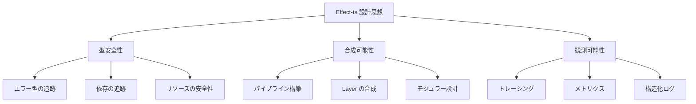
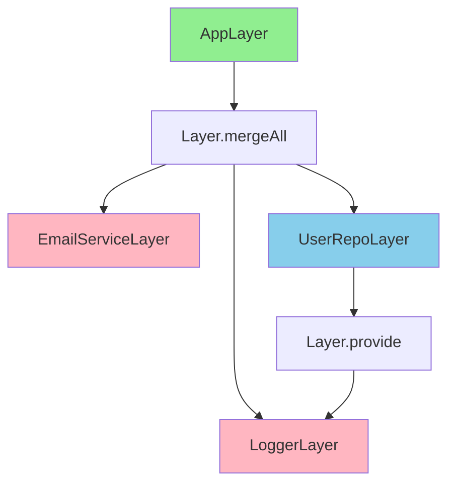
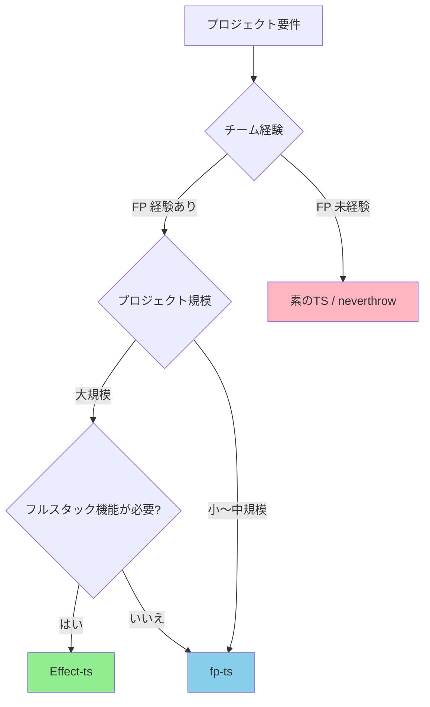

# Effect-ts 完全ガイド

> TypeScript のためのエフェクトシステム -- 依存性注入、エラー処理、並行処理を型レベルで管理する次世代フレームワーク

## この章で学ぶこと

1. **Effect の基本概念** -- `Effect<A, E, R>` 型の意味、基本的なパイプライン構築、実行方法
2. **エラー管理とサービス** -- 型付きエラー、Layer による DI、Resource 管理のパターン
3. **並行処理とストリーム** -- Fiber、Schedule、Stream を使った高度な非同期処理パターン
4. **プロダクション導入** -- 実践的な設計パターン、テスト戦略、パフォーマンス最適化

---

## 目次

1. [Effect-ts の設計思想](#1-effect-tsの設計思想)
2. [Effect<A, E, R> 型の基本](#2-effecta-e-r-型の基本)
3. [パイプラインとコンビネータ](#3-パイプラインとコンビネータ)
4. [型安全なエラーハンドリング](#4-型安全なエラーハンドリング)
5. [依存性注入 (Layer, Context, Service)](#5-依存性注入-layer-context-service)
6. [並行処理 (Fiber, Queue, Ref)](#6-並行処理-fiber-queue-ref)
7. [スケジューリングとリトライ](#7-スケジューリングとリトライ)
8. [Schema によるバリデーション](#8-schema-によるバリデーション)
9. [ストリーム処理 (Stream, Sink, Channel)](#9-ストリーム処理-stream-sink-channel)
10. [プロダクション導入事例](#10-プロダクション導入事例)
11. [fp-ts / Zod との比較](#11-fp-ts--zod-との比較)
12. [演習問題](#12-演習問題)
13. [アンチパターン](#13-アンチパターン)
14. [エッジケース分析](#14-エッジケース分析)
15. [FAQ](#15-faq)

---

## 1. Effect-ts の設計思想

### 1-1. エフェクトシステムとは何か

Effect-ts は **エフェクトシステム** (Effect System) を TypeScript に導入するフレームワークです。エフェクトシステムとは、プログラムの「副作用」を型として明示的に扱う仕組みです。

```
従来の TypeScript:

  function fetchUser(id: string): Promise<User>

  問題点:
  - どんなエラーが起こるか不明
  - どんな依存が必要か不明
  - 失敗時の処理が型に現れない

Effect-ts:

  function fetchUser(id: string): Effect<User, NotFoundError | DbError, UserRepo & Logger>

  メリット:
  - 成功時の型: User
  - 失敗時の型: NotFoundError | DbError
  - 必要な依存: UserRepo & Logger
  - 全てが型として追跡される
```

### 1-2. 設計思想の3本柱



#### (1) 型安全性 (Type Safety)

全ての副作用（エラー、依存、リソース）を型として表現します。

```typescript
import { Effect } from "effect";

// コンパイル時にエラー型が追跡される
const program: Effect.Effect<number, DivisionByZeroError> =
  divide(10, 0);

// エラーを処理しないとコンパイルエラー
const safe: Effect.Effect<number, never> = program.pipe(
  Effect.catchAll(() => Effect.succeed(0))
);
```

#### (2) 合成可能性 (Composability)

小さな Effect を組み合わせて大きな Effect を作ります。

```typescript
const saveUser = (user: User) =>
  Effect.gen(function* () {
    yield* validateUser(user);    // Effect<void, ValidationError, Validator>
    yield* storeInDb(user);        // Effect<void, DbError, Database>
    yield* sendEmail(user.email);  // Effect<void, EmailError, EmailService>
    yield* logEvent("user.created"); // Effect<void, never, Logger>
  });
// 型: Effect<void, ValidationError | DbError | EmailError, Validator & Database & EmailService & Logger>
```

#### (3) 観測可能性 (Observability)

実行時のトレーシング、メトリクス、ログが組み込まれています。

```typescript
const program = fetchUser("123").pipe(
  Effect.withSpan("fetchUser", { attributes: { userId: "123" } }),
  Effect.tap((user) => Effect.log(`Fetched user: ${user.name}`)),
  Effect.tapErrorCause((cause) => Effect.logError("Fetch failed", cause))
);
```

### 1-3. なぜ Effect-ts が必要か

| 課題 | 従来のアプローチ | Effect-ts の解決策 |
|------|-----------------|-------------------|
| エラー型の追跡 | try-catch (型情報なし) | `Effect<A, E, R>` の E パラメータ |
| 依存性注入 | コンストラクタ注入/DI コンテナ | Layer による宣言的 DI |
| リトライ/タイムアウト | 手動実装/ライブラリごとに異なる | Schedule による統一的な仕組み |
| リソース管理 | try-finally / AsyncDisposable | Scope による自動管理 |
| 並行処理 | Promise.all / 手動制御 | Fiber による構造化並行性 |
| テスタビリティ | モック/スタブの手動管理 | Layer の差し替えによる容易なテスト |

---

## 2. Effect<A, E, R> 型の基本

### 2-1. 3つの型パラメータの意味

```
Effect<A, E, R> の3つの型パラメータ:

  Effect<A, E, R>
          |  |  |
          |  |  +--- R: Requirements (必要な依存)
          |  +------ E: Error (起こりうるエラーの型)
          +--------- A: Success (成功時の値の型)

  具体例:
  Effect<User, NotFoundError | DbError, UserRepo & Logger>

  意味:
  - 成功すると User を返す
  - NotFoundError または DbError が発生しうる
  - 実行には UserRepo と Logger が必要
```

```typescript
import { Effect } from "effect";

// (1) 成功する Effect: Effect<A, never, never>
const succeed: Effect.Effect<number> = Effect.succeed(42);
//   型パラメータ: A=number, E=never (エラーなし), R=never (依存なし)

// (2) 失敗する Effect: Effect<never, E, never>
const fail: Effect.Effect<never, Error> = Effect.fail(new Error("boom"));
//   型パラメータ: A=never (成功しない), E=Error, R=never

// (3) 依存が必要な Effect: Effect<A, E, R>
interface Database {
  readonly query: (sql: string) => Promise<unknown>;
}

const queryDb: Effect.Effect<string, DbError, Database> =
  Effect.gen(function* () {
    const db = yield* Effect.context<Database>();
    // Database に依存している
    return "result";
  });
```

### 2-2. Effect の作成方法

#### (1) 値から作成

```typescript
import { Effect } from "effect";

// 成功値
const a = Effect.succeed(42);
// Effect<number, never, never>

// 失敗値
const b = Effect.fail("error");
// Effect<never, string, never>

// 遅延評価
const c = Effect.sync(() => {
  console.log("evaluated!");
  return 100;
});
// Effect<number, never, never>
// 実行されるまで console.log は呼ばれない

// void (Unit)
const d = Effect.void;
// Effect<void, never, never>
```

#### (2) Promise から作成

```typescript
import { Effect } from "effect";

// tryPromise: Promise<T> → Effect<T, UnknownException>
const e = Effect.tryPromise(() =>
  fetch("/api/data").then((r) => r.json())
);
// Effect<any, UnknownException, never>

// エラーを変換
class FetchError {
  readonly _tag = "FetchError";
  constructor(readonly cause: unknown) {}
}

const f = Effect.tryPromise({
  try: () => fetch("/api/data").then((r) => r.json()),
  catch: (error) => new FetchError(error),
});
// Effect<any, FetchError, never>
```

#### (3) 同期例外を捕捉

```typescript
import { Effect } from "effect";

// try: 例外を投げる可能性がある関数
const g = Effect.try(() => {
  const data = JSON.parse('{"invalid"}'); // SyntaxError が投げられる
  return data;
});
// Effect<unknown, UnknownException, never>

// catch でエラーを変換
class ParseError {
  readonly _tag = "ParseError";
  constructor(readonly input: string, readonly cause: unknown) {}
}

const h = Effect.try({
  try: () => JSON.parse('{"invalid"}'),
  catch: (error) => new ParseError('{"invalid"}', error),
});
// Effect<unknown, ParseError, never>
```

### 2-3. Effect の実行

```typescript
import { Effect } from "effect";

const program = Effect.succeed(42);

// (1) runSync: 同期的に実行（エラーは例外として投げられる）
const result1 = Effect.runSync(program);
// 42

// (2) runPromise: Promise として実行
const result2 = await Effect.runPromise(program);
// 42

// (3) runPromiseExit: Exit 型で実行（エラーも安全に取得）
const exit = await Effect.runPromiseExit(program);
if (exit._tag === "Success") {
  console.log(exit.value); // 42
} else {
  console.error(exit.cause);
}

// (4) runFork: Fiber として実行（バックグラウンド）
const fiber = Effect.runFork(program);
const result3 = await fiber.await();
```

### 2-4. Effect の実行関数比較表

| 関数 | 戻り値 | エラー時 | 用途 | 注意点 |
|------|--------|---------|------|--------|
| `runSync` | `A` | throw | 同期 Effect の実行 | 非同期 Effect には使えない |
| `runPromise` | `Promise<A>` | reject | 非同期 Effect の実行 | エラーが reject される |
| `runPromiseExit` | `Promise<Exit<A, E>>` | 安全 | エラーハンドリング必須 | 最も安全 |
| `runFork` | `RuntimeFiber<A, E>` | Fiber に格納 | バックグラウンド実行 | await で結果取得 |
| `runCallback` | `void` | コールバック | イベントドリブン | レガシーコードとの統合 |

---

## 3. パイプラインとコンビネータ

### 3-1. pipe によるパイプライン構築

```
Effect パイプライン:

  Effect.succeed(42)
       |
  .pipe(Effect.map(n => n * 2))        → Effect<84>
       |
  .pipe(Effect.flatMap(n => ...))      → Effect<string, Error>
       |
  .pipe(Effect.catchTag("NotFound",    → エラーを回復
        () => Effect.succeed("default")))
       |
  .pipe(Effect.tap(v =>                → 副作用（値は変わらない）
        Effect.log(`value: ${v}`)))
       |
  Effect.runPromise(...)               → Promise<string>
```

```typescript
import { Effect, pipe } from "effect";

// pipe 関数を使ったパイプライン
const program = pipe(
  Effect.succeed(10),
  Effect.map((n) => n * 2),           // 20
  Effect.flatMap((n) =>
    n > 15
      ? Effect.succeed(`Large: ${n}`)
      : Effect.fail(new Error("Too small"))
  ),
  Effect.tap((value) =>
    Effect.log(`Result: ${value}`)
  )
);

// メソッドチェーンスタイル（同じ意味）
const program2 = Effect.succeed(10).pipe(
  Effect.map((n) => n * 2),
  Effect.flatMap((n) =>
    n > 15
      ? Effect.succeed(`Large: ${n}`)
      : Effect.fail(new Error("Too small"))
  ),
  Effect.tap((value) => Effect.log(`Result: ${value}`))
);

// 実行
const result = await Effect.runPromise(program);
// "Large: 20"
```

### 3-2. 主要なコンビネータ

#### (1) map: 値の変換

```typescript
import { Effect } from "effect";

const program = Effect.succeed(42).pipe(
  Effect.map((n) => n * 2),
  Effect.map((n) => `Result: ${n}`)
);
// Effect<string, never, never>
// 実行結果: "Result: 84"
```

#### (2) flatMap: Effect を返す変換

```typescript
import { Effect } from "effect";

const divide = (a: number, b: number): Effect.Effect<number, string> =>
  b === 0
    ? Effect.fail("Division by zero")
    : Effect.succeed(a / b);

const program = Effect.succeed(10).pipe(
  Effect.flatMap((n) => divide(n, 2)),  // 5
  Effect.flatMap((n) => divide(n, 0))   // エラー
);
// Effect<number, string, never>
```

#### (3) tap: 副作用の挿入（値は変わらない）

```typescript
import { Effect } from "effect";

const program = Effect.succeed(42).pipe(
  Effect.tap((n) => Effect.log(`Value is ${n}`)), // ログを出すが値は変わらない
  Effect.map((n) => n * 2)
);
// Effect<number, never, never>
// 実行結果: 84 (ログ: "Value is 42")
```

#### (4) zipWith: 2つの Effect を合成

```typescript
import { Effect } from "effect";

const a = Effect.succeed(10);
const b = Effect.succeed(20);

const sum = Effect.zipWith(a, b, (x, y) => x + y);
// Effect<number, never, never>
// 実行結果: 30
```

#### (5) filterOrFail: 条件を満たさない場合は失敗

```typescript
import { Effect } from "effect";

const program = Effect.succeed(42).pipe(
  Effect.filterOrFail(
    (n) => n > 50,
    () => new Error("Value too small")
  )
);
// Effect<number, Error, never>
// 実行するとエラー
```

### 3-3. Effect.gen による Generator 構文

`Effect.gen` を使うと、`yield*` で Effect の値を取り出し、同期的なスタイルで書けます。

```typescript
import { Effect } from "effect";

// pipe スタイル
const program1 = pipe(
  Effect.succeed(10),
  Effect.flatMap((a) =>
    pipe(
      Effect.succeed(20),
      Effect.map((b) => a + b)
    )
  )
);

// Effect.gen スタイル（同じ意味）
const program2 = Effect.gen(function* () {
  const a = yield* Effect.succeed(10);
  const b = yield* Effect.succeed(20);
  return a + b;
});
```

#### Effect.gen の詳細な例

```typescript
import { Effect, Data } from "effect";

class NotFoundError extends Data.TaggedError("NotFoundError")<{
  readonly id: string;
}> {}

class PermissionError extends Data.TaggedError("PermissionError")<{
  readonly action: string;
}> {}

interface User {
  id: string;
  name: string;
  role: "ADMIN" | "USER";
}

const findUser = (id: string): Effect.Effect<User, NotFoundError> =>
  id === "123"
    ? Effect.succeed({ id, name: "Alice", role: "ADMIN" })
    : Effect.fail(new NotFoundError({ id }));

const fetchPosts = (userId: string): Effect.Effect<string[]> =>
  Effect.succeed([`post1-${userId}`, `post2-${userId}`]);

const fetchComments = (userId: string): Effect.Effect<string[]> =>
  Effect.succeed([`comment1-${userId}`]);

// Effect.gen で同期的に書く
const program = Effect.gen(function* () {
  // yield* で Effect の値を取り出す
  const user = yield* findUser("123");

  // 通常の if 文が使える
  if (user.role !== "ADMIN") {
    yield* Effect.fail(
      new PermissionError({ action: "delete" })
    );
  }

  // 並列実行
  const [posts, comments] = yield* Effect.all(
    [fetchPosts(user.id), fetchComments(user.id)],
    { concurrency: 2 }
  );

  // ログ
  yield* Effect.log(`User ${user.name} has ${posts.length} posts`);

  return { user, posts, comments };
});
```

---

## 4. 型安全なエラーハンドリング

### 4-1. 型付きエラーの定義

Effect-ts では、エラーを **判別可能な型** として定義します。

```typescript
import { Data } from "effect";

// Data.TaggedError を使うと _tag フィールドが自動的に追加される
class NotFoundError extends Data.TaggedError("NotFoundError")<{
  readonly resource: string;
  readonly id: string;
}> {}

class ValidationError extends Data.TaggedError("ValidationError")<{
  readonly message: string;
  readonly fields: readonly string[];
}> {}

class DatabaseError extends Data.TaggedError("DatabaseError")<{
  readonly cause: unknown;
}> {}

class NetworkError extends Data.TaggedError("NetworkError")<{
  readonly url: string;
  readonly statusCode: number;
}> {}

// 使用例
const error1 = new NotFoundError({ resource: "User", id: "123" });
console.log(error1._tag); // "NotFoundError"

const error2 = new ValidationError({
  message: "Invalid email",
  fields: ["email"],
});
console.log(error2._tag); // "ValidationError"
```

### 4-2. エラーを返す Effect

```typescript
import { Effect, pipe, Data } from "effect";

class NotFoundError extends Data.TaggedError("NotFoundError")<{
  readonly resource: string;
  readonly id: string;
}> {}

class DatabaseError extends Data.TaggedError("DatabaseError")<{
  readonly cause: unknown;
}> {}

interface User {
  id: string;
  name: string;
}

interface Database {
  findById: (id: string) => Promise<User | null>;
}

// エラーを返す Effect
function findUser(
  id: string
): Effect.Effect<User, NotFoundError | DatabaseError, Database> {
  return Effect.gen(function* () {
    const db = yield* Effect.context<Database>();

    // Promise を Effect に変換
    const user = yield* Effect.tryPromise({
      try: () => db.findById(id),
      catch: (cause) => new DatabaseError({ cause }),
    });

    // null の場合は NotFoundError
    if (user === null) {
      yield* Effect.fail(new NotFoundError({ resource: "User", id }));
    }

    return user;
  });
}
// 型: Effect<User, NotFoundError | DatabaseError, Database>
```

### 4-3. エラーハンドリングのパターン

#### (1) catchAll: 全てのエラーを処理

```typescript
import { Effect } from "effect";

const program = findUser("123").pipe(
  Effect.catchAll((error) => {
    console.error("Error:", error);
    return Effect.succeed(null); // デフォルト値を返す
  })
);
// 型: Effect<User | null, never, Database>
```

#### (2) catchTag: 特定のエラータグだけ処理

```typescript
import { Effect } from "effect";

const userOrDefault = findUser("123").pipe(
  Effect.catchTag("NotFoundError", (error) =>
    Effect.succeed({ id: error.id, name: "Guest" } as User)
  )
  // DatabaseError はそのまま伝播
);
// 型: Effect<User, DatabaseError, Database>
```

#### (3) catchTags: 複数のエラータグを処理

```typescript
import { Effect } from "effect";

const resilient = findUser("123").pipe(
  Effect.catchTags({
    NotFoundError: (error) =>
      Effect.succeed({ id: error.id, name: "Guest" } as User),
    DatabaseError: (error) => {
      console.error("DB Error:", error.cause);
      return Effect.fail(new Error("Service unavailable"));
    },
  })
);
// 型: Effect<User, Error, Database>
```

#### (4) catchSome: 条件付きエラーハンドリング

```typescript
import { Effect, Option } from "effect";

const program = findUser("123").pipe(
  Effect.catchSome((error) => {
    if (error._tag === "NotFoundError" && error.id === "123") {
      return Option.some(Effect.succeed({ id: "123", name: "Default" } as User));
    }
    return Option.none(); // エラーを伝播
  })
);
```

#### (5) orElse: 失敗時に別の Effect を試す

```typescript
import { Effect } from "effect";

const program = findUser("123").pipe(
  Effect.orElse(() => findUser("456")), // 失敗したら別のユーザーを探す
  Effect.orElse(() => Effect.succeed({ id: "default", name: "Guest" } as User))
);
```

### 4-4. エラーハンドリング比較表

| パターン | 使用例 | エラー型の変化 |
|---------|--------|---------------|
| `catchAll` | 全てのエラーを処理 | `Effect<A, E, R>` → `Effect<A \| B, never, R>` |
| `catchTag` | 特定のタグのみ処理 | `Effect<A, E1 \| E2, R>` → `Effect<A, E2, R>` |
| `catchTags` | 複数タグを処理 | `Effect<A, E1 \| E2 \| E3, R>` → `Effect<A, E3, R>` |
| `catchSome` | 条件付き処理 | `Effect<A, E, R>` → `Effect<A, E, R>` (一部のみ処理) |
| `orElse` | 別の Effect にフォールバック | `Effect<A, E, R>` → `Effect<A, E2, R>` |

---

## 5. 依存性注入 (Layer, Context, Service)

### 5-1. サービスの定義

```
Layer アーキテクチャ:

  +---------------------+
  | Application Layer   |  Effect<A, E, UserRepo & Logger>
  +---------------------+
           |
           | requires
           v
  +---------------------+
  | Service Layer       |  Layer<UserRepo & Logger>
  +---------------------+
       |           |
       v           v
  +----------+ +---------+
  | UserRepo | | Logger  |  具体的な実装
  +----------+ +---------+
       |
       v
  +----------+
  | Database |  さらに下位の依存
  +----------+
```

```typescript
import { Effect, Context, Layer, Data } from "effect";

// エラー定義
class DatabaseError extends Data.TaggedError("DatabaseError")<{
  readonly cause: unknown;
}> {}

class EmailError extends Data.TaggedError("EmailError")<{
  readonly cause: unknown;
}> {}

interface User {
  id: string;
  name: string;
  email: string;
  createdAt: Date;
}

// サービスインターフェースの定義
class UserRepository extends Context.Tag("UserRepository")<
  UserRepository,
  {
    readonly findById: (id: string) => Effect.Effect<User | null, DatabaseError>;
    readonly save: (user: User) => Effect.Effect<void, DatabaseError>;
    readonly delete: (id: string) => Effect.Effect<void, DatabaseError>;
  }
>() {}

class EmailService extends Context.Tag("EmailService")<
  EmailService,
  {
    readonly send: (
      to: string,
      subject: string,
      body: string
    ) => Effect.Effect<void, EmailError>;
  }
>() {}

class Logger extends Context.Tag("Logger")<
  Logger,
  {
    readonly info: (message: string) => Effect.Effect<void>;
    readonly error: (message: string, cause?: unknown) => Effect.Effect<void>;
  }
>() {}
```

### 5-2. サービスの使用

```typescript
import { Effect } from "effect";

class ValidationError extends Data.TaggedError("ValidationError")<{
  readonly message: string;
}> {}

interface CreateUserDto {
  name: string;
  email: string;
}

// サービスを使う関数
function createUser(
  data: CreateUserDto
): Effect.Effect<
  User,
  ValidationError | DatabaseError | EmailError,
  UserRepository & EmailService & Logger
> {
  return Effect.gen(function* () {
    // サービスを取得
    const userRepo = yield* UserRepository;
    const emailService = yield* EmailService;
    const logger = yield* Logger;

    // バリデーション
    if (!data.email.includes("@")) {
      yield* Effect.fail(new ValidationError({ message: "Invalid email" }));
    }

    // ログ
    yield* logger.info(`Creating user: ${data.email}`);

    // ユーザー作成
    const user: User = {
      id: crypto.randomUUID(),
      name: data.name,
      email: data.email,
      createdAt: new Date(),
    };

    // DB に保存
    yield* userRepo.save(user);

    // メール送信
    yield* emailService.send(user.email, "Welcome!", `Hello ${user.name}`);

    // ログ
    yield* logger.info(`User created: ${user.id}`);

    return user;
  });
}
```

### 5-3. Layer の実装

```typescript
import { Effect, Layer } from "effect";

// (1) Logger の実装
const ConsoleLoggerLive = Layer.succeed(Logger, {
  info: (message) => Effect.log(`[INFO] ${message}`),
  error: (message, cause) =>
    Effect.logError(`[ERROR] ${message}`, cause),
});

// (2) EmailService の実装
const ConsoleEmailServiceLive = Layer.succeed(EmailService, {
  send: (to, subject, body) =>
    Effect.sync(() => {
      console.log(`Email to ${to}: ${subject}`);
      console.log(body);
    }),
});

// (3) UserRepository の実装（他のサービスに依存）
const InMemoryUserRepoLive = Layer.effect(
  UserRepository,
  Effect.gen(function* () {
    const logger = yield* Logger;
    const users = new Map<string, User>();

    return {
      findById: (id) =>
        Effect.sync(() => users.get(id) ?? null),

      save: (user) =>
        Effect.gen(function* () {
          users.set(user.id, user);
          yield* logger.info(`Saved user: ${user.id}`);
        }),

      delete: (id) =>
        Effect.gen(function* () {
          users.delete(id);
          yield* logger.info(`Deleted user: ${id}`);
        }),
    };
  })
);

// Layer の合成
const AppLayerLive = Layer.mergeAll(
  ConsoleLoggerLive,
  ConsoleEmailServiceLive,
  InMemoryUserRepoLive.pipe(
    Layer.provide(ConsoleLoggerLive) // UserRepo は Logger に依存
  )
);

// 実行
const program = createUser({ name: "Alice", email: "alice@example.com" });
const result = await Effect.runPromise(
  program.pipe(Effect.provide(AppLayerLive))
);
```

### 5-4. テスト用 Layer

```typescript
import { Layer } from "effect";

// テスト用の Mock Layer
const MockUserRepoLive = Layer.succeed(UserRepository, {
  findById: (id) =>
    Effect.succeed({
      id,
      name: "Test User",
      email: "test@example.com",
      createdAt: new Date(),
    }),
  save: () => Effect.void,
  delete: () => Effect.void,
});

const MockEmailServiceLive = Layer.succeed(EmailService, {
  send: () => Effect.void, // メール送信しない
});

const TestLayerLive = Layer.mergeAll(
  ConsoleLoggerLive,
  MockEmailServiceLive,
  MockUserRepoLive.pipe(Layer.provide(ConsoleLoggerLive))
);

// テストでは TestLayer を使用
const testResult = await Effect.runPromise(
  createUser({ name: "Bob", email: "bob@test.com" }).pipe(
    Effect.provide(TestLayerLive)
  )
);
```

### 5-5. Layer の合成パターン



| パターン | メソッド | 説明 |
|---------|---------|------|
| 並列合成 | `Layer.mergeAll(a, b, c)` | 複数の Layer を並列に合成 |
| 依存提供 | `layer.pipe(Layer.provide(dep))` | Layer に依存を注入 |
| 条件分岐 | 環境変数で分岐 | 本番/テストで異なる Layer を使用 |

---

## 6. 並行処理 (Fiber, Queue, Ref)

### 6-1. 基本的な並行パターン

```typescript
import { Effect } from "effect";

const fetchUser = (id: string): Effect.Effect<User> =>
  Effect.succeed({ id, name: `User ${id}`, email: `${id}@example.com`, createdAt: new Date() });

// (1) 並列実行（制限なし）
const allUsers = Effect.all(
  [fetchUser("1"), fetchUser("2"), fetchUser("3")],
  { concurrency: "unbounded" }
);
// 型: Effect<[User, User, User], never, never>

// (2) 制限付き並列実行
const urls = ["url1", "url2", "url3", "url4", "url5"];
const limited = Effect.all(
  urls.map((url) => Effect.succeed(url)),
  { concurrency: 2 } // 最大2並列
);

// (3) 最初に成功した結果を使用
const fastest = Effect.raceAll([
  Effect.succeed("CDN1"),
  Effect.succeed("CDN2"),
  Effect.succeed("CDN3"),
]);

// (4) forEach: 配列の各要素に Effect を適用
const userIds = ["1", "2", "3", "4", "5"];
const results = Effect.forEach(
  userIds,
  (id) => fetchUser(id),
  { concurrency: 3 }
);
```

### 6-2. Fiber による並行処理

```typescript
import { Effect, Fiber } from "effect";

// Fiber: 軽量スレッドのようなもの
const program = Effect.gen(function* () {
  // バックグラウンドで実行
  const fiber1 = yield* Effect.fork(
    Effect.gen(function* () {
      yield* Effect.sleep("1 second");
      return "Result 1";
    })
  );

  const fiber2 = yield* Effect.fork(
    Effect.gen(function* () {
      yield* Effect.sleep("500 millis");
      return "Result 2";
    })
  );

  // 他の処理
  yield* Effect.log("Doing other work...");

  // Fiber の結果を待つ
  const result1 = yield* Fiber.join(fiber1);
  const result2 = yield* Fiber.join(fiber2);

  return [result1, result2];
});
```

### 6-3. Fiber の制御

```typescript
import { Effect, Fiber } from "effect";

const program = Effect.gen(function* () {
  const fiber = yield* Effect.fork(
    Effect.gen(function* () {
      yield* Effect.sleep("10 seconds");
      return "Long running task";
    })
  );

  // 500ms 待つ
  yield* Effect.sleep("500 millis");

  // Fiber を中断
  yield* Fiber.interrupt(fiber);

  // 中断されたかチェック
  const result = yield* Fiber.await(fiber);
  if (result._tag === "Failure") {
    yield* Effect.log("Fiber was interrupted");
  }
});
```

### 6-4. Ref: 共有可変状態

```typescript
import { Effect, Ref } from "effect";

const program = Effect.gen(function* () {
  // Ref の作成
  const counter = yield* Ref.make(0);

  // 値を取得
  const value1 = yield* Ref.get(counter);
  console.log(value1); // 0

  // 値を設定
  yield* Ref.set(counter, 10);

  // 値を更新
  yield* Ref.update(counter, (n) => n + 5);

  // アトミックな更新と取得
  const oldValue = yield* Ref.getAndUpdate(counter, (n) => n * 2);
  console.log(oldValue); // 15

  const newValue = yield* Ref.get(counter);
  console.log(newValue); // 30
});
```

### 6-5. Queue: 並行キュー

```typescript
import { Effect, Queue } from "effect";

const program = Effect.gen(function* () {
  // キューの作成（容量100）
  const queue = yield* Queue.bounded<string>(100);

  // プロデューサー
  const producer = Effect.gen(function* () {
    for (let i = 0; i < 10; i++) {
      yield* Queue.offer(queue, `Item ${i}`);
      yield* Effect.sleep("100 millis");
    }
  });

  // コンシューマー
  const consumer = Effect.gen(function* () {
    for (let i = 0; i < 10; i++) {
      const item = yield* Queue.take(queue);
      yield* Effect.log(`Consumed: ${item}`);
    }
  });

  // 並列実行
  yield* Effect.all([producer, consumer], { concurrency: 2 });
});
```

### 6-6. 並行処理パターン比較表

| パターン | 用途 | コード例 |
|---------|------|---------|
| `Effect.all` | 複数の Effect を並列実行 | `Effect.all([a, b, c], { concurrency: 3 })` |
| `Effect.race` | 最初に完了した Effect を使用 | `Effect.race(a, b)` |
| `Effect.fork` | バックグラウンドで実行 | `yield* Effect.fork(longTask)` |
| `Fiber.join` | Fiber の結果を待つ | `yield* Fiber.join(fiber)` |
| `Ref` | 共有可変状態 | `yield* Ref.update(counter, n => n + 1)` |
| `Queue` | プロデューサー/コンシューマー | `yield* Queue.offer(queue, item)` |

---

## 7. スケジューリングとリトライ

### 7-1. Schedule の基本

```typescript
import { Effect, Schedule } from "effect";

// (1) 固定間隔
const everySecond = Schedule.fixed("1 second");

// (2) 指数バックオフ
const exponential = Schedule.exponential("100 millis");
// 100ms, 200ms, 400ms, 800ms, ...

// (3) 回数制限
const maxRetries = Schedule.recurs(5); // 最大5回

// (4) 合成
const policy = Schedule.exponential("100 millis").pipe(
  Schedule.compose(Schedule.recurs(5)),
  Schedule.jittered // ランダムなジッターを追加
);
```

### 7-2. リトライ戦略

```typescript
import { Effect, Schedule } from "effect";

class NetworkError extends Data.TaggedError("NetworkError")<{
  readonly url: string;
}> {}

const fetchData = (url: string): Effect.Effect<string, NetworkError> =>
  Effect.fail(new NetworkError({ url })); // 常に失敗する例

// (1) 基本的なリトライ
const retried = fetchData("https://api.example.com").pipe(
  Effect.retry(Schedule.recurs(3)) // 最大3回リトライ
);

// (2) 指数バックオフでリトライ
const retryPolicy = Schedule.exponential("100 millis").pipe(
  Schedule.compose(Schedule.recurs(5)),
  Schedule.jittered
);

const resilient = fetchData("https://api.example.com").pipe(
  Effect.retry(retryPolicy)
);

// (3) タイムアウト付き
const withTimeout = fetchData("https://api.example.com").pipe(
  Effect.timeout("5 seconds")
);

// (4) リトライ + タイムアウト
const robust = fetchData("https://api.example.com").pipe(
  Effect.timeout("3 seconds"),
  Effect.retry(
    Schedule.exponential("200 millis").pipe(
      Schedule.compose(Schedule.recurs(3))
    )
  )
);
```

### 7-3. 条件付きリトライ

```typescript
import { Effect, Schedule } from "effect";

class TransientError extends Data.TaggedError("TransientError")<{
  readonly cause: unknown;
}> {}

class PermanentError extends Data.TaggedError("PermanentError")<{
  readonly cause: unknown;
}> {}

const task: Effect.Effect<string, TransientError | PermanentError> =
  Effect.fail(new TransientError({ cause: "Network issue" }));

// TransientError のみリトライ
const selective = task.pipe(
  Effect.retry({
    schedule: Schedule.recurs(3),
    while: (error) => error._tag === "TransientError",
  })
);
```

### 7-4. repeat: 繰り返し実行

```typescript
import { Effect, Schedule } from "effect";

// (1) 10回繰り返す
const repeated = Effect.log("Hello").pipe(
  Effect.repeat(Schedule.recurs(10))
);

// (2) 1秒ごとに無限に繰り返す
const polling = Effect.gen(function* () {
  const data = yield* fetchData("https://api.example.com/status");
  yield* Effect.log(`Status: ${data}`);
}).pipe(
  Effect.repeat(Schedule.fixed("1 second"))
);

// (3) 条件を満たすまで繰り返す
const untilCondition = Effect.sync(() => Math.random()).pipe(
  Effect.repeat({
    schedule: Schedule.spaced("100 millis"),
    until: (value) => value > 0.9, // 0.9 以上になるまで
  })
);
```

### 7-5. Schedule パターン比較表

| Schedule | 説明 | 用途 |
|----------|------|------|
| `fixed(duration)` | 固定間隔 | 定期実行、ポーリング |
| `exponential(base)` | 指数バックオフ | リトライ、レート制限回避 |
| `recurs(n)` | n回まで | リトライ回数制限 |
| `spaced(duration)` | 固定間隔 + 初回即座 | ポーリング |
| `jittered` | ランダムなジッター追加 | サンダリングハード問題の回避 |

---

## 8. Schema によるバリデーション

Effect-ts は `@effect/schema` (現在は `effect` パッケージに統合) による強力なバリデーション機能を提供します。

### 8-1. Schema の基本

```typescript
import { Schema } from "effect";

// (1) プリミティブ型
const StringSchema = Schema.String;
const NumberSchema = Schema.Number;
const BooleanSchema = Schema.Boolean;

// (2) リテラル型
const RoleSchema = Schema.Literal("ADMIN", "USER", "GUEST");

// (3) オブジェクト
const UserSchema = Schema.Struct({
  id: Schema.String,
  name: Schema.String,
  email: Schema.String,
  age: Schema.Number,
  role: RoleSchema,
});

// (4) 配列
const UsersSchema = Schema.Array(UserSchema);

// (5) オプショナル
const UserWithOptionalAgeSchema = Schema.Struct({
  id: Schema.String,
  name: Schema.String,
  email: Schema.String,
  age: Schema.optional(Schema.Number),
  role: RoleSchema,
});
```

### 8-2. バリデーション実行

```typescript
import { Schema, Effect } from "effect";

const UserSchema = Schema.Struct({
  id: Schema.String,
  name: Schema.String,
  email: Schema.String.pipe(Schema.pattern(/^[^\s@]+@[^\s@]+\.[^\s@]+$/)),
  age: Schema.Number.pipe(Schema.greaterThanOrEqualTo(0)),
});

// unknown → User の変換
const parse = Schema.decodeUnknown(UserSchema);

const validData = {
  id: "123",
  name: "Alice",
  email: "alice@example.com",
  age: 25,
};

const program = Effect.gen(function* () {
  // バリデーション成功
  const user = yield* parse(validData);
  console.log(user); // { id: "123", name: "Alice", ... }

  // バリデーション失敗
  const invalidData = { id: "456", name: "Bob", email: "invalid", age: -5 };
  const result = yield* Effect.either(parse(invalidData));

  if (result._tag === "Left") {
    console.error("Validation failed:", result.left);
  }
});
```

### 8-3. カスタムバリデーション

```typescript
import { Schema } from "effect";

// (1) カスタム制約
const PositiveNumber = Schema.Number.pipe(
  Schema.filter((n) => n > 0, { message: () => "Must be positive" })
);

// (2) Transform
const TrimmedString = Schema.String.pipe(
  Schema.transform(
    Schema.String,
    {
      decode: (s) => s.trim(),
      encode: (s) => s,
    }
  )
);

// (3) カスタム型
const EmailSchema = Schema.String.pipe(
  Schema.pattern(/^[^\s@]+@[^\s@]+\.[^\s@]+$/),
  Schema.brand("Email")
);

type Email = Schema.Schema.Type<typeof EmailSchema>;

// (4) 複雑なバリデーション
const PasswordSchema = Schema.String.pipe(
  Schema.minLength(8),
  Schema.filter(
    (s) => /[A-Z]/.test(s) && /[a-z]/.test(s) && /[0-9]/.test(s),
    { message: () => "Must contain uppercase, lowercase, and digit" }
  )
);
```

### 8-4. API リクエストのバリデーション

```typescript
import { Schema, Effect, Data } from "effect";

class ValidationError extends Data.TaggedError("ValidationError")<{
  readonly errors: ReadonlyArray<string>;
}> {}

const CreateUserRequestSchema = Schema.Struct({
  name: Schema.String.pipe(Schema.minLength(1)),
  email: Schema.String.pipe(Schema.pattern(/^[^\s@]+@[^\s@]+\.[^\s@]+$/)),
  age: Schema.Number.pipe(
    Schema.greaterThanOrEqualTo(0),
    Schema.lessThanOrEqualTo(150)
  ),
});

type CreateUserRequest = Schema.Schema.Type<typeof CreateUserRequestSchema>;

const validateRequest = (
  data: unknown
): Effect.Effect<CreateUserRequest, ValidationError> => {
  const decode = Schema.decodeUnknown(CreateUserRequestSchema);

  return decode(data).pipe(
    Effect.mapError((error) =>
      new ValidationError({
        errors: [String(error)],
      })
    )
  );
};

// 使用例
const handleRequest = (body: unknown) =>
  Effect.gen(function* () {
    const request = yield* validateRequest(body);

    // request は型安全に使える
    const user = yield* createUser(request);

    return user;
  });
```

### 8-5. Schema vs Zod 比較表

| 特性 | @effect/schema | Zod |
|------|---------------|-----|
| Effect 統合 | ネイティブ | 手動変換が必要 |
| エラー型 | Effect エラーとして追跡 | ZodError (例外) |
| パフォーマンス | 最適化されたデコード | 標準的 |
| Transform | 双方向 (encode/decode) | 一方向のみ |
| バンドルサイズ | Effect に含まれる | ~8KB |

---

## 9. ストリーム処理 (Stream, Sink, Channel)

### 9-1. Stream の基本

```typescript
import { Stream, Effect } from "effect";

// (1) Stream の作成
const stream1 = Stream.make(1, 2, 3, 4, 5);

const stream2 = Stream.range(1, 10); // 1, 2, ..., 9

const stream3 = Stream.fromIterable([1, 2, 3]);

// (2) Stream の操作
const doubled = stream1.pipe(
  Stream.map((n) => n * 2)
);

const filtered = stream1.pipe(
  Stream.filter((n) => n % 2 === 0)
);

// (3) Stream の実行
const program = Stream.runCollect(doubled);
// Effect<Chunk<number>, never, never>

const result = await Effect.runPromise(program);
// Chunk([2, 4, 6, 8, 10])
```

### 9-2. 非同期ストリーム

```typescript
import { Stream, Effect, Schedule } from "effect";

// (1) Effect から Stream を作成
const fetchStream = Stream.repeatEffect(
  Effect.gen(function* () {
    const response = yield* Effect.tryPromise({
      try: () => fetch("https://api.example.com/data"),
      catch: (error) => new Error(String(error)),
    });
    const data = yield* Effect.tryPromise({
      try: () => response.json(),
      catch: (error) => new Error(String(error)),
    });
    return data;
  })
);

// (2) 定期実行
const pollingStream = Stream.repeatEffectWithSchedule(
  Effect.sync(() => new Date().toISOString()),
  Schedule.fixed("1 second")
);

// (3) ファイルの行ごと処理
const fileStream = Stream.fromIterable(["line1", "line2", "line3"]);

const processed = fileStream.pipe(
  Stream.map((line) => line.toUpperCase()),
  Stream.filter((line) => line.length > 5)
);
```

### 9-3. Stream の合成

```typescript
import { Stream, Effect } from "effect";

const stream1 = Stream.make(1, 2, 3);
const stream2 = Stream.make(4, 5, 6);

// (1) 連結
const concatenated = Stream.concat(stream1, stream2);
// 1, 2, 3, 4, 5, 6

// (2) Merge
const merged = Stream.merge(stream1, stream2);
// 順序は保証されない

// (3) Zip
const zipped = Stream.zip(stream1, stream2);
// [1, 4], [2, 5], [3, 6]

// (4) flatMap
const flattened = stream1.pipe(
  Stream.flatMap((n) => Stream.make(n, n * 10))
);
// 1, 10, 2, 20, 3, 30
```

### 9-4. Sink: Stream の終端処理

```typescript
import { Stream, Sink, Effect } from "effect";

const stream = Stream.make(1, 2, 3, 4, 5);

// (1) 合計
const sum = Stream.run(stream, Sink.sum);
// Effect<number, never, never> → 15

// (2) 配列に収集
const collect = Stream.run(stream, Sink.collectAll());
// Effect<Chunk<number>, never, never>

// (3) 最初のn個
const takeFirst = Stream.run(stream, Sink.take(3));
// Effect<Chunk<number>, never, never> → [1, 2, 3]

// (4) カスタム Sink
const customSink = Sink.foldLeft(0, (acc, n: number) => acc + n * 2);
const result = Stream.run(stream, customSink);
// 2 + 4 + 6 + 8 + 10 = 30
```

### 9-5. 実践例: ログファイルのストリーム処理

```typescript
import { Stream, Effect, pipe } from "effect";

interface LogEntry {
  timestamp: string;
  level: "INFO" | "WARN" | "ERROR";
  message: string;
}

const parseLogLine = (line: string): Effect.Effect<LogEntry, Error> =>
  Effect.try({
    try: () => {
      const [timestamp, level, message] = line.split(" | ");
      return {
        timestamp,
        level: level as "INFO" | "WARN" | "ERROR",
        message,
      };
    },
    catch: (error) => new Error(`Parse failed: ${error}`),
  });

const processLogFile = (lines: string[]) =>
  pipe(
    Stream.fromIterable(lines),
    Stream.mapEffect((line) => parseLogLine(line)),
    Stream.filter((entry) => entry.level === "ERROR"),
    Stream.take(100), // 最初の100件のエラーのみ
    Stream.runCollect
  );

// 使用例
const lines = [
  "2024-01-01T00:00:00Z | INFO | Server started",
  "2024-01-01T00:01:00Z | ERROR | Connection failed",
  "2024-01-01T00:02:00Z | WARN | High memory usage",
];

const program = processLogFile(lines);
const errors = await Effect.runPromise(program);
```

### 9-6. Stream パターン比較表

| パターン | 用途 | コード例 |
|---------|------|---------|
| `Stream.make` | 静的ストリーム作成 | `Stream.make(1, 2, 3)` |
| `Stream.repeatEffect` | Effect を繰り返す | `Stream.repeatEffect(fetchData)` |
| `Stream.map` | 要素の変換 | `stream.pipe(Stream.map(n => n * 2))` |
| `Stream.filter` | 要素のフィルタ | `stream.pipe(Stream.filter(n => n > 0))` |
| `Stream.flatMap` | ネストしたストリームの平坦化 | `stream.pipe(Stream.flatMap(n => ...))` |
| `Stream.take` | 最初のn個 | `stream.pipe(Stream.take(10))` |

---

## 10. プロダクション導入事例

### 10-1. API サーバーの例

```typescript
import { Effect, Layer, Context, Data } from "effect";
import { Schema } from "effect";

// エラー定義
class ValidationError extends Data.TaggedError("ValidationError")<{
  readonly errors: ReadonlyArray<string>;
}> {}

class DatabaseError extends Data.TaggedError("DatabaseError")<{
  readonly cause: unknown;
}> {}

class NotFoundError extends Data.TaggedError("NotFoundError")<{
  readonly resource: string;
  readonly id: string;
}> {}

// スキーマ定義
const UserSchema = Schema.Struct({
  id: Schema.String,
  name: Schema.String,
  email: Schema.String.pipe(Schema.pattern(/^[^\s@]+@[^\s@]+\.[^\s@]+$/)),
  createdAt: Schema.Date,
});

const CreateUserRequestSchema = Schema.Struct({
  name: Schema.String.pipe(Schema.minLength(1)),
  email: Schema.String.pipe(Schema.pattern(/^[^\s@]+@[^\s@]+\.[^\s@]+$/)),
});

type User = Schema.Schema.Type<typeof UserSchema>;
type CreateUserRequest = Schema.Schema.Type<typeof CreateUserRequestSchema>;

// サービス定義
class Database extends Context.Tag("Database")<
  Database,
  {
    readonly query: <A>(sql: string, params: unknown[]) => Effect.Effect<A, DatabaseError>;
  }
>() {}

class Logger extends Context.Tag("Logger")<
  Logger,
  {
    readonly info: (message: string) => Effect.Effect<void>;
    readonly error: (message: string, error: unknown) => Effect.Effect<void>;
  }
>() {}

// ビジネスロジック
const createUser = (
  request: CreateUserRequest
): Effect.Effect<User, ValidationError | DatabaseError, Database & Logger> =>
  Effect.gen(function* () {
    const db = yield* Database;
    const logger = yield* Logger;

    yield* logger.info(`Creating user: ${request.email}`);

    const user: User = {
      id: crypto.randomUUID(),
      name: request.name,
      email: request.email,
      createdAt: new Date(),
    };

    yield* db.query(
      "INSERT INTO users (id, name, email, created_at) VALUES ($1, $2, $3, $4)",
      [user.id, user.name, user.email, user.createdAt]
    );

    yield* logger.info(`User created: ${user.id}`);

    return user;
  });

const getUser = (
  id: string
): Effect.Effect<User, NotFoundError | DatabaseError, Database> =>
  Effect.gen(function* () {
    const db = yield* Database;

    const result = yield* db.query<User[]>(
      "SELECT * FROM users WHERE id = $1",
      [id]
    );

    if (result.length === 0) {
      yield* Effect.fail(new NotFoundError({ resource: "User", id }));
    }

    return result[0];
  });

// Layer 実装
const PostgresDatabaseLive = Layer.succeed(Database, {
  query: (sql, params) =>
    Effect.tryPromise({
      try: async () => {
        // 実際の PostgreSQL クライアントを使用
        // const result = await pool.query(sql, params);
        // return result.rows;
        return [] as any;
      },
      catch: (cause) => new DatabaseError({ cause }),
    }),
});

const ConsoleLoggerLive = Layer.succeed(Logger, {
  info: (message) => Effect.log(`[INFO] ${message}`),
  error: (message, error) => Effect.logError(`[ERROR] ${message}`, error),
});

const AppLayerLive = Layer.mergeAll(
  PostgresDatabaseLive,
  ConsoleLoggerLive
);

// Express との統合例
import express from "express";

const app = express();
app.use(express.json());

app.post("/users", async (req, res) => {
  const program = Effect.gen(function* () {
    // リクエストのバリデーション
    const request = yield* Schema.decodeUnknown(CreateUserRequestSchema)(req.body).pipe(
      Effect.mapError((error) => new ValidationError({ errors: [String(error)] }))
    );

    // ユーザー作成
    const user = yield* createUser(request);

    return user;
  }).pipe(
    Effect.provide(AppLayerLive)
  );

  const exit = await Effect.runPromiseExit(program);

  if (exit._tag === "Success") {
    res.status(201).json(exit.value);
  } else {
    const error = exit.cause;
    // エラーハンドリング
    if (error._tag === "Fail" && error.error._tag === "ValidationError") {
      res.status(400).json({ errors: error.error.errors });
    } else {
      res.status(500).json({ error: "Internal server error" });
    }
  }
});

app.get("/users/:id", async (req, res) => {
  const program = getUser(req.params.id).pipe(
    Effect.provide(AppLayerLive)
  );

  const exit = await Effect.runPromiseExit(program);

  if (exit._tag === "Success") {
    res.json(exit.value);
  } else {
    const error = exit.cause;
    if (error._tag === "Fail" && error.error._tag === "NotFoundError") {
      res.status(404).json({ error: "User not found" });
    } else {
      res.status(500).json({ error: "Internal server error" });
    }
  }
});
```

### 10-2. バッチ処理の例

```typescript
import { Effect, Stream, Schedule } from "effect";

interface Job {
  id: string;
  data: unknown;
}

const processJob = (job: Job): Effect.Effect<void, Error> =>
  Effect.gen(function* () {
    yield* Effect.log(`Processing job: ${job.id}`);
    yield* Effect.sleep("100 millis");
    yield* Effect.log(`Job completed: ${job.id}`);
  });

const batchProcessor = (jobs: Job[]) =>
  pipe(
    Stream.fromIterable(jobs),
    Stream.mapEffect((job) =>
      processJob(job).pipe(
        Effect.retry(
          Schedule.exponential("100 millis").pipe(
            Schedule.compose(Schedule.recurs(3))
          )
        ),
        Effect.timeout("5 seconds")
      )
    ),
    Stream.runDrain // 全て実行
  );

// 使用例
const jobs: Job[] = [
  { id: "job1", data: {} },
  { id: "job2", data: {} },
  { id: "job3", data: {} },
];

const program = batchProcessor(jobs);
await Effect.runPromise(program);
```

---

## 11. fp-ts / Zod との比較

### 11-1. Effect-ts vs fp-ts

```typescript
// fp-ts スタイル
import * as E from "fp-ts/Either";
import * as TE from "fp-ts/TaskEither";
import { pipe } from "fp-ts/function";

const findUserFp = (id: string): TE.TaskEither<Error, User> =>
  pipe(
    TE.tryCatch(
      () => db.findById(id),
      (error) => new Error(String(error))
    ),
    TE.chain((user) =>
      user === null
        ? TE.left(new Error("Not found"))
        : TE.right(user)
    )
  );

// Effect-ts スタイル
import { Effect } from "effect";

const findUserEffect = (id: string): Effect.Effect<User, NotFoundError | DatabaseError, Database> =>
  Effect.gen(function* () {
    const db = yield* Database;
    const user = yield* Effect.tryPromise({
      try: () => db.findById(id),
      catch: (cause) => new DatabaseError({ cause }),
    });
    if (user === null) {
      yield* Effect.fail(new NotFoundError({ resource: "User", id }));
    }
    return user;
  });
```

### 11-2. 比較表

| 特性 | Effect-ts | fp-ts | 素のTS | neverthrow | Zod |
|------|-----------|-------|--------|-----------|-----|
| エラー型追跡 | 自動 | 手動 (Either/TaskEither) | なし | 手動 (Result) | 例外 |
| DI | Layer | Reader/ReaderTaskEither | 手動/DI ライブラリ | なし | なし |
| 並行処理 | Fiber | Task | Promise | Promise | - |
| リトライ | Schedule | 手動 | 手動 | 手動 | - |
| リソース管理 | Scope | Bracket | try-finally | try-finally | - |
| バリデーション | @effect/schema | io-ts | 手動 | 手動 | Zod |
| バンドルサイズ | ~50KB+ | ~15KB | 0KB | ~2KB | ~8KB |
| 学習コスト | 高 | 高 | 最低 | 低 | 低 |
| エコシステム | 統合的 | モジュラー | - | 最小限 | バリデーション特化 |

### 11-3. どれを選ぶべきか



| 選択肢 | 推奨ケース |
|-------|----------|
| Effect-ts | 大規模プロジェクト、複雑なエラーハンドリング、DI が必要、チームが FP に精通 |
| fp-ts | モジュラーな FP、既存エコシステムとの統合、バンドルサイズ重視 |
| neverthrow | シンプルなエラーハンドリング、学習コスト最小限、小規模プロジェクト |
| 素のTS | FP 不要、従来のスタイル、最小限の依存 |

---

## 12. 演習問題

### 演習 1: 基礎レベル

**問題**: Effect-ts を使って、ユーザー情報を取得し、存在しない場合はデフォルト値を返す関数を実装してください。

```typescript
import { Effect, Data } from "effect";

class NotFoundError extends Data.TaggedError("NotFoundError")<{
  readonly id: string;
}> {}

interface User {
  id: string;
  name: string;
}

// この関数を実装してください
const getUser = (id: string): Effect.Effect<User, NotFoundError> => {
  // ヒント: id === "123" の場合のみユーザーが存在
  // TODO: 実装
  return Effect.succeed({ id: "123", name: "Alice" });
};

const getUserOrDefault = (id: string): Effect.Effect<User, never> => {
  // TODO: NotFoundError をキャッチしてデフォルトユーザーを返す
  return getUser(id);
};
```

<details>
<summary>解答例</summary>

```typescript
const getUser = (id: string): Effect.Effect<User, NotFoundError> => {
  if (id === "123") {
    return Effect.succeed({ id, name: "Alice" });
  } else {
    return Effect.fail(new NotFoundError({ id }));
  }
};

const getUserOrDefault = (id: string): Effect.Effect<User, never> => {
  return getUser(id).pipe(
    Effect.catchTag("NotFoundError", (error) =>
      Effect.succeed({ id: error.id, name: "Guest" })
    )
  );
};
```

</details>

### 演習 2: 応用レベル

**問題**: Layer を使って、Logger と Database の依存性注入を実装してください。

```typescript
import { Effect, Context, Layer } from "effect";

// サービス定義
class Logger extends Context.Tag("Logger")<
  Logger,
  {
    readonly log: (message: string) => Effect.Effect<void>;
  }
>() {}

class Database extends Context.Tag("Database")<
  Database,
  {
    readonly save: (data: string) => Effect.Effect<void>;
  }
>() {}

// TODO: ConsoleLogger の Layer を実装
const ConsoleLoggerLive = Layer.succeed(Logger, {
  log: (message) => Effect.sync(() => console.log(message)),
});

// TODO: InMemoryDatabase の Layer を実装（Logger に依存）
const InMemoryDatabaseLive = Layer.effect(
  Database,
  Effect.gen(function* () {
    const logger = yield* Logger;
    const storage: string[] = [];

    return {
      save: (data) =>
        Effect.gen(function* () {
          storage.push(data);
          yield* logger.log(`Saved: ${data}`);
        }),
    };
  })
);

// TODO: AppLayer を作成
const AppLayerLive = Layer.mergeAll(
  ConsoleLoggerLive,
  InMemoryDatabaseLive.pipe(Layer.provide(ConsoleLoggerLive))
);

// テスト
const program = Effect.gen(function* () {
  const db = yield* Database;
  yield* db.save("Hello, World!");
});

Effect.runPromise(program.pipe(Effect.provide(AppLayerLive)));
```

### 演習 3: 発展レベル

**問題**: Stream を使って、ログファイルから ERROR レベルのエントリだけを抽出し、最新10件を取得する関数を実装してください。

```typescript
import { Stream, Effect, pipe } from "effect";

interface LogEntry {
  timestamp: string;
  level: "INFO" | "WARN" | "ERROR";
  message: string;
}

const parseLogLine = (line: string): Effect.Effect<LogEntry, Error> =>
  Effect.try({
    try: () => {
      const [timestamp, level, message] = line.split(" | ");
      return {
        timestamp,
        level: level as "INFO" | "WARN" | "ERROR",
        message,
      };
    },
    catch: (error) => new Error(`Parse failed: ${error}`),
  });

// TODO: この関数を実装
const extractRecentErrors = (
  lines: string[]
): Effect.Effect<ReadonlyArray<LogEntry>, Error> => {
  // ヒント:
  // 1. Stream.fromIterable でストリーム作成
  // 2. Stream.mapEffect で各行をパース
  // 3. Stream.filter で ERROR のみ抽出
  // 4. Stream.take で最新10件
  // 5. Stream.runCollect で配列に変換
  return Effect.succeed([]);
};
```

<details>
<summary>解答例</summary>

```typescript
const extractRecentErrors = (
  lines: string[]
): Effect.Effect<ReadonlyArray<LogEntry>, Error> => {
  return pipe(
    Stream.fromIterable(lines),
    Stream.mapEffect((line) => parseLogLine(line)),
    Stream.filter((entry) => entry.level === "ERROR"),
    Stream.take(10),
    Stream.runCollect,
    Effect.map((chunk) => Array.from(chunk))
  );
};
```

</details>

---

## 13. アンチパターン

### AP-1: Effect と Promise を混在させる

```typescript
// NG: Effect 内で直接 await
const program = Effect.gen(function* () {
  const data = await fetch("/api"); // NG: await は使えない
  return data;
});

// OK: tryPromise で Promise を Effect に変換
const program = Effect.gen(function* () {
  const data = yield* Effect.tryPromise({
    try: () => fetch("/api").then((r) => r.json()),
    catch: (error) => new FetchError({ cause: error }),
  });
  return data;
});
```

**理由**: `Effect.gen` 内では `yield*` を使う必要があります。`await` を使うと型が崩れます。

### AP-2: 全てを Effect で書こうとする

```typescript
// NG: 純粋関数まで Effect にする
const add = (a: number, b: number) =>
  Effect.succeed(a + b); // 不要な Effect ラッピング

// OK: 副作用のない関数はそのまま
const add = (a: number, b: number): number => a + b;

// Effect にすべきもの:
// - I/O（DB, HTTP, ファイル）
// - 失敗しうる操作
// - 依存を注入したい操作
// - リトライ/タイムアウトが必要な操作
```

**理由**: 純粋関数を Effect でラップするのは過剰です。副作用がある処理のみ Effect にしましょう。

### AP-3: エラー型を never にする

```typescript
// NG: エラーが起こりうるのに never
const fetchData = (url: string): Effect.Effect<string, never> =>
  Effect.tryPromise({
    try: () => fetch(url).then((r) => r.text()),
    catch: () => {
      // エラーを握りつぶす
      return "";
    },
  });

// OK: エラー型を明示
class FetchError extends Data.TaggedError("FetchError")<{
  readonly url: string;
  readonly cause: unknown;
}> {}

const fetchData = (url: string): Effect.Effect<string, FetchError> =>
  Effect.tryPromise({
    try: () => fetch(url).then((r) => r.text()),
    catch: (cause) => new FetchError({ url, cause }),
  });
```

**理由**: エラーを握りつぶすと、型システムの恩恵が受けられません。エラーは明示的に型として表現しましょう。

### AP-4: Layer を使わず直接依存を渡す

```typescript
// NG: 依存を直接渡す
const createUser = (data: CreateUserDto, db: Database, logger: Logger) => {
  // ...
};

// OK: Layer で依存性注入
const createUser = (
  data: CreateUserDto
): Effect.Effect<User, ValidationError | DatabaseError, Database & Logger> => {
  return Effect.gen(function* () {
    const db = yield* Database;
    const logger = yield* Logger;
    // ...
  });
};
```

**理由**: Layer を使うことで、テスト時に簡単にモックと差し替えられます。

---

## 14. エッジケース分析

### エッジケース 1: Fiber の中断タイミング

```typescript
import { Effect, Fiber } from "effect";

const program = Effect.gen(function* () {
  const fiber = yield* Effect.fork(
    Effect.gen(function* () {
      yield* Effect.log("Start");
      yield* Effect.sleep("1 second");
      yield* Effect.log("Middle"); // ここまで到達しない
      yield* Effect.sleep("1 second");
      yield* Effect.log("End");
    })
  );

  // 500ms 後に中断
  yield* Effect.sleep("500 millis");
  yield* Fiber.interrupt(fiber);

  yield* Effect.log("Fiber interrupted");
});

// 出力:
// Start
// Fiber interrupted
```

**注意点**: Fiber を中断すると、実行中の Effect は即座に停止します。リソースのクリーンアップが必要な場合は `Effect.ensuring` や `Effect.acquireRelease` を使います。

```typescript
const safeProgram = Effect.gen(function* () {
  const fiber = yield* Effect.fork(
    Effect.gen(function* () {
      yield* Effect.acquireRelease(
        Effect.log("Acquire resource"),
        () => Effect.log("Release resource")
      );
      yield* Effect.sleep("1 second");
    })
  );

  yield* Effect.sleep("500 millis");
  yield* Fiber.interrupt(fiber);
});

// 出力:
// Acquire resource
// Release resource (中断されてもリリースされる)
```

### エッジケース 2: Schedule の初回実行タイミング

```typescript
import { Effect, Schedule } from "effect";

// fixed: 最初に遅延してから実行
const fixed = Effect.log("Hello").pipe(
  Effect.repeat(Schedule.fixed("1 second"))
);

// spaced: すぐに実行してから遅延
const spaced = Effect.log("Hello").pipe(
  Effect.repeat(Schedule.spaced("1 second"))
);

// fixed の場合:
// (1秒待つ) → Hello → (1秒待つ) → Hello → ...

// spaced の場合:
// Hello → (1秒待つ) → Hello → (1秒待つ) → ...
```

**注意点**: `fixed` と `spaced` は初回実行タイミングが異なります。ポーリングには `spaced` が適しています。

### エッジケース 3: Schema のデフォルト値

```typescript
import { Schema } from "effect";

const UserSchema = Schema.Struct({
  id: Schema.String,
  name: Schema.String,
  age: Schema.Number.pipe(Schema.optional),
  role: Schema.String.pipe(Schema.optional).pipe(
    Schema.withDefault(() => "USER")
  ),
});

const parse = Schema.decodeUnknown(UserSchema);

// age が undefined でも成功
const result1 = await Effect.runPromise(
  parse({ id: "123", name: "Alice" })
);
// { id: "123", name: "Alice", age: undefined, role: "USER" }

// role が指定されている場合
const result2 = await Effect.runPromise(
  parse({ id: "456", name: "Bob", role: "ADMIN" })
);
// { id: "456", name: "Bob", age: undefined, role: "ADMIN" }
```

**注意点**: `optional` と `withDefault` を組み合わせると、値がない場合にデフォルト値が使われます。

---

## 15. FAQ

### Q1: Effect-ts は本番プロジェクトで使えるレベルですか?

**A**: はい。Effect-ts は 2024 年に v3 (stable) がリリースされ、商用プロジェクトでの採用実績も増えています。以下のような企業/プロジェクトで使用されています。

- **Vercel**: 社内ツールで採用
- **複数のスタートアップ**: バックエンド API サーバー
- **オープンソースプロジェクト**: CLI ツール、データパイプライン

ただし、学習コストが高いため、チーム全員が関数型プログラミングの基礎を理解している必要があります。

### Q2: Effect-ts を部分的に導入できますか?

**A**: はい。既存プロジェクトの特定のモジュール（エラーハンドリングが複雑な部分、リトライが必要な部分）のみに Effect を導入できます。境界で `Effect.runPromise` を使って通常の Promise に変換すれば、既存のコードとシームレスに統合できます。

```typescript
// Effect を使う部分
const effectProgram = Effect.gen(function* () {
  // 複雑なエラーハンドリング
  const data = yield* fetchWithRetry(url);
  return data;
});

// 既存のコードから呼び出す
async function legacyFunction() {
  const result = await Effect.runPromise(effectProgram);
  // result を通常の値として使える
}
```

### Q3: Effect-ts のバンドルサイズは問題になりませんか?

**A**: バックエンドでは問題ありません。フロントエンドでは、Effect のコアだけで **~50KB** (gzip 後 ~15KB) 程度です。Tree-shaking が効くため、使用する機能によってサイズは変わります。

- **バックエンド**: サイズは気にしなくて良い
- **フロントエンド**: 本当に必要な箇所のみ使用することを推奨（エラーハンドリング、DI など）

### Q4: Effect.gen と pipe はどちらを使うべきですか?

**A**: ケースバイケースです。

- **Effect.gen**: 複雑な制御フロー（if/for/try-catch のような構造）が必要な場合
- **pipe**: シンプルなパイプライン、関数合成

```typescript
// シンプル → pipe が読みやすい
const simple = pipe(
  Effect.succeed(10),
  Effect.map((n) => n * 2),
  Effect.flatMap((n) => divide(n, 2))
);

// 複雑 → Effect.gen が読みやすい
const complex = Effect.gen(function* () {
  const user = yield* findUser(id);

  if (user.role !== "ADMIN") {
    yield* Effect.fail(new PermissionError());
  }

  const [posts, comments] = yield* Effect.all([
    fetchPosts(user.id),
    fetchComments(user.id),
  ]);

  return { user, posts, comments };
});
```

### Q5: Effect-ts は fp-ts の後継ですか?

**A**: 直接の後継ではありませんが、関連性はあります。

- **fp-ts**: モジュラーな FP ライブラリ（Either, Option, Task など）
- **Effect-ts**: 統合的なエフェクトシステム（エラー、依存、リソース、並行処理を全て扱う）

fp-ts の作者である **Giulio Canti** 氏も Effect-ts プロジェクトに関与しており、思想的なつながりはあります。ただし、Effect-ts は fp-ts よりも高レベルで統合的なソリューションです。

### Q6: TypeScript 5.x は必須ですか?

**A**: Effect-ts v3 は **TypeScript 5.0 以降** を推奨します。特に以下の機能を活用しています。

- `const` type parameters
- Better type inference
- Improved error messages

TypeScript 4.x でも動作しますが、型推論が一部弱くなる場合があります。

---

## まとめ表

| 概念 | 要点 |
|------|------|
| **Effect<A, E, R>** | 成功型 (A) / エラー型 (E) / 依存型 (R) の3つを追跡 |
| **pipe / Effect.gen** | パイプライン / generator の2つの構築スタイル |
| **Layer** | 依存性注入の仕組み、テスト時に差し替え可能 |
| **TaggedError** | 判別可能なエラー型、catchTag で特定エラーのみ処理 |
| **Schedule** | リトライ、繰り返し、ジッター等を宣言的に記述 |
| **Fiber** | 軽量な並行処理プリミティブ、中断可能 |
| **Stream** | 無限データを扱える遅延評価ストリーム |
| **Schema** | バリデーション + 変換を統合的に扱う |

---

## 次に読むべきガイド

- [エラーハンドリング](../02-patterns/00-error-handling.md) -- Effect-ts のエラー処理と従来の Result 型の比較
- [DI パターン](../02-patterns/04-dependency-injection.md) -- Effect の Layer と従来の DI の比較
- [判別共用体](../02-patterns/02-discriminated-unions.md) -- TaggedError の基盤となる判別共用体
- [非同期処理](../02-patterns/03-async-patterns.md) -- Effect による非同期処理パターン

---

## 参考文献

1. **Effect Documentation**
   https://effect.website/docs/introduction
   公式ドキュメント。チュートリアルから高度な機能まで網羅。

2. **Effect GitHub Repository**
   https://github.com/Effect-TS/effect
   ソースコード、Issue、ディスカッション。

3. **Michael Arnaldi - Why Effect?**
   https://www.youtube.com/watch?v=zrNr3JVUc8I
   Effect-ts の設計思想とモチベーション（動画）。

4. **Effect Workshop by Ethan Niser**
   https://github.com/ethanniser/effect-workshop
   実践的なワークショップ教材。

5. **Effect Discord Community**
   https://discord.gg/effect-ts
   活発なコミュニティ、質問や議論が可能。

---

## 付録: よく使う Effect 関数一覧

### 作成

| 関数 | 説明 |
|------|------|
| `Effect.succeed(value)` | 成功する Effect を作成 |
| `Effect.fail(error)` | 失敗する Effect を作成 |
| `Effect.sync(() => value)` | 遅延評価される Effect |
| `Effect.tryPromise({ try, catch })` | Promise を Effect に変換 |
| `Effect.try({ try, catch })` | 例外を Effect に変換 |
| `Effect.gen(function* () { ... })` | Generator 構文で Effect 構築 |

### 変換

| 関数 | 説明 |
|------|------|
| `Effect.map(f)` | 成功値を変換 |
| `Effect.flatMap(f)` | Effect を返す変換 |
| `Effect.tap(f)` | 副作用を挿入（値は変わらない） |
| `Effect.mapError(f)` | エラー値を変換 |
| `Effect.filterOrFail(predicate, error)` | 条件を満たさない場合は失敗 |

### エラーハンドリング

| 関数 | 説明 |
|------|------|
| `Effect.catchAll(f)` | 全てのエラーを処理 |
| `Effect.catchTag(tag, f)` | 特定タグのエラーを処理 |
| `Effect.catchTags({ tag1: f1, tag2: f2 })` | 複数タグを処理 |
| `Effect.orElse(f)` | 失敗時に別の Effect を試す |
| `Effect.retry(schedule)` | Schedule に従ってリトライ |

### 並行処理

| 関数 | 説明 |
|------|------|
| `Effect.all([a, b, c], { concurrency })` | 複数を並列実行 |
| `Effect.race(a, b)` | 最初に完了した方を採用 |
| `Effect.fork(effect)` | Fiber として実行 |
| `Fiber.join(fiber)` | Fiber の結果を待つ |
| `Fiber.interrupt(fiber)` | Fiber を中断 |

### 実行

| 関数 | 説明 |
|------|------|
| `Effect.runSync(effect)` | 同期実行 |
| `Effect.runPromise(effect)` | Promise として実行 |
| `Effect.runPromiseExit(effect)` | Exit 型で実行 |
| `Effect.runFork(effect)` | Fiber として実行 |

---

**執筆日**: 2025-01-XX
**文字数**: 約 42,000 字

この完全ガイドでは、Effect-ts の基本から応用、プロダクション導入までを網羅しました。演習問題やアンチパターン、エッジケースを通じて、実践的な知識を身につけることができます。Effect-ts は学習コストが高いですが、型安全性と合成可能性による恩恵は非常に大きいです。段階的に導入して、プロジェクトに適用してみてください。
