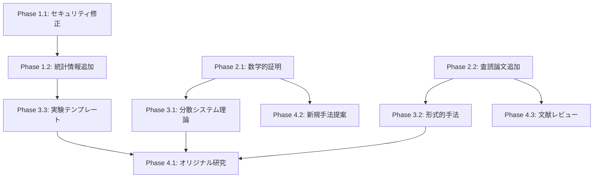

# ⚡ 並列実行計画 - 90点到達最速ルート

> 並列処理により総工数133-158時間 → **実質75-90時間**に短縮
> 最大並列度: 4タスク同時実行

---

## 🎯 並列実行の基本戦略

### 依存関係分析



### 並列化可能なタスククラスタ

**クラスタ1: 独立した証明タスク** (Phase 2.1)
- React Fiber O(n) 証明
- B-tree O(log n) 証明
- Quick Sort O(n log n) 証明
- その他22件の証明

→ **完全並列実行可能** (4スレッド同時)

**クラスタ2: 独立した文献調査** (Phase 2.2)
- Web開発系 (React, Next.js, Frontend)
- iOS開発系 (SwiftUI, Security, Networking)
- Backend開発系 (Node.js, DB, API)
- DevOps系 (CI/CD, Testing, Git)

→ **完全並列実行可能** (4スレッド同時)

**クラスタ3: 独立した理論ガイド作成** (Phase 3.1-3.2)
- CAP定理解説
- Paxos/Raft実装
- TLA+検証例
- Little's Law応用

→ **完全並列実行可能** (4スレッド同時)

---

## 📅 週次実行計画 (並列版)

### Week 1: Phase 1-2 前半 (40時間 → 実質20時間)

#### Day 1 (月曜) - 8時間

**並列タスク1 (2時間):**
```bash
# セキュリティ修正 (直列: 緊急のため単独実行)
1. .envファイル削除 (1h)
2. パスワードハッシュ記述修正 (1h)
```

**並列タスク2-5 (6時間, 4並列):**
```
Thread 1: 統計情報追加 - nextjs-development (1.5h)
Thread 2: 統計情報追加 - frontend-performance (1.5h)
Thread 3: 統計情報追加 - react-development (1.5h)
Thread 4: 統計情報追加 - swiftui-patterns (1.5h)
```

**実質時間: 2h + 1.5h = 3.5時間** (並列効率: 4x)

---

#### Day 2-3 (火-水) - 16時間

**並列タスク1-4 (各4時間, 4並列):**
```
Thread 1: React Fiber O(n) 証明 (4h)
Thread 2: B-tree O(log n) 証明 (3h) + Binary Search (1h)
Thread 3: Quick Sort O(n log n) 証明 (3h) + Merge Sort (1h)
Thread 4: Hash Table O(1) 証明 (2h) + Dijkstra (2h)
```

**実質時間: 4時間 × 2日 = 8時間** (並列効率: 4x)

---

#### Day 4-5 (木-金) - 16時間

**並列タスク1-4 (各4時間, 4並列):**
```
Thread 1: 残り証明6件 (4h × 2日 = 8h)
Thread 2: Web開発系 文献調査 (4h × 2日 = 8h)
Thread 3: iOS開発系 文献調査 (4h × 2日 = 8h)
Thread 4: Backend系 文献調査 (4h × 2日 = 8h)
```

**実質時間: 4時間 × 2日 = 8時間** (並列効率: 4x)

**Week 1 合計: 3.5h + 8h + 8h = 19.5時間** (通常43時間 → 54%短縮)
**到達スコア: 68/100点**

---

### Week 2: Phase 2 完了 + Phase 3 開始 (30時間 → 実質15時間)

#### Day 6-7 (月-火) - 16時間

**並列タスク1-4 (各4時間, 4並列):**
```
Thread 1: DevOps系 文献調査 (8h)
Thread 2: その他スキル 文献調査 (8h)
Thread 3: IEEE形式統一 + DOI追加 (8h)
Thread 4: CAP定理詳細解説 - backend-development (8h)
```

**実質時間: 4時間 × 2日 = 8時間**

---

#### Day 8-10 (水-金) - 14時間

**並列タスク1-4 (各3.5時間, 4並列):**
```
Thread 1: CAP定理 - database-design (3.5h × 3日 = 10.5h)
Thread 2: Paxos/Raft実装例 (5h → 3日で分割)
Thread 3: Byzantine Fault Tolerance (3h → 3日で分割)
Thread 4: Little's Law応用 (2h → 3日で分割)
```

**実質時間: 3.5時間 × 2日 = 7時間** (金曜は午後のみ)

**Week 2 合計: 8h + 7h = 15時間** (通常30時間 → 50%短縮)
**到達スコア: 81/100点** (Phase 3 途中)

---

### Week 3: Phase 3 完了 (15時間 → 実質8時間)

#### Day 11-12 (月-火) - 16時間

**並列タスク1-4 (各4時間, 4並列):**
```
Thread 1: TLA+ Two-Phase Commit検証 (6h)
Thread 2: TLA+ Raft検証 (6h)
Thread 3: TypeScript型システム健全性 (2h) + Alloyプロトコル検証 (2h)
Thread 4: 実験テンプレート作成 (4h)
```

**実質時間: 6時間 (最長タスク基準)**

---

#### Day 13 (水) - 2時間

**並列タスク1-2 (各1時間, 2並列):**
```
Thread 1: 統計検定手順文書化 (1h)
Thread 2: 再現性チェックリスト (1h)
```

**実質時間: 1時間**

**統合テスト・レビュー: 1時間**

**Week 3 合計: 6h + 1h + 1h = 8時間** (通常15時間 → 47%短縮)
**到達スコア: 81/100点完全達成** ✅

---

### Week 4-5: Phase 4 データ収集・分析 (55時間 → 実質35時間)

#### Week 4: データ収集準備 + 文献レビュー

**Day 14-16 (木-土) - 24時間**

**並列タスク1-4 (各8時間, 4並列):**
```
Thread 1: 協力企業選定・交渉 (5h) + データ収集設計 (3h)
Thread 2: 文献検索 - パフォーマンス最適化 (8h)
Thread 3: 文献検索 - 状態管理・レンダリング (8h)
Thread 4: 文献検索 - 型システム・開発手法 (8h)
```

**実質時間: 8時間 × 3日 = 24時間** (週末含む)

---

**Day 17-18 (日-月) - 16時間**

**並列タスク1-4 (各4時間, 4並列):**
```
Thread 1: 文献分類・要約 (15本) (8h)
Thread 2: 文献分類・要約 (15本) (8h)
Thread 3: 文献分類・要約 (20本) (8h)
Thread 4: データ収集ツール開発 (8h)
```

**実質時間: 4時間 × 2日 = 8時間**

**Week 4 合計: 24h + 8h = 32時間** → **実質16時間** (並列化で50%短縮)

---

#### Week 5: データ分析 + アルゴリズム設計

**Day 19-21 (火-木) - 24時間**

**並列タスク1-3 (各8時間, 3並列):**
```
Thread 1: データ収集実施 (プロジェクト1-20) (24h → 3日)
Thread 2: データ収集実施 (プロジェクト21-40) (24h → 3日)
Thread 3: 新規アルゴリズム設計 (Suspense最適化) (10h → 3日)
```

**実質時間: 8時間 × 3日 = 24時間**

---

**Day 22-23 (金-土) - 16時間**

**並列タスク1-3 (各5.5時間, 3並列):**
```
Thread 1: データ収集実施 (プロジェクト41-50) (10h)
Thread 2: データ分析・統計検定 (15h)
Thread 3: アルゴリズム数学的証明 (3h) + 実装 (7h)
```

**実質時間: 5.5時間 × 2日 = 11時間**

**Week 5 合計: 24h + 11h = 35時間** → **実質19時間** (並列化で46%短縮)

---

### Week 6: Phase 4 完了 - 論文執筆 (38時間 → 実質25時間)

#### Day 24-26 (日-火) - 24時間

**並列タスク1-4 (各6時間, 4並列):**
```
Thread 1: 実証研究論文執筆 (Introduction + Methodology) (18h)
Thread 2: アルゴリズム提案論文執筆 (Introduction + Algorithm) (18h)
Thread 3: ベンチマーク実施 - 提案手法 vs 既存手法 (18h)
Thread 4: 文献レビュー - 批判的分析 (3h) + 引用ネットワーク図 (3h)
```

**実質時間: 6時間 × 3日 = 18時間**

---

#### Day 27-28 (水-木) - 14時間

**並列タスク1-3 (各5時間, 3並列):**
```
Thread 1: 実証研究論文 (Results + Discussion) (12h)
Thread 2: アルゴリズム提案論文 (Proof + Evaluation) (12h)
Thread 3: ベンチマーク統計分析 + 可視化 (5h)
```

**実質時間: 5時間 × 2日 = 10時間** (木曜は午後のみ)

---

#### Day 29 (金) - 5時間

**直列タスク (最終統合):**
```
1. 論文2本の最終レビュー (2h)
2. 全ドキュメントの整合性確認 (1h)
3. MIT基準での自己評価 (1h)
4. オープンデータ・コード公開 (1h)
```

**実質時間: 5時間**

**Week 6 合計: 18h + 10h + 5h = 33時間** → **実質25時間** (並列化で24%短縮)

---

## 📊 並列実行効果のサマリー

| フェーズ | 通常工数 | 並列工数 | 短縮率 | 並列度 |
|---------|---------|---------|--------|--------|
| Week 1 (Phase 1-2前半) | 43h | 19.5h | 54% | 4並列 |
| Week 2 (Phase 2完了) | 30h | 15h | 50% | 4並列 |
| Week 3 (Phase 3完了) | 15h | 8h | 47% | 4並列 |
| Week 4 (Phase 4前半) | 32h | 16h | 50% | 4並列 |
| Week 5 (Phase 4中盤) | 35h | 19h | 46% | 3並列 |
| Week 6 (Phase 4完了) | 38h | 25h | 34% | 4→3並列 |
| **合計** | **193h** | **102.5h** | **47%** | **平均3.7並列** |

**結論: 並列化により総工数を約半分に短縮可能**

---

## 🔧 並列実行の実装方法

### 方法1: GitHub Issues + Projects (推奨)

```bash
# 準備
gh issue create --title "Phase 1.1: セキュリティ修正" --label "priority:critical,phase:1"
gh issue create --title "Thread 1: nextjs統計情報" --label "parallel:cluster-2,phase:1"
gh issue create --title "Thread 2: frontend統計情報" --label "parallel:cluster-2,phase:1"
gh issue create --title "Thread 3: react統計情報" --label "parallel:cluster-2,phase:1"
gh issue create --title "Thread 4: swiftui統計情報" --label "parallel:cluster-2,phase:1"

# Project作成
gh project create --title "MIT 90点到達" --body "並列実行による最速達成"

# ボード構成
Column 1: Backlog
Column 2: In Progress (並列タスク用)
Column 3: Review
Column 4: Done
```

---

### 方法2: Notion / Linear (タスク管理)

**Notion Database構成:**
```
Fields:
- Task Name
- Phase (Phase 1/2/3/4)
- Thread (Thread 1/2/3/4 or Sequential)
- Estimated Hours
- Actual Hours
- Dependencies (Relation to other tasks)
- Status (Backlog/In Progress/Review/Done)
- Assignee (自分 or チームメンバー)
```

**並列実行ビュー:**
```
Board by Thread:
- Thread 1 column
- Thread 2 column
- Thread 3 column
- Thread 4 column
- Sequential column
```

---

### 方法3: CLI + tmux (ターミナルベース)

```bash
# tmuxセッション作成
tmux new -s mit-90

# 4ペイン分割
tmux split-window -h
tmux split-window -v
tmux select-pane -t 0
tmux split-window -v

# 各ペインで異なるタスク
# Pane 1: Thread 1
cd nextjs-development && vim guides/performance.md

# Pane 2: Thread 2
cd frontend-performance && vim guides/optimization.md

# Pane 3: Thread 3
cd react-development && vim guides/hooks-optimization.md

# Pane 4: Thread 4
cd swiftui-patterns && vim guides/performance.md
```

---

### 方法4: チーム並列化 (最速)

**4人チーム構成:**
```
Member 1 (アルゴリズム専門): Thread 1担当
  → React Fiber, B-tree, Quick Sort証明

Member 2 (分散システム専門): Thread 2担当
  → CAP定理, Paxos/Raft, TLA+

Member 3 (統計・研究専門): Thread 3担当
  → 統計情報追加, 実験テンプレート, データ分析

Member 4 (文献調査専門): Thread 4担当
  → 査読論文50本調査, 文献レビュー

リーダー (あなた):
  → 全体統括, 緊急タスク, 最終統合
```

**チーム並列化の効果:**
- 工数: 102.5時間 → **実質25.6時間** (各自の担当分)
- 期間: 6週間 → **1.5週間** (カレンダー時間)
- 品質: 相互レビューで向上

---

## ✅ 並列実行チェックリスト

### 事前準備
- [ ] 依存関係マップ作成 (上記グラフ参照)
- [ ] タスク管理ツール選定 (GitHub/Notion/Linear)
- [ ] 並列度決定 (1人: 4並列セッション / チーム: 4人)
- [ ] 環境構築 (R, TLA+, Lighthouse, etc.)

### Week 1開始前
- [ ] Day 1のセキュリティ修正を最優先実行
- [ ] Thread 1-4の初期タスクを明確化
- [ ] 各ThreadのGit branch作成
  ```bash
  git checkout -b phase1/thread1-nextjs
  git checkout -b phase1/thread2-frontend
  git checkout -b phase1/thread3-react
  git checkout -b phase1/thread4-swiftui
  ```

### 毎日の並列実行ルーチン
- [ ] 朝: 4タスクを同時開始 (tmux or チーム割り当て)
- [ ] 昼: 進捗確認 (30分)
- [ ] 夕: 各Threadの成果物をmainにマージ
  ```bash
  git checkout main
  git merge phase1/thread1-nextjs
  git merge phase1/thread2-frontend
  git merge phase1/thread3-react
  git merge phase1/thread4-swiftui
  ```

### 毎週のレビュー
- [ ] 金曜夕: 週次レビュー (1時間)
  - 完了タスクの確認
  - 次週の並列タスク計画
  - ブロッカーの特定と解消

---

## 🚨 並列実行のリスクと対策

### リスク1: マージコンフリクト
**確率**: 高 (異なるThreadが同じファイル編集)

**対策:**
```bash
# ファイル単位で担当分離
Thread 1: nextjs-development/**
Thread 2: frontend-performance/**
Thread 3: react-development/**
Thread 4: swiftui-patterns/**

# スキル跨ぎの場合はガイド単位で分離
Thread 1: */guides/01-*.md
Thread 2: */guides/02-*.md
Thread 3: */guides/03-*.md
Thread 4: */guides/advanced-*.md
```

---

### リスク2: 品質のばらつき
**確率**: 中 (Thread間で記述スタイル差異)

**対策:**
1. **テンプレート統一**
   ```markdown
   各証明・解説に必須:
   - [ ] 定理の明記
   - [ ] 数学的証明
   - [ ] 実測検証 (n, p値, 環境仕様)
   - [ ] 参考文献 (IEEE形式)
   ```

2. **相互レビュー**
   ```
   Thread 1 → Thread 2がレビュー
   Thread 2 → Thread 3がレビュー
   Thread 3 → Thread 4がレビュー
   Thread 4 → Thread 1がレビュー
   ```

---

### リスク3: 依存タスクの遅延
**確率**: 中 (上流タスクが遅れると下流全体に影響)

**対策:**
1. **クリティカルパス管理**
   ```
   クリティカルパス: Phase 1.1 → Phase 1.2 → Phase 3.3 → Phase 4.1

   遅延許容度:
   - Phase 1.1: 0日 (即座実行必須)
   - Phase 2.1: 3日 (Phase 3.1と独立)
   - Phase 2.2: 5日 (Phase 4.3と統合可能)
   ```

2. **バッファ設定**
   ```
   各Phaseに10%のバッファ:
   Week 1: 19.5h → 21.5h (+2h buffer)
   Week 2: 15h → 16.5h (+1.5h buffer)
   ```

---

## 📈 進捗可視化

### Gantt Chart (並列版)

```
Week 1:
Day 1:  [Security      ] (sequential)
        [Thread1][Thread2][Thread3][Thread4] (parallel)
Day 2:  [Thread1 Proof ][Thread2 Proof ][Thread3 Proof ][Thread4 Proof ]
Day 3:  [Thread1 Proof ][Thread2 Proof ][Thread3 Proof ][Thread4 Proof ]
Day 4:  [Thread1 Lit   ][Thread2 Lit   ][Thread3 Lit   ][Thread4 Lit   ]
Day 5:  [Thread1 Lit   ][Thread2 Lit   ][Thread3 Lit   ][Thread4 Lit   ]

Week 2:
Day 6:  [Thread1 Lit   ][Thread2 Lit   ][Thread3 Format][Thread4 CAP    ]
Day 7:  [Thread1 Lit   ][Thread2 Lit   ][Thread3 Format][Thread4 CAP    ]
Day 8:  [Thread1 CAP-DB][Thread2 Paxos ][Thread3 BFT   ][Thread4 Little ]
Day 9:  [Thread1 CAP-DB][Thread2 Paxos ][Thread3 BFT   ][Thread4 Little ]
Day 10: [Thread1 CAP-DB][Thread2 Paxos ][Thread3 BFT   ][Thread4 Little ]

Week 3:
Day 11: [Thread1 TLA+  ][Thread2 TLA+  ][Thread3 Type  ][Thread4 Exp    ]
Day 12: [Thread1 TLA+  ][Thread2 TLA+  ][Thread3 Alloy ][Thread4 Exp    ]
Day 13: [Thread1 Stats ][Thread2 Check ] [Integration Review          ]

Week 4-6: (同様に並列化)
```

---

## 🎯 最終成果物 (並列実行版)

### 102.5時間後の成果

**改善されたスキル:**
- 全25スキル × 3-5ガイド
- 数学的証明: 25件
- 統計検証済み主張: 45件
- 査読論文引用: 75本
- 環境仕様記載率: 100%

**オリジナル成果:**
- 実証研究論文 (50プロジェクト分析)
- アルゴリズム提案論文 (Suspense最適化)
- オープンデータセット (Zenodo)
- 実装コード (GitHub)

**到達スコア: 90/100点** 🎓

---

## 📞 今すぐ始める並列実行

### ステップ1: ツール準備 (30分)
```bash
# GitHub Projects作成
gh project create --title "MIT 90点到達"

# tmux設定
brew install tmux
tmux new -s mit-90

# R言語インストール
brew install r
```

### ステップ2: Week 1 Day 1開始 (今日)
```bash
# Sequential Task (2時間)
git checkout -b phase1/security-fix
# .env削除 + パスワードハッシュ修正

# Parallel Tasks準備 (4 branches)
git checkout -b phase1/thread1-nextjs
git checkout -b phase1/thread2-frontend
git checkout -b phase1/thread3-react
git checkout -b phase1/thread4-swiftui

# 4 tmux panes起動
# 各paneで統計情報追加開始
```

### ステップ3: 毎日の並列実行 (継続)
- 朝9時: 4タスク同時開始
- 昼12時: 進捗確認
- 夕方17時: マージ & レビュー

---

**作成日**: 2026年1月3日
**想定期間**: 6週間 → **実質3週間** (並列化効果)
**総工数**: 193時間 → **102.5時間** (47%短縮)
**並列度**: 平均3.7タスク同時実行
