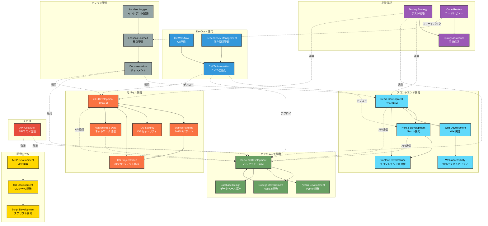

# Claude Code Skills 関連図

## 全体構成（26スキル + 補助スキル）

## スキル間の主な関係性

### 1. フロントエンド開発チェーン
- **React** → **Next.js** → **Frontend Performance**
- **Web Development** → **Web Accessibility**

### 2. バックエンド開発チェーン
- **Backend Development** ⇄ **Node.js/Python**
- **Backend** → **Database Design**

### 3. iOS開発チェーン
- **iOS Development** → **SwiftUI Patterns** → **iOS Project Setup**
- **iOS** → **iOS Security** + **Networking & Data**

### 4. 品質保証チェーン
- **Testing Strategy** → **Quality Assurance** ← **Code Review**

### 5. DevOpsチェーン
- **Git Workflow** → **CI/CD Automation** ← **Dependency Management**

### 6. ナレッジ管理チェーン
- **Incident Logger** → **Lessons Learned** → **Documentation**

### 7. 横断的な関係
- **Testing** → すべての開発スキル（React, Backend, iOS）
- **CI/CD** → デプロイ対象（Next.js, Backend, iOS）
- **Documentation** → すべての開発スキル
- **API Cost** → Backend, MCP

## 学習推奨パス

### パス1: フロントエンドエンジニア
1. Web Development
2. React Development
3. Next.js Development
4. Frontend Performance
5. Web Accessibility
6. Testing Strategy

### パス2: バックエンドエンジニア
1. Backend Development
2. Node.js/Python Development
3. Database Design
4. Testing Strategy
5. CI/CD Automation

### パス3: iOSエンジニア
1. iOS Development
2. SwiftUI Patterns
3. iOS Project Setup
4. Networking & Data
5. iOS Security
6. Testing Strategy

### パス4: フルスタックエンジニア
1. Backend Development
2. Database Design
3. React Development
4. Next.js Development
5. Testing Strategy
6. CI/CD Automation
7. Git Workflow

### パス5: DevOpsエンジニア
1. Git Workflow
2. Dependency Management
3. CI/CD Automation
4. Script Development
5. CLI Development

## 文字数統計

| カテゴリ | スキル数 | 合計文字数 |
|---------|---------|-----------|
| フロントエンド | 5 | 約63万字 |
| バックエンド | 4 | 約102万字 |
| モバイル | 5 | 約71万字 |
| 品質保証 | 3 | 約73万字 |
| DevOps | 3 | 約46万字 |
| ナレッジ管理 | 3 | 約29万字 |
| ツール | 3 | 約36万字 |
| その他 | 1 | 約109万字 |

**合計: 約529万字（node_modules除く）**
