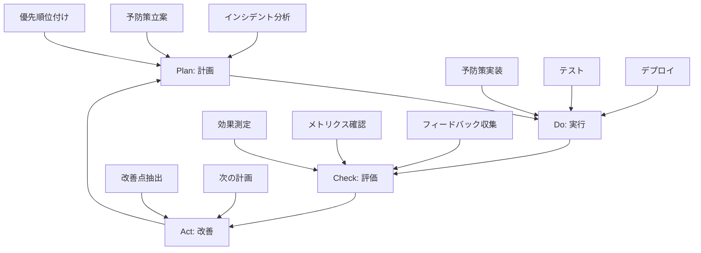

# 🛡️ Prevention Strategy - 再発防止と継続的改善ガイド

> **目的**: インシデントから学び、再発を防ぎ、チーム全体の品質と信頼性を継続的に向上させる

## 📚 目次

1. [予防戦略の基本](#予防戦略の基本)
2. [多層防御アプローチ](#多層防御アプローチ)
3. [自動化による予防](#自動化による予防)
4. [プロセス改善](#プロセス改善)
5. [チーム文化の醸成](#チーム文化の醸成)
6. [継続的改善サイクル](#継続的改善サイクル)
7. [実践例](#実践例)

---

## 予防戦略の基本

### 予防の3つのレベル

```
レベル1: 事前予防（Proactive）
├─ 問題が発生する前に対策
├─ 例: コードレビュー、静的解析、設計レビュー
└─ 効果: ★★★★★（最も効果的）

レベル2: 早期検知（Detective）
├─ 問題を早期に発見
├─ 例: 監視、アラート、自動テスト
└─ 効果: ★★★★☆

レベル3: 迅速対応（Reactive）
├─ 問題発生時の被害最小化
├─ 例: ロールバック、自動復旧、手順書
└─ 効果: ★★★☆☆
```

### 予防戦略のフレームワーク

**PDCA サイクル**:
```
Plan（計画）
├─ インシデント分析
├─ 予防策の立案
└─ 優先順位付け
   ↓
Do（実行）
├─ 予防策の実装
├─ テスト
└─ デプロイ
   ↓
Check（評価）
├─ 効果測定
├─ メトリクス確認
└─ レビュー
   ↓
Act（改善）
├─ フィードバック反映
├─ 次の改善計画
└─ → Plan へ戻る
```

---

## 多層防御アプローチ

### Defense in Depth（深層防御）

**複数の防御層を組み合わせて、単一障害点を排除**

```
┌─────────────────────────────────┐
│ Layer 1: 設計段階                │
│ - アーキテクチャレビュー           │
│ - 設計パターン適用                │
├─────────────────────────────────┤
│ Layer 2: 実装段階                │
│ - コードレビュー                  │
│ - 静的解析                       │
│ - ペアプログラミング              │
├─────────────────────────────────┤
│ Layer 3: テスト段階               │
│ - ユニットテスト                  │
│ - 統合テスト                     │
│ - E2E テスト                     │
├─────────────────────────────────┤
│ Layer 4: デプロイ段階             │
│ - カナリアデプロイ                │
│ - 段階的ロールアウト              │
│ - 自動ロールバック                │
├─────────────────────────────────┤
│ Layer 5: 運用段階                │
│ - 監視・アラート                  │
│ - ログ分析                       │
│ - 自動復旧                       │
└─────────────────────────────────┘
```

### Layer 1: 設計段階

**アーキテクチャレビュー**:
```markdown
# 設計レビューチェックリスト

## スケーラビリティ
- [ ] 負荷増加時の対応策は？
- [ ] ボトルネックは特定できているか？
- [ ] 水平スケーリング可能か？

## 可用性
- [ ] 単一障害点（SPOF）はないか？
- [ ] フェイルオーバー戦略は？
- [ ] データバックアップ戦略は？

## セキュリティ
- [ ] 認証・認可は適切か？
- [ ] データ暗号化は？
- [ ] 入力検証は？

## 保守性
- [ ] ログ戦略は明確か？
- [ ] 監視ポイントは定義されているか？
- [ ] ロールバック手順は？
```

**設計パターンの適用**:
```typescript
// 例: Retry パターン（一時的な障害に対応）
class ApiClient {
  private maxRetries = 3;
  private retryDelay = 1000; // ms

  async fetchWithRetry<T>(
    url: string,
    options?: RequestInit
  ): Promise<T> {
    for (let attempt = 0; attempt < this.maxRetries; attempt++) {
      try {
        const response = await fetch(url, options);

        if (response.ok) {
          return await response.json();
        }

        // リトライ可能なエラーの場合
        if (this.isRetryableError(response.status)) {
          await this.delay(this.retryDelay * Math.pow(2, attempt)); // Exponential backoff
          continue;
        }

        // リトライ不可能なエラーの場合は即座に throw
        throw new Error(`HTTP ${response.status}: ${response.statusText}`);
      } catch (error) {
        if (attempt === this.maxRetries - 1) {
          throw error; // 最後の試行で失敗
        }

        // ネットワークエラーなどはリトライ
        await this.delay(this.retryDelay * Math.pow(2, attempt));
      }
    }

    throw new Error('Max retries exceeded');
  }

  private isRetryableError(status: number): boolean {
    // 429: Too Many Requests, 500-599: Server errors
    return status === 429 || (status >= 500 && status < 600);
  }

  private delay(ms: number): Promise<void> {
    return new Promise(resolve => setTimeout(resolve, ms));
  }
}
```

### Layer 2: 実装段階

**静的解析ツール**:
```json
// .eslintrc.json
{
  "extends": [
    "eslint:recommended",
    "plugin:@typescript-eslint/recommended",
    "plugin:@typescript-eslint/recommended-requiring-type-checking"
  ],
  "rules": {
    "@typescript-eslint/no-explicit-any": "error",
    "@typescript-eslint/no-unused-vars": "error",
    "@typescript-eslint/no-floating-promises": "error",
    "@typescript-eslint/strict-boolean-expressions": "error",
    "no-console": ["warn", { "allow": ["error", "warn"] }],
    "eqeqeq": ["error", "always"],
    "no-eval": "error"
  }
}
```

**型安全性の強化**:
```typescript
// Before: 型安全でない
function processUser(user: any) {
  console.log(user.name);  // ランタイムエラーの可能性
}

// After: 型安全
interface User {
  id: number;
  name: string;
  email: string;
}

function processUser(user: User) {
  console.log(user.name);  // コンパイル時にチェック
}

// さらに安全: Runtime validation
import { z } from 'zod';

const UserSchema = z.object({
  id: z.number(),
  name: z.string(),
  email: z.string().email()
});

type User = z.infer<typeof UserSchema>;

function processUser(data: unknown) {
  const user = UserSchema.parse(data);  // 実行時に検証
  console.log(user.name);  // 型安全 + ランタイム検証
}
```

### Layer 3: テスト段階

**テストピラミッド**:
```
         /\
        /  \  E2E Tests (10%)
       /────\
      /      \
     / Integr.\ Integration Tests (30%)
    /──────────\
   /            \
  /  Unit Tests  \ Unit Tests (60%)
 /────────────────\
```

**高品質なテスト**:
```typescript
// ❌ 悪いテスト: 実装詳細に依存
test('user registration', () => {
  const component = mount(<UserForm />);
  component.find('input').at(0).simulate('change', { target: { value: 'test@example.com' } });
  component.find('input').at(1).simulate('change', { target: { value: 'password123' } });
  component.find('form').simulate('submit');
  expect(component.state('submitted')).toBe(true);  // 内部状態に依存
});

// ✅ 良いテスト: ユーザー視点
test('user can register with email and password', async () => {
  render(<UserForm />);

  // ユーザーの操作を模倣
  const emailInput = screen.getByLabelText('Email');
  const passwordInput = screen.getByLabelText('Password');
  const submitButton = screen.getByRole('button', { name: /register/i });

  await userEvent.type(emailInput, 'test@example.com');
  await userEvent.type(passwordInput, 'password123');
  await userEvent.click(submitButton);

  // 結果を検証
  expect(await screen.findByText('Registration successful')).toBeInTheDocument();
});
```

### Layer 4: デプロイ段階

**カナリアデプロイ**:
```yaml
# Kubernetes Canary Deployment
apiVersion: apps/v1
kind: Deployment
metadata:
  name: app-canary
spec:
  replicas: 1  # カナリア: 全体の10%
  selector:
    matchLabels:
      app: myapp
      version: v2.0
  template:
    metadata:
      labels:
        app: myapp
        version: v2.0
    spec:
      containers:
      - name: app
        image: myapp:v2.0
---
apiVersion: apps/v1
kind: Deployment
metadata:
  name: app-stable
spec:
  replicas: 9  # 安定版: 全体の90%
  selector:
    matchLabels:
      app: myapp
      version: v1.0
  template:
    metadata:
      labels:
        app: myapp
        version: v1.0
    spec:
      containers:
      - name: app
        image: myapp:v1.0
```

**自動ロールバック**:
```yaml
# GitHub Actions: Automated Rollback
name: Deploy with Auto Rollback

on:
  push:
    branches: [main]

jobs:
  deploy:
    runs-on: ubuntu-latest
    steps:
      - uses: actions/checkout@v3

      - name: Deploy
        id: deploy
        run: ./scripts/deploy.sh

      - name: Health Check
        id: health
        run: |
          # 30秒間ヘルスチェック
          for i in {1..30}; do
            if curl -f https://api.example.com/health; then
              echo "Health check passed"
              exit 0
            fi
            sleep 1
          done
          echo "Health check failed"
          exit 1

      - name: Auto Rollback
        if: failure()
        run: |
          echo "Deployment failed, rolling back..."
          ./scripts/rollback.sh
          curl -X POST $SLACK_WEBHOOK \
            -d '{"text": "🚨 Deployment failed and rolled back automatically"}'
```

### Layer 5: 運用段階

**包括的な監視**:
```yaml
# Prometheus Alerts
groups:
  - name: application
    interval: 30s
    rules:
      # エラー率
      - alert: HighErrorRate
        expr: rate(http_requests_total{status=~"5.."}[5m]) > 0.05
        for: 2m
        annotations:
          summary: "High error rate detected"

      # レスポンスタイム
      - alert: SlowResponse
        expr: histogram_quantile(0.95, http_request_duration_seconds) > 1
        for: 5m
        annotations:
          summary: "95th percentile latency > 1s"

      # メモリ使用率
      - alert: HighMemoryUsage
        expr: process_resident_memory_bytes / node_memory_MemTotal_bytes > 0.8
        for: 5m
        annotations:
          summary: "Memory usage > 80%"

      # データベース接続
      - alert: DatabaseConnectionPoolExhaustion
        expr: db_connection_pool_active / db_connection_pool_max > 0.9
        for: 2m
        annotations:
          summary: "DB connection pool > 90%"
```

---

## 自動化による予防

### 1. Pre-commit Hooks

**コミット前の自動チェック**:
```bash
# .husky/pre-commit
#!/bin/sh
. "$(dirname "$0")/_/husky.sh"

echo "🔍 Running pre-commit checks..."

# 1. Lint
echo "→ Linting..."
npm run lint

# 2. Type check
echo "→ Type checking..."
npm run type-check

# 3. Unit tests
echo "→ Running unit tests..."
npm run test:unit

# 4. Security check
echo "→ Security audit..."
npm audit --audit-level=moderate

echo "✅ Pre-commit checks passed!"
```

### 2. CI/CD パイプライン

**完全自動化されたテスト・デプロイ**:
```yaml
# .github/workflows/ci-cd.yml
name: CI/CD Pipeline

on:
  pull_request:
  push:
    branches: [main]

jobs:
  test:
    runs-on: ubuntu-latest
    steps:
      - uses: actions/checkout@v3

      - name: Install Dependencies
        run: npm ci

      - name: Lint
        run: npm run lint

      - name: Type Check
        run: npm run type-check

      - name: Unit Tests
        run: npm run test:unit

      - name: Integration Tests
        run: npm run test:integration

      - name: E2E Tests
        run: npm run test:e2e

      - name: Security Audit
        run: npm audit --audit-level=moderate

      - name: Build
        run: npm run build

  deploy:
    needs: test
    if: github.ref == 'refs/heads/main'
    runs-on: ubuntu-latest
    steps:
      - name: Deploy to Staging
        run: ./scripts/deploy-staging.sh

      - name: Smoke Tests
        run: |
          curl -f https://staging.example.com/health
          curl -f https://staging.example.com/api/users | jq -e '.length > 0'

      - name: Deploy to Production (Canary)
        run: ./scripts/deploy-canary.sh

      - name: Monitor Canary
        run: ./scripts/monitor-canary.sh

      - name: Full Rollout
        run: ./scripts/deploy-production.sh
```

### 3. 依存関係の自動更新

**Dependabot 設定**:
```yaml
# .github/dependabot.yml
version: 2
updates:
  - package-ecosystem: "npm"
    directory: "/"
    schedule:
      interval: "weekly"
    reviewers:
      - "backend-team"
    assignees:
      - "tech-lead"
    open-pull-requests-limit: 5

  - package-ecosystem: "github-actions"
    directory: "/"
    schedule:
      interval: "monthly"
```

### 4. データベースマイグレーション安全性

**安全なマイグレーション**:
```typescript
// migrations/001_add_email_index.ts
export async function up(db: Database) {
  // インデックス追加（CONCURRENTLY で本番環境への影響を最小化）
  await db.query(`
    CREATE INDEX CONCURRENTLY idx_users_email
    ON users(email)
  `);

  // マイグレーション記録
  console.log('✅ Created index on users.email');
}

export async function down(db: Database) {
  // ロールバック処理
  await db.query(`
    DROP INDEX CONCURRENTLY IF EXISTS idx_users_email
  `);

  console.log('✅ Rolled back index on users.email');
}

// マイグレーション実行前の検証
export async function validate(db: Database) {
  // テーブル存在確認
  const tableExists = await db.query(`
    SELECT EXISTS (
      SELECT FROM information_schema.tables
      WHERE table_name = 'users'
    )
  `);

  if (!tableExists.rows[0].exists) {
    throw new Error('Table "users" does not exist');
  }

  // カラム存在確認
  const columnExists = await db.query(`
    SELECT EXISTS (
      SELECT FROM information_schema.columns
      WHERE table_name = 'users' AND column_name = 'email'
    )
  `);

  if (!columnExists.rows[0].exists) {
    throw new Error('Column "email" does not exist in table "users"');
  }

  console.log('✅ Migration validation passed');
}
```

---

## プロセス改善

### 1. チェックリスト活用

**デプロイ前チェックリスト**:
```markdown
# デプロイ前チェックリスト

## コード品質
- [ ] すべてのテストが通過
- [ ] コードレビュー完了（最低2名の承認）
- [ ] Lint エラーなし
- [ ] 型エラーなし
- [ ] セキュリティスキャン通過

## 環境設定
- [ ] 環境変数がすべて設定されている
- [ ] データベースマイグレーションが準備されている
- [ ] 外部サービス連携の確認（API キー、Webhook など）

## テスト
- [ ] ステージング環境でのスモークテスト完了
- [ ] 負荷テスト完了（必要に応じて）
- [ ] E2E テスト通過

## ロールバック準備
- [ ] ロールバック手順の確認
- [ ] 前バージョンのバックアップ確認
- [ ] データベースロールバック手順の確認

## 監視
- [ ] 監視ダッシュボードの準備
- [ ] アラート設定の確認
- [ ] オンコール担当者の確認

## コミュニケーション
- [ ] チームへの事前通知
- [ ] ユーザーへの告知（メンテナンスの場合）
- [ ] デプロイウィンドウの確認

## デプロイ戦略
- [ ] カナリアデプロイ or ブルーグリーンデプロイ
- [ ] 段階的ロールアウト計画
- [ ] ヘルスチェック確認

## 承認
- [ ] Tech Lead 承認
- [ ] PM 承認（重要な変更の場合）
```

**機能追加チェックリスト**:
```markdown
# 機能追加チェックリスト

## 設計
- [ ] 設計ドキュメント作成
- [ ] アーキテクチャレビュー完了
- [ ] API 設計レビュー完了
- [ ] データベース設計レビュー完了

## 実装
- [ ] 型安全性の確保
- [ ] エラーハンドリングの実装
- [ ] ログ出力の実装
- [ ] バリデーションの実装

## テスト
- [ ] ユニットテスト（カバレッジ > 80%）
- [ ] 統合テスト
- [ ] E2E テスト
- [ ] エッジケースのテスト

## セキュリティ
- [ ] 認証・認可の確認
- [ ] 入力検証の実装
- [ ] SQL インジェクション対策
- [ ] XSS 対策

## パフォーマンス
- [ ] N+1 クエリの確認
- [ ] インデックス設定
- [ ] キャッシュ戦略
- [ ] 負荷テスト

## ドキュメント
- [ ] API ドキュメント更新
- [ ] README 更新
- [ ] チーム Wiki 更新

## レビュー
- [ ] コードレビュー（最低2名）
- [ ] デザインレビュー（UI 変更の場合）
- [ ] QA レビュー
```

### 2. ポストモーテム文化

**ポストモーテムテンプレート**:
```markdown
# ポストモーテム: [インシデントタイトル]

## 概要

| 項目 | 内容 |
|------|------|
| **発生日時** | YYYY-MM-DD HH:MM |
| **検知日時** | YYYY-MM-DD HH:MM |
| **復旧日時** | YYYY-MM-DD HH:MM |
| **MTTR** | XX 分 |
| **影響範囲** | XX,XXX ユーザー |
| **深刻度** | CRITICAL / HIGH / MEDIUM / LOW |

## Timeline

[時系列の詳細]

## 根本原因

[RCA の結果]

## 対策

### 実施済み（即時対応）
- [x] [対策1]
- [x] [対策2]

### 短期（1週間以内）
- [ ] [対策1]
- [ ] [対策2]

### 長期（1ヶ月以内）
- [ ] [対策1]
- [ ] [対策2]

## 学んだ教訓

### What Went Well（うまくいったこと）
1. [良かった点1]
2. [良かった点2]

### What Went Wrong（問題だったこと）
1. [問題点1]
2. [問題点2]

### What We Learned（学んだこと）
1. [学び1]
2. [学び2]

## アクションアイテム

| アクション | 担当者 | 期限 | 優先度 | ステータス |
|-----------|--------|------|--------|-----------|
| [アクション1] | @user | YYYY-MM-DD | HIGH | 🔄 In Progress |
| [アクション2] | @user | YYYY-MM-DD | MEDIUM | ⏳ Pending |

## メトリクス

[効果測定の指標]
```

### 3. 定期的なレビュー会

**週次インシデントレビュー**:
```markdown
# 週次インシデントレビュー

## アジェンダ（45分）

### 1. 今週のインシデントサマリー（10分）
- 件数・重大度別の内訳
- 主要カテゴリ

### 2. 主要インシデントの深掘り（25分）
- CRITICAL/HIGH インシデント 1-2件
- 担当者プレゼン + Q&A

### 3. パターン分析（5分）
- 繰り返し発生している問題
- 共通の根本原因

### 4. アクションアイテム（5分）
- 予防策の優先順位付け
- 担当者・期限設定
```

**月次品質レビュー**:
```markdown
# 月次品質レビュー

## アジェンダ（90分）

### 1. メトリクス確認（20分）
- インシデント件数推移
- MTTR 推移
- テストカバレッジ
- デプロイ頻度・成功率

### 2. 主要な改善施策の振り返り（30分）
- 先月実施した予防策の効果
- 継続すべき施策
- 中止・変更すべき施策

### 3. トレンド分析（20分）
- 増加傾向の問題カテゴリ
- 技術的負債の蓄積
- チームのスキルギャップ

### 4. 次月の改善計画（20分）
- 優先度の高い課題
- リソース配分
- 目標設定
```

---

## チーム文化の醸成

### 1. 心理的安全性

**失敗を学びに変える文化**:
```markdown
# 失敗から学ぶ文化

## 基本原則

### 1. 人を責めない
❌ 「誰がミスしたのか？」
✅ 「なぜシステムがミスを防げなかったのか？」

### 2. 失敗を共有する
❌ 問題を隠す
✅ オープンに共有し、チーム全体で学ぶ

### 3. 学びを称賛する
❌ 完璧主義を求める
✅ 失敗からの学びと改善を評価する

## 実践

### 毎週の「失敗共有会」
- 各メンバーが今週の失敗を1つ共有
- 学んだこと、改善したことを発表
- ベストな学びに「今週の学び賞」🏆

### Blameless Postmortem
- インシデント分析時は人を責めない
- システム・プロセスの改善に焦点
- 「どうすれば防げたか」を考える
```

### 2. 知識共有の仕組み

**ナレッジベースの構築**:
```markdown
# ナレッジベース構造

knowledge-base/
├── incidents/           # インシデント記録
│   ├── 2025/
│   └── README.md
├── lessons-learned/     # 学んだ教訓
│   ├── backend/
│   ├── frontend/
│   └── devops/
├── runbooks/           # 手順書
│   ├── deployment/
│   ├── rollback/
│   └── troubleshooting/
├── best-practices/     # ベストプラクティス
│   ├── coding/
│   ├── testing/
│   └── security/
└── faq/               # よくある質問
```

**週次勉強会**:
```markdown
# 週次勉強会

## 形式
- 毎週金曜 15:00-16:00
- 持ち回りで担当者が発表

## トピック例
- 今週発生したインシデントの深掘り
- 新しい技術・ツールの紹介
- ベストプラクティスの共有
- 外部記事・カンファレンスの知見共有

## ルール
- 発表後は必ず Wiki にドキュメント化
- Q&A タイムを設ける
- アクションアイテムを明確化
```

### 3. 継続的なスキルアップ

**トレーニングプログラム**:
```markdown
# エンジニアトレーニングプログラム

## レベル別トレーニング

### Junior（0-1年）
- [ ] Git/GitHub フロー
- [ ] コードレビューの受け方・やり方
- [ ] テスト駆動開発（TDD）
- [ ] デバッグ技術
- [ ] ログ分析

### Mid（1-3年）
- [ ] システム設計
- [ ] パフォーマンスチューニング
- [ ] セキュリティベストプラクティス
- [ ] CI/CD パイプライン構築
- [ ] インシデント対応

### Senior（3年以上）
- [ ] アーキテクチャ設計
- [ ] 技術選定・評価
- [ ] メンタリング
- [ ] ポストモーテムファシリテーション
- [ ] チームプロセス改善
```

---

## 継続的改善サイクル

### PDCA サイクルの実践



### メトリクス駆動改善

**追跡すべきメトリクス**:
```markdown
# 品質メトリクス

## インシデント関連
- **総インシデント数**: 週次/月次
- **重大度別件数**: CRITICAL/HIGH/MEDIUM/LOW
- **MTTR** (Mean Time To Repair): 平均復旧時間
- **MTTD** (Mean Time To Detect): 平均検知時間
- **再発率**: 同じ問題の再発頻度

## テスト関連
- **テストカバレッジ**: 目標 > 80%
- **テスト実行時間**: CI/CD のボトルネック確認
- **失敗率**: フレーキーテストの検出

## デプロイ関連
- **デプロイ頻度**: 週次/月次
- **デプロイ成功率**: 目標 > 95%
- **ロールバック率**: 目標 < 5%
- **リードタイム**: コミットから本番までの時間

## コード品質
- **Lint エラー数**: ゼロを維持
- **型エラー数**: ゼロを維持
- **セキュリティ脆弱性**: Critical/High はゼロ
```

**ダッシュボード例**:
```markdown
# 品質ダッシュボード

## 今月のサマリー（2025年1月）

| 指標 | 今月 | 先月 | 変化 | 目標 |
|------|------|------|------|------|
| 総インシデント数 | 12件 | 18件 | ▼ 33% | < 10件 |
| CRITICAL | 0件 | 1件 | ▼ 100% | 0件 |
| MTTR | 15分 | 32分 | ▼ 53% | < 20分 |
| テストカバレッジ | 85% | 82% | ▲ 3.7% | > 80% |
| デプロイ成功率 | 97% | 92% | ▲ 5.4% | > 95% |

## トレンドチャート

```
インシデント件数推移

20 ┤
18 ┤     ●
16 ┤
14 ┤           ●
12 ┤                 ●  ← 今月
10 ┤                       ● 目標ライン
 8 ┤
 6 ┤
   └─────────────────────────────
    Oct   Nov   Dec   Jan
```

## 改善施策の効果

### 実施済み施策
1. **Pre-commit hooks 導入**
   - Lint エラー: 15件/週 → 2件/週（▼ 87%）

2. **自動ロールバック機能**
   - MTTR: 45分 → 15分（▼ 67%）

3. **データベース接続プール監視**
   - DB 関連インシデント: 5件/月 → 0件/月（▼ 100%）
```

---

## 実践例

### ケース1: API エラー率削減プロジェクト

**目標**: API エラー率を 5% → 0.5% に削減

```markdown
# API エラー率削減プロジェクト

## 現状分析

### 主要なエラー原因
1. **バリデーションエラー**（40%）
   - 不正な入力データ
2. **タイムアウト**（30%）
   - 外部 API 呼び出しのタイムアウト
3. **データベースエラー**（20%）
   - 接続プールの枯渇
4. **認証エラー**（10%）
   - トークン期限切れ

## 対策

### Phase 1: バリデーション強化（1週間）

**実装**:
```typescript
// Before: バリデーションなし
app.post('/api/users', async (req, res) => {
  const user = await createUser(req.body);  // エラーの可能性
  res.json(user);
});

// After: Zod でバリデーション
import { z } from 'zod';

const CreateUserSchema = z.object({
  name: z.string().min(1).max(100),
  email: z.string().email(),
  age: z.number().int().min(0).max(150).optional()
});

app.post('/api/users', async (req, res) => {
  try {
    const data = CreateUserSchema.parse(req.body);  // 検証
    const user = await createUser(data);
    res.json(user);
  } catch (error) {
    if (error instanceof z.ZodError) {
      res.status(400).json({ errors: error.errors });
    } else {
      res.status(500).json({ error: 'Internal server error' });
    }
  }
});
```

**効果**:
- バリデーションエラー: 40% → 5%（▼ 87.5%）
- 総エラー率: 5% → 3.5%（▼ 30%）

### Phase 2: タイムアウト対策（1週間）

**実装**:
```typescript
// Before: タイムアウト処理なし
async function fetchExternalAPI(url: string) {
  const response = await fetch(url);  // 無限待機の可能性
  return await response.json();
}

// After: タイムアウト + リトライ
async function fetchExternalAPI(url: string, options: {
  timeout?: number;
  retries?: number;
} = {}) {
  const { timeout = 5000, retries = 3 } = options;

  for (let attempt = 0; attempt < retries; attempt++) {
    try {
      const controller = new AbortController();
      const timeoutId = setTimeout(() => controller.abort(), timeout);

      const response = await fetch(url, {
        signal: controller.signal
      });

      clearTimeout(timeoutId);

      if (response.ok) {
        return await response.json();
      }

      // リトライ可能なエラー
      if (response.status >= 500) {
        continue;
      }

      throw new Error(`HTTP ${response.status}`);
    } catch (error) {
      if (attempt === retries - 1) {
        throw error;
      }
      // Exponential backoff
      await new Promise(resolve => setTimeout(resolve, 1000 * Math.pow(2, attempt)));
    }
  }
}
```

**効果**:
- タイムアウトエラー: 30% → 3%（▼ 90%）
- 総エラー率: 3.5% → 1.5%（▼ 57%）

### Phase 3: データベース接続プール最適化（1週間）

**実装**:
```javascript
// Before: 固定設定
const pool = new Pool({
  max: 10
});

// After: 動的設定 + 監視
const pool = new Pool({
  max: parseInt(process.env.DB_POOL_MAX) || 100,
  min: parseInt(process.env.DB_POOL_MIN) || 10,
  idleTimeoutMillis: 30000,
  connectionTimeoutMillis: 2000
});

// 接続プール監視
pool.on('connect', () => {
  console.log('Client connected to pool');
  metrics.increment('db.pool.connect');
});

pool.on('acquire', () => {
  metrics.increment('db.pool.acquire');
  metrics.gauge('db.pool.active', pool.totalCount);
});

pool.on('error', (err) => {
  console.error('Unexpected pool error:', err);
  metrics.increment('db.pool.error');
});

// アラート設定
setInterval(() => {
  const usage = pool.totalCount / pool.options.max;
  metrics.gauge('db.pool.usage', usage);

  if (usage > 0.8) {
    alerting.warn('Database connection pool usage > 80%');
  }
}, 10000);
```

**効果**:
- データベースエラー: 20% → 1%（▼ 95%）
- 総エラー率: 1.5% → 0.6%（▼ 60%）

### Phase 4: 認証エラー対策（1週間）

**実装**:
```typescript
// Before: トークン期限切れで即座にエラー
async function authenticateRequest(req: Request) {
  const token = req.headers.authorization?.split(' ')[1];

  if (!token) {
    throw new Error('No token provided');
  }

  const decoded = jwt.verify(token, process.env.JWT_SECRET);
  return decoded;
}

// After: トークンリフレッシュ機能
async function authenticateRequest(req: Request, res: Response) {
  const accessToken = req.headers.authorization?.split(' ')[1];

  if (!accessToken) {
    throw new Error('No token provided');
  }

  try {
    const decoded = jwt.verify(accessToken, process.env.JWT_SECRET);
    return decoded;
  } catch (error) {
    if (error.name === 'TokenExpiredError') {
      // トークンリフレッシュを試行
      const refreshToken = req.cookies.refreshToken;

      if (refreshToken) {
        try {
          const newAccessToken = await refreshAccessToken(refreshToken);
          res.setHeader('X-New-Access-Token', newAccessToken);

          const decoded = jwt.verify(newAccessToken, process.env.JWT_SECRET);
          return decoded;
        } catch (refreshError) {
          throw new Error('Token refresh failed');
        }
      }
    }

    throw error;
  }
}
```

**効果**:
- 認証エラー: 10% → 0.5%（▼ 95%）
- 総エラー率: 0.6% → 0.4%（▼ 33%）

## 最終結果

| フェーズ | エラー率 | 改善 |
|----------|---------|------|
| Before | 5.0% | - |
| Phase 1 | 3.5% | ▼ 30% |
| Phase 2 | 1.5% | ▼ 57% |
| Phase 3 | 0.6% | ▼ 60% |
| Phase 4 | **0.4%** | ▼ 33% |
| **総合** | **5.0% → 0.4%** | **▼ 92%** ✨ |

## 学んだ教訓

1. **段階的な改善が効果的**
   - 一度に全てを変えるのではなく、フェーズ分けして効果測定
2. **メトリクスが改善を導く**
   - データに基づく優先順位付けが重要
3. **小さな改善の積み重ね**
   - 各フェーズは1週間で完了、合計1ヶ月で大幅改善
```

### ケース2: デプロイ失敗率削減

**目標**: デプロイ失敗率を 15% → 3% に削減

```markdown
# デプロイ失敗率削減プロジェクト

## 現状分析

### デプロイ失敗の主要原因
1. **環境変数設定漏れ**（35%）
2. **データベースマイグレーション失敗**（25%）
3. **依存関係の問題**（20%）
4. **テスト不足**（15%）
5. **その他**（5%）

## 対策

### 1. 環境変数チェック自動化

**スクリプト**:
```bash
#!/bin/bash
# scripts/check-env.sh

set -e

echo "🔍 Checking required environment variables..."

REQUIRED_VARS=(
  "DATABASE_URL"
  "JWT_SECRET"
  "API_KEY"
  "STRIPE_API_KEY"
)

MISSING_VARS=()

for var in "${REQUIRED_VARS[@]}"; do
  if [ -z "${!var}" ]; then
    MISSING_VARS+=("$var")
  fi
done

if [ ${#MISSING_VARS[@]} -eq 0 ]; then
  echo "✅ All required environment variables are set"
  exit 0
else
  echo "❌ Missing environment variables:"
  printf '  - %s\n' "${MISSING_VARS[@]}"
  exit 1
fi
```

**CI/CD統合**:
```yaml
# .github/workflows/deploy.yml
- name: Check Environment Variables
  run: ./scripts/check-env.sh
```

**効果**:
- 環境変数起因の失敗: 35% → 2%

### 2. マイグレーション安全性向上

**Before**:
```sql
-- 危険: ダウンタイムあり
ALTER TABLE users ADD COLUMN email VARCHAR(255);
```

**After**:
```sql
-- 安全: ダウンタイムなし
ALTER TABLE users ADD COLUMN email VARCHAR(255) DEFAULT '';

-- インデックスも CONCURRENTLY
CREATE INDEX CONCURRENTLY idx_users_email ON users(email);
```

**マイグレーションテスト**:
```yaml
# CI/CD でマイグレーションをテスト
- name: Test Migrations
  run: |
    # ステージング DB にマイグレーション実行
    npm run migrate:test

    # ロールバックテスト
    npm run migrate:rollback:test

    # 再度マイグレーション（冪等性確認）
    npm run migrate:test
```

**効果**:
- マイグレーション起因の失敗: 25% → 3%

### 3. 依存関係の固定化

**package-lock.json の厳密化**:
```json
// .npmrc
package-lock=true
save-exact=true
```

**依存関係の検証**:
```yaml
# CI/CD
- name: Verify Dependencies
  run: |
    # lock ファイルが最新か確認
    npm ci

    # セキュリティ監査
    npm audit --audit-level=moderate

    # 重複パッケージ確認
    npm dedupe --dry-run
```

**効果**:
- 依存関係起因の失敗: 20% → 1%

### 4. デプロイ前スモークテスト

**スモークテストスイート**:
```bash
#!/bin/bash
# scripts/smoke-test.sh

BASE_URL=$1

echo "🧪 Running smoke tests against $BASE_URL..."

# Health check
echo "→ Health check..."
curl -f "$BASE_URL/health" || exit 1

# API tests
echo "→ API tests..."
curl -f "$BASE_URL/api/users" | jq -e '.length > 0' || exit 1

# Authentication test
echo "→ Authentication test..."
TOKEN=$(curl -s -X POST "$BASE_URL/auth/login" \
  -H "Content-Type: application/json" \
  -d '{"email": "test@example.com", "password": "test123"}' \
  | jq -r '.token')

if [ -z "$TOKEN" ] || [ "$TOKEN" = "null" ]; then
  echo "❌ Authentication failed"
  exit 1
fi

echo "✅ All smoke tests passed"
```

**CI/CD統合**:
```yaml
# デプロイ後に必ず実行
- name: Smoke Tests
  run: ./scripts/smoke-test.sh https://staging.example.com
```

**効果**:
- テスト不足起因の失敗: 15% → 1%

## 最終結果

| 対策 | Before | After | 削減 |
|------|--------|-------|------|
| 環境変数チェック | 35% | 2% | ▼ 94% |
| マイグレーション安全化 | 25% | 3% | ▼ 88% |
| 依存関係固定化 | 20% | 1% | ▼ 95% |
| スモークテスト | 15% | 1% | ▼ 93% |
| その他 | 5% | 1% | ▼ 80% |
| **総合** | **15%** | **3%** | **▼ 80%** ✨ |

## ROI（投資対効果）

### 投資
- 実装時間: 40時間（1週間 × 5人）
- 運用コスト: ほぼゼロ（自動化）

### 効果
- デプロイ失敗による損失時間削減: 月20時間 → 月4時間（▼ 16時間）
- 年間削減時間: 192時間（約24人日）
- チームのストレス軽減: 計測不能だが大きな価値

### 結論
**投資: 40時間 → 年間リターン: 192時間（4.8倍の ROI）**
```

---

## まとめ

### 予防戦略の鍵

1. **多層防御**: 単一の対策に頼らない
2. **自動化**: 人的ミスを排除
3. **測定**: データに基づく改善
4. **文化**: 失敗から学ぶ組織
5. **継続**: PDCA サイクルを回す

### チェックリスト

**予防策実施時**:
- [ ] 複数の防御層を設計
- [ ] 可能な限り自動化
- [ ] 効果測定の仕組みを用意
- [ ] チームで合意形成
- [ ] ドキュメント化

**継続的改善**:
- [ ] 週次でインシデントレビュー
- [ ] 月次で品質メトリクス確認
- [ ] 四半期で大きな改善施策
- [ ] 年次で戦略の見直し

### 成功の指標

| 指標 | 目標 | 測定方法 |
|------|------|---------|
| インシデント削減 | ▼ 50%/年 | 月次カウント |
| MTTR 短縮 | < 20分 | 平均値測定 |
| 再発率 | < 10% | 同一原因追跡 |
| デプロイ成功率 | > 95% | CI/CD ログ |
| テストカバレッジ | > 80% | カバレッジツール |

---

## 次のステップ

1. **lessons-learned スキル**: 教訓の体系化とチーム共有
2. **testing-strategy スキル**: 包括的なテスト戦略
3. **code-review スキル**: レビューで品質向上

**関連スキル**:
- `quality-assurance`: 品質保証プロセス
- `ci-cd-automation`: CI/CD 自動化
- `git-workflow`: Git 運用ベストプラクティス

---

*予防は治療に勝る。継続的な改善で、信頼性の高いシステムを構築しましょう。*
