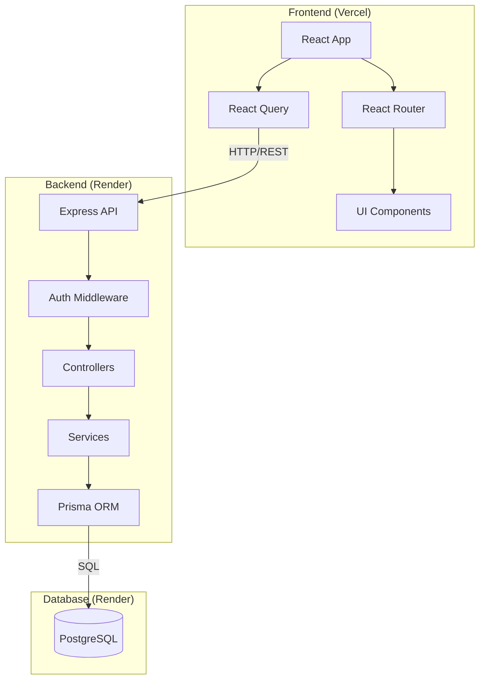
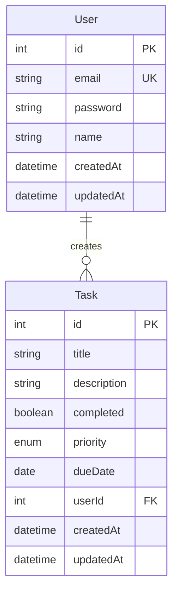

# フルスタックタスク管理アプリ - プロジェクト概要

## 目次

1. [プロジェクト概要](#プロジェクト概要)
2. [このプロジェクトで学べること](#このプロジェクトで学べること)
3. [技術スタック](#技術スタック)
4. [アーキテクチャ設計](#アーキテクチャ設計)
5. [データベース設計](#データベース設計)
6. [API設計](#api設計)
7. [機能一覧](#機能一覧)
8. [前提知識](#前提知識)
9. [ディレクトリ構成](#ディレクトリ構成)
10. [開発フロー](#開発フロー)
11. [学習時間](#学習時間)

---

## プロジェクト概要

### 何を作るか

**実務レベルのフルスタックタスク管理アプリケーション**を構築します。

このプロジェクトは、これまで学んだ全てのスキルを統合し、**実際の企業で開発されるようなアプリケーション**を作成します。

### 完成イメージ

```
ユーザー登録・ログイン
    ↓
タスク一覧表示
    ↓
タスク作成・編集・削除
    ↓
タスク検索・フィルタリング
    ↓
ダッシュボード（統計表示）
```

### このプロジェクトの特徴

- ✅ **実務レベル**: 企業で使われる技術・パターンを採用
- ✅ **完全なフルスタック**: フロントエンド + バックエンド + データベース
- ✅ **認証システム**: JWT を使った本格的な認証
- ✅ **本番デプロイ**: 実際にインターネット上で公開
- ✅ **ポートフォリオ**: 就職・案件獲得に使える

---

## このプロジェクトで学べること

### 技術的スキル

#### フロントエンド
- ✅ React + TypeScript による SPA 開発
- ✅ 認証フロー（ログイン・ログアウト）の実装
- ✅ API 連携とデータ管理（React Query）
- ✅ フォームバリデーション
- ✅ ルーティング（React Router）
- ✅ 状態管理の実践
- ✅ レスポンシブデザイン

#### バックエンド
- ✅ Node.js + Express による REST API 構築
- ✅ PostgreSQL + Prisma ORM によるデータベース操作
- ✅ JWT 認証の実装
- ✅ パスワードハッシュ化（bcrypt）
- ✅ ミドルウェアパターン
- ✅ エラーハンドリング
- ✅ バリデーション（Zod）

#### インフラ・デプロイ
- ✅ Vercel へのフロントエンドデプロイ
- ✅ Render へのバックエンドデプロイ
- ✅ PostgreSQL データベースのセットアップ
- ✅ 環境変数の管理
- ✅ CI/CD の基礎

### 実務スキル

- ✅ **設計力**: アーキテクチャ設計、API 設計、データベース設計
- ✅ **実装力**: 複雑な機能を段階的に実装する能力
- ✅ **デバッグ力**: エラーを特定し解決する能力
- ✅ **統合力**: フロントエンドとバックエンドを統合する能力
- ✅ **デプロイ力**: アプリケーションを本番環境で公開する能力

---

## 技術スタック

### フロントエンド

```
React 18.2+           - UI フレームワーク
TypeScript 5.0+       - 型安全性
React Router 6.x      - ルーティング
React Query 4.x       - データフェッチング・キャッシング
React Hook Form 7.x   - フォーム管理
Zod 3.x               - バリデーション
Tailwind CSS 3.x      - スタイリング
Vite 4.x              - ビルドツール
```

### バックエンド

```
Node.js 20+           - ランタイム
Express 4.18+         - Web フレームワーク
TypeScript 5.0+       - 型安全性
Prisma 5.x            - ORM
PostgreSQL 15+        - データベース
jsonwebtoken 9.x      - JWT 認証
bcrypt 5.x            - パスワードハッシュ化
Zod 3.x               - バリデーション
```

### インフラ・ツール

```
Vercel                - フロントエンドホスティング
Render                - バックエンドホスティング
PostgreSQL (Render)   - データベースホスティング
Git + GitHub          - バージョン管理
```

---

## アーキテクチャ設計

### システム全体図



### レイヤードアーキテクチャ

#### フロントエンド構成

```
src/
├── pages/           # ページコンポーネント
│   ├── Login.tsx
│   ├── Register.tsx
│   ├── Dashboard.tsx
│   └── Tasks.tsx
├── components/      # 再利用可能なコンポーネント
│   ├── TaskCard.tsx
│   ├── TaskForm.tsx
│   └── Header.tsx
├── hooks/           # カスタムフック
│   ├── useAuth.ts
│   └── useTasks.ts
├── services/        # API 通信
│   └── api.ts
├── types/           # TypeScript 型定義
│   └── index.ts
└── utils/           # ユーティリティ関数
    └── validation.ts
```

#### バックエンド構成

```
src/
├── controllers/     # リクエストハンドラー
│   ├── auth.controller.ts
│   └── task.controller.ts
├── services/        # ビジネスロジック
│   ├── auth.service.ts
│   └── task.service.ts
├── middleware/      # ミドルウェア
│   ├── auth.middleware.ts
│   └── error.middleware.ts
├── routes/          # ルート定義
│   ├── auth.routes.ts
│   └── task.routes.ts
├── types/           # TypeScript 型定義
│   └── index.ts
├── utils/           # ユーティリティ関数
│   ├── jwt.ts
│   └── password.ts
└── prisma/          # Prisma 設定
    └── schema.prisma
```

---

## データベース設計

### ER 図



### テーブル定義

#### Users テーブル

| カラム名 | 型 | 制約 | 説明 |
|---------|-----|-----|------|
| id | SERIAL | PRIMARY KEY | ユーザーID |
| email | VARCHAR(255) | UNIQUE, NOT NULL | メールアドレス |
| password | VARCHAR(255) | NOT NULL | ハッシュ化されたパスワード |
| name | VARCHAR(100) | NOT NULL | ユーザー名 |
| createdAt | TIMESTAMP | DEFAULT NOW() | 作成日時 |
| updatedAt | TIMESTAMP | DEFAULT NOW() | 更新日時 |

#### Tasks テーブル

| カラム名 | 型 | 制約 | 説明 |
|---------|-----|-----|------|
| id | SERIAL | PRIMARY KEY | タスクID |
| title | VARCHAR(200) | NOT NULL | タスクタイトル |
| description | TEXT | NULL | タスク詳細 |
| completed | BOOLEAN | DEFAULT FALSE | 完了フラグ |
| priority | ENUM | DEFAULT 'MEDIUM' | 優先度（LOW, MEDIUM, HIGH） |
| dueDate | DATE | NULL | 期限日 |
| userId | INTEGER | FOREIGN KEY, NOT NULL | ユーザーID |
| createdAt | TIMESTAMP | DEFAULT NOW() | 作成日時 |
| updatedAt | TIMESTAMP | DEFAULT NOW() | 更新日時 |

### Prisma スキーマ

```prisma
generator client {
  provider = "prisma-client-js"
}

datasource db {
  provider = "postgresql"
  url      = env("DATABASE_URL")
}

model User {
  id        Int      @id @default(autoincrement())
  email     String   @unique
  password  String
  name      String
  tasks     Task[]
  createdAt DateTime @default(now())
  updatedAt DateTime @updatedAt

  @@map("users")
}

model Task {
  id          Int       @id @default(autoincrement())
  title       String
  description String?
  completed   Boolean   @default(false)
  priority    Priority  @default(MEDIUM)
  dueDate     DateTime?
  userId      Int
  user        User      @relation(fields: [userId], references: [id], onDelete: Cascade)
  createdAt   DateTime  @default(now())
  updatedAt   DateTime  @updatedAt

  @@map("tasks")
}

enum Priority {
  LOW
  MEDIUM
  HIGH
}
```

---

## API設計

### エンドポイント一覧

#### 認証 API

| メソッド | エンドポイント | 説明 | 認証 |
|---------|--------------|------|-----|
| POST | `/api/auth/register` | ユーザー登録 | 不要 |
| POST | `/api/auth/login` | ログイン | 不要 |
| GET | `/api/auth/me` | 現在のユーザー情報取得 | 必要 |
| POST | `/api/auth/logout` | ログアウト | 必要 |

#### タスク API

| メソッド | エンドポイント | 説明 | 認証 |
|---------|--------------|------|-----|
| GET | `/api/tasks` | タスク一覧取得 | 必要 |
| POST | `/api/tasks` | タスク作成 | 必要 |
| GET | `/api/tasks/:id` | タスク詳細取得 | 必要 |
| PUT | `/api/tasks/:id` | タスク更新 | 必要 |
| DELETE | `/api/tasks/:id` | タスク削除 | 必要 |
| GET | `/api/tasks/stats` | タスク統計取得 | 必要 |

### API 仕様詳細

#### POST `/api/auth/register`

**リクエスト:**
```json
{
  "email": "user@example.com",
  "password": "SecurePassword123!",
  "name": "山田太郎"
}
```

**レスポンス（成功）:**
```json
{
  "user": {
    "id": 1,
    "email": "user@example.com",
    "name": "山田太郎"
  },
  "token": "eyJhbGciOiJIUzI1NiIsInR5cCI6IkpXVCJ9..."
}
```

**レスポンス（エラー）:**
```json
{
  "error": "Email already exists"
}
```

#### POST `/api/auth/login`

**リクエスト:**
```json
{
  "email": "user@example.com",
  "password": "SecurePassword123!"
}
```

**レスポンス（成功）:**
```json
{
  "user": {
    "id": 1,
    "email": "user@example.com",
    "name": "山田太郎"
  },
  "token": "eyJhbGciOiJIUzI1NiIsInR5cCI6IkpXVCJ9..."
}
```

#### GET `/api/tasks`

**クエリパラメータ:**
```
?completed=true          # 完了済みタスクのみ
&priority=HIGH           # 優先度でフィルタ
&sort=dueDate            # ソート（dueDate, createdAt, priority）
&order=asc               # ソート順序（asc, desc）
```

**レスポンス:**
```json
{
  "tasks": [
    {
      "id": 1,
      "title": "プロジェクト資料作成",
      "description": "Q1の報告書を作成する",
      "completed": false,
      "priority": "HIGH",
      "dueDate": "2024-12-31T00:00:00.000Z",
      "createdAt": "2024-12-24T10:00:00.000Z",
      "updatedAt": "2024-12-24T10:00:00.000Z"
    }
  ],
  "total": 1
}
```

#### POST `/api/tasks`

**リクエスト:**
```json
{
  "title": "新しいタスク",
  "description": "詳細説明",
  "priority": "MEDIUM",
  "dueDate": "2024-12-31"
}
```

**レスポンス:**
```json
{
  "task": {
    "id": 2,
    "title": "新しいタスク",
    "description": "詳細説明",
    "completed": false,
    "priority": "MEDIUM",
    "dueDate": "2024-12-31T00:00:00.000Z",
    "createdAt": "2024-12-24T11:00:00.000Z",
    "updatedAt": "2024-12-24T11:00:00.000Z"
  }
}
```

#### PUT `/api/tasks/:id`

**リクエスト:**
```json
{
  "title": "更新されたタスク",
  "completed": true
}
```

**レスポンス:**
```json
{
  "task": {
    "id": 1,
    "title": "更新されたタスク",
    "completed": true,
    ...
  }
}
```

#### GET `/api/tasks/stats`

**レスポンス:**
```json
{
  "stats": {
    "total": 50,
    "completed": 30,
    "pending": 20,
    "highPriority": 5,
    "overdue": 3,
    "completionRate": 60
  }
}
```

---

## 機能一覧

### 認証機能

- ✅ **ユーザー登録**
  - メールアドレス・パスワード・名前
  - パスワードバリデーション（8文字以上、英数字含む）
  - メールアドレス重複チェック

- ✅ **ログイン**
  - メールアドレス・パスワード認証
  - JWT トークン発行
  - ローカルストレージへのトークン保存

- ✅ **ログアウト**
  - トークン削除
  - リダイレクト

- ✅ **認証保護**
  - 未ログイン時のリダイレクト
  - トークン検証
  - 自動ログアウト（トークン期限切れ）

### タスク管理機能

- ✅ **タスク一覧表示**
  - 全タスクの表示
  - 完了/未完了のフィルタリング
  - 優先度でのフィルタリング
  - ソート（作成日、期限日、優先度）

- ✅ **タスク作成**
  - タイトル・説明・優先度・期限日の入力
  - バリデーション
  - リアルタイム更新

- ✅ **タスク編集**
  - タスク情報の更新
  - 完了/未完了の切り替え
  - 優先度の変更

- ✅ **タスク削除**
  - 削除確認ダイアログ
  - 論理削除またはハードデリート

- ✅ **タスク検索**
  - タイトルでの検索
  - 説明文での検索

### ダッシュボード機能

- ✅ **統計表示**
  - 総タスク数
  - 完了タスク数
  - 未完了タスク数
  - 完了率
  - 優先度別タスク数
  - 期限切れタスク数

- ✅ **最近のタスク**
  - 最近作成されたタスク（5件）
  - 期限が近いタスク（5件）

### UI/UX 機能

- ✅ **レスポンシブデザイン**
  - モバイル対応
  - タブレット対応
  - デスクトップ対応

- ✅ **ローディング状態**
  - API リクエスト中のスピナー表示

- ✅ **エラー表示**
  - フォームエラーの表示
  - API エラーの表示

- ✅ **成功メッセージ**
  - タスク作成成功
  - タスク更新成功
  - タスク削除成功

---

## 前提知識

### このプロジェクトを始める前に

#### 必須の前提知識

**フロントエンド:**
- ✅ React の基礎（コンポーネント、useState、useEffect）
- ✅ TypeScript の基本文法
- ✅ JavaScript ES6+（アロー関数、分割代入、async/await）
- ✅ HTML/CSS の基礎

**推奨ガイド:**
- [React Development - 基礎ガイド](../../react-development/SKILL.md)

**バックエンド:**
- ✅ Node.js の基礎（モジュール、npm、非同期処理）
- ✅ Express の基本（ルーティング、ミドルウェア）
- ✅ REST API の概念
- ✅ データベースの基礎（SQL、ORM）

**推奨ガイド:**
- [Node.js Development - 基礎ガイド](../../nodejs-development/SKILL.md)
- [Backend Development - 基礎ガイド](../../backend-development/SKILL.md)

#### あると良い知識

- ✅ Git/GitHub の基本操作
- ✅ ターミナル/コマンドラインの操作
- ✅ 環境変数の概念
- ✅ JWT 認証の概念

---

## ディレクトリ構成

### プロジェクト全体

```
fullstack-task-app/
├── frontend/                # React アプリケーション
│   ├── src/
│   │   ├── pages/          # ページコンポーネント
│   │   ├── components/     # 再利用可能なコンポーネント
│   │   ├── hooks/          # カスタムフック
│   │   ├── services/       # API 通信
│   │   ├── types/          # TypeScript 型定義
│   │   ├── utils/          # ユーティリティ関数
│   │   ├── App.tsx         # ルートコンポーネント
│   │   └── main.tsx        # エントリーポイント
│   ├── public/             # 静的ファイル
│   ├── package.json
│   ├── tsconfig.json
│   ├── vite.config.ts
│   └── .env.local          # 環境変数（ローカル）
│
├── backend/                 # Express API
│   ├── src/
│   │   ├── controllers/    # リクエストハンドラー
│   │   ├── services/       # ビジネスロジック
│   │   ├── middleware/     # ミドルウェア
│   │   ├── routes/         # ルート定義
│   │   ├── types/          # TypeScript 型定義
│   │   ├── utils/          # ユーティリティ関数
│   │   ├── prisma/         # Prisma 設定
│   │   │   └── schema.prisma
│   │   └── server.ts       # エントリーポイント
│   ├── package.json
│   ├── tsconfig.json
│   └── .env                # 環境変数
│
└── README.md               # プロジェクト説明
```

---

## 開発フロー

### フェーズ1：環境構築（30分）

1. プロジェクトディレクトリ作成
2. フロントエンド・バックエンドの初期化
3. 依存関係のインストール
4. Git リポジトリの初期化

### フェーズ2：バックエンド開発（6-8時間）

1. **データベースセットアップ（1時間）**
   - PostgreSQL のセットアップ
   - Prisma スキーマ定義
   - マイグレーション実行

2. **認証 API 実装（2-3時間）**
   - ユーザー登録エンドポイント
   - ログインエンドポイント
   - JWT ミドルウェア
   - パスワードハッシュ化

3. **タスク API 実装（3-4時間）**
   - CRUD エンドポイント
   - クエリパラメータ対応
   - バリデーション
   - エラーハンドリング

### フェーズ3：フロントエンド開発（6-8時間）

1. **認証画面実装（2-3時間）**
   - ログインページ
   - 登録ページ
   - 認証コンテキスト
   - プライベートルート

2. **タスク管理画面実装（3-4時間）**
   - タスク一覧ページ
   - タスク作成フォーム
   - タスク編集機能
   - フィルタリング・ソート

3. **ダッシュボード実装（1-2時間）**
   - 統計表示
   - 最近のタスク表示

### フェーズ4：統合とテスト（2-3時間）

1. **API 連携**
   - フロントエンドとバックエンドの統合
   - CORS 設定
   - エラーハンドリング

2. **テスト**
   - 手動テスト
   - エッジケースの確認

### フェーズ5：デプロイ（1-2時間）

1. **バックエンドデプロイ（Render）**
   - PostgreSQL データベース作成
   - Express API デプロイ
   - 環境変数設定

2. **フロントエンドデプロイ（Vercel）**
   - React アプリデプロイ
   - 環境変数設定
   - API エンドポイント設定

---

## 学習時間

### 合計：15-20時間

| フェーズ | 所要時間 | 難易度 |
|---------|---------|--------|
| 環境構築 | 30分 | ★☆☆☆☆ |
| バックエンド開発 | 6-8時間 | ★★★★☆ |
| フロントエンド開発 | 6-8時間 | ★★★☆☆ |
| 統合とテスト | 2-3時間 | ★★★★☆ |
| デプロイ | 1-2時間 | ★★★☆☆ |

### 推奨スケジュール

**Week 1:**
- Day 1-2: 環境構築 + データベースセットアップ
- Day 3-4: 認証 API 実装
- Day 5-7: タスク API 実装

**Week 2:**
- Day 1-2: 認証画面実装
- Day 3-5: タスク管理画面実装
- Day 6: ダッシュボード実装
- Day 7: 統合とテスト

**Week 3:**
- Day 1: デプロイ
- Day 2-7: 機能追加・改善

---

## 次のステップ

### このガイドで学んだこと

- ✅ プロジェクト全体の設計
- ✅ 技術スタックの選定理由
- ✅ アーキテクチャの構造
- ✅ データベース設計
- ✅ API 設計
- ✅ 開発フロー

### 次に学ぶべきガイド

**次のガイド:** [02-backend-implementation.md](./02-backend-implementation.md) - バックエンド実装

このガイドでは、Node.js + Express + PostgreSQL + JWT を使った認証システムとタスク API の実装を学びます。

---

**親ガイド:** [統合プロジェクト - README](../README.md)
